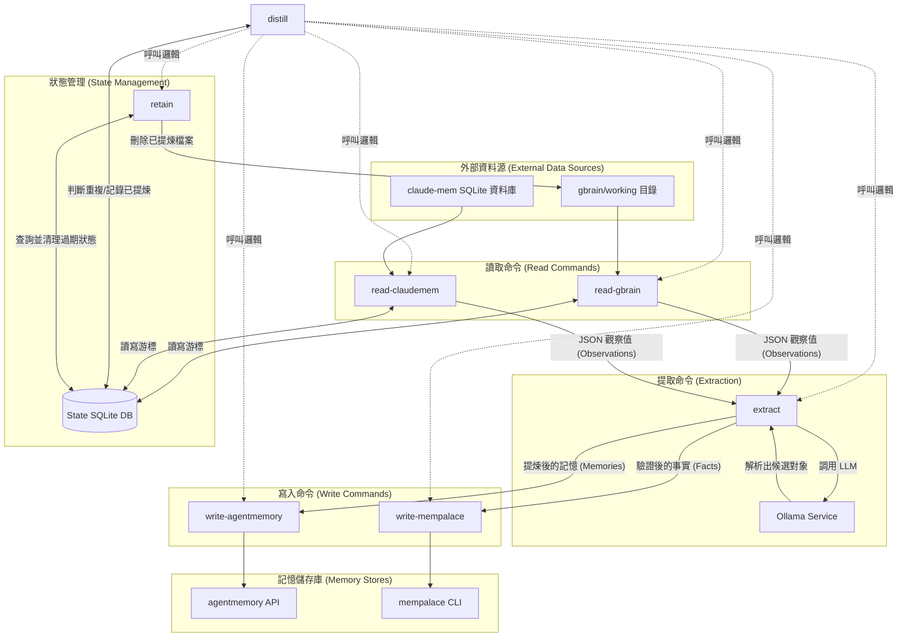

# CC-Plugin 全域設定配置庫 (CC-Plugin Global Configuration Repository)

本專案是一個針對 `Claude Code` 的全域設定配置庫，提供集中化的設定管理、客製化插件 (Plugins)、自訂技能 (Skills) 與專屬代理 (Agents) 配置。

透過本專案，您可以快速將自訂的最佳實務（例如 Go 程式碼品質審查、Apple 生態系整合等技能）與全域編輯鉤子 (Hooks) 部署至本地的 `Claude Code` 與 `Gemini` 環境中。

## 專案功能定位 (Project Position & Architecture)

- **環境初始化與配置同步**：提供 `run.sh` (macOS/Unix) 與 `run.ps1` (Windows) 初始化腳本，將本庫的設定檔與模版，防禦性地軟連結 (Symbolic Link) 至使用者的家目錄資料夾（例如 `$HOME/.claude`、`$HOME/.gemini`、`$HOME/.hermes`）中。
- **全域編輯鉤子 (Hooks)**：內建 `PostToolUse` 鉤子，在編輯或寫入檔案後觸發 `hooks/post-tool.sh`，可針對 Go 專案自動執行 `go fmt` 格式化與 `golangci-lint` 檢查。
- **自訂技能集 (Custom Skills)**：提供多樣化的實用技能，包括 `apple-notes`、`apple-reminders`、`apple-calendar` 等 Apple 工具整合，以及 `golang-code-quality`、`summarize` 等開發工具。
- **外部工具配置**：集中管理 LiteLLM (`litellm_config.yaml`)、CCStatusline、Tokscale 等工具的預設配置。

---

## 快速開始與初始化 (Quick Start & Initialization)

### 1. 安裝 Claude Code

如果您尚未安裝 `Claude Code`，請執行以下指令：

```bash
curl -fsSL https://claude.ai/install.sh | bash
```

### 2. 執行初始化指令稿

根據您的作業系統，執行對應的初始化腳本來建立目錄並完成軟連結：

#### macOS / Linux 環境

```bash
chmod +x run.sh
./run.sh
```

#### Windows 環境 (PowerShell)

```powershell
Set-ExecutionPolicy Bypass -Scope Process -Force
.\run.ps1
```

### 3. 安裝/載入本插件

在專案根目錄下執行以下指令以安裝本地開發插件：

```bash
claude --plugin-dir .
```

---

### 4. 移除與清理 (Cleanup & Uninstall)

如果您需要移除軟連結並回復備份的設定檔案，可以使用以下指令稿：

#### macOS / Linux 環境

```bash
chmod +x uninstall.sh
./uninstall.sh
```

#### Windows 環境 (PowerShell)

```powershell
Set-ExecutionPolicy Bypass -Scope Process -Force
.\uninstall.ps1
```

---

## 常用 MCP 與插件列表 (MCP & Plugin Reference)

### 1. 新增專案專屬 MCP

您可以透過 `claude mcp add` 將以下常用工具新增至專案或全域中：

- **Playwright MCP**：

    ```bash
    claude mcp add --scope project playwright npx @playwright/mcp@latest
    ```

- **Chrome DevTools MCP**：

    ```bash
    claude mcp add --scope project chrome-devtools npx @chrome-devtools/mcp@latest
    ```

    或者透過插件市場進行安裝：

    ```bash
    /plugin marketplace add ChromeDevTools/chrome-devtools-mcp
    /plugin install chrome-devtools-mcp@chrome-devtools-plugins
    ```

### 2. 官方插件推薦

- **Superpowers 插件**（提供進階工具發現與流程引導）：

    ```bash
    claude plugin install superpowers@claude-plugins-official
    ```

---

## 自訂技能與代理擴充 (Custom Skills & Agents)

- **技能 (Skills)**：放置於 `skills/` 資料夾下，如 `apple-calendar/SKILL.md`，可藉由 `view_file` 或 Claude Code 的內建載入機制啟用。
- **代理 (Agents)**：放置於 `agents/` 資料夾下，如 `golang-refactor.md`，定義特定領域的 AI 角色扮演與指令指引。

## command distill


