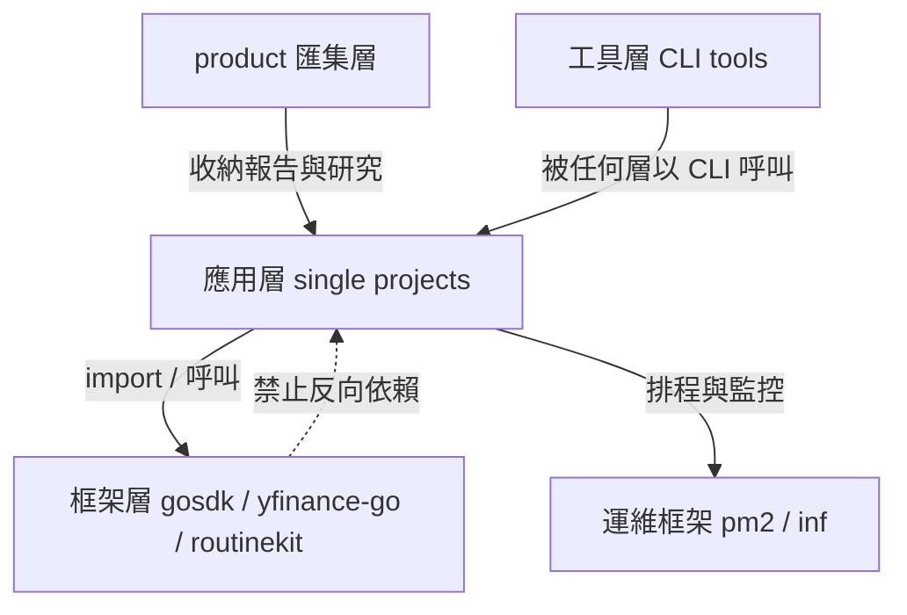
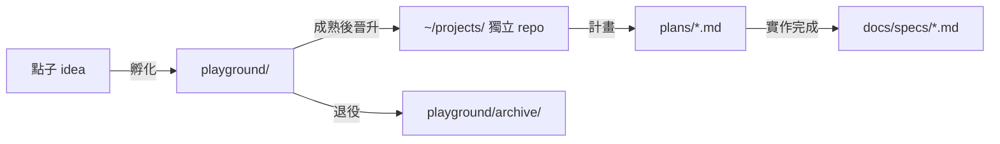

# 專案工作區 (Projects Workspace) — 管理方向 (Management Direction)

本檔為 `~/projects/` 全工作區的方向性規範 (direction)，所有 repo 的 session 均會繼承。
各 repo 細節以其自身 `CLAUDE.md` 為準；本檔只定規則與分層，不放具體內容。

## 全域 AI 規則 (Global AI Rules)

衝突無法判斷時，使用 AskUserQuestions 並等待回覆。

### 輸出風格 (Output Style)

- 結論優先 (answer conclusion first)
- 簡潔回應 (concise response)
- 關係/關聯 (relations/associations) 優先採用以下格式：
    - 縮排清單 (Indented List / tree graph)
    - 極簡關係表達 (Minimalist Relationship Expression)
    - Mermaid
    - Markdown Table
    - SVG

### 上下文 (Context)

- 載入 `@./CLAUDE.md` 作為專案結構，結構變更時須同步更新
- 載入 `@./README.md` 作為專案概覽，業務範圍變更時須同步更新

### 限制 (Restriction)

- 見到 `# [context_only]` 時，忽略該行至行尾的輸出
- 遇到執行錯誤時，先嘗試修復，最多重試 5 次；若仍無法解決則明確報錯並停止

### 慣例 (Convention)

既有慣例 (convention) 不得額外建立自訂選項。
例如 `gosdk` 已有 app log dir / app config dir / app data dir，service layer 不得再建 config path 指向 data dir。

### 演化 (Evolution)

- 多次遭遇相同錯誤/問題時，將解法記錄至 Memory

## 分層 (Tiering)

所有 repo 依職責分四層，依賴方向只能由上往下，禁止反向或跨層循環：

```tree
~/projects/
├── product/            # 匯集層 (Aggregation)：產品研究容器 + 各專案產出報告
├── <single projects>   # 應用層 (Application)：stock, data, surf_analysis, playground,
│                       #   bizshuk.github.io, daily-collections ...
├── <frameworks>        # 框架層 (Framework)：gosdk, pm2, inf, routine_agent, cc-plugin,
│                       #   env_setup, m-agent, yfinance-go, superset
└── <tools>             # 工具層 (Tool)：macnotesapp, macemailapp, port_listenor
```



- `框架層` 服務多個專案：`gosdk` (Go 共用 SDK)、`pm2` (排程/程序管理)、`inf` (LGTM 觀測後端)、`routine_agent` (agent runtime)、`cc-plugin` (skill/plugin host)、`env_setup` (機器初始化)。
- `工具層` 是獨立 CLI，以 binary 形式被呼叫 (`uv tool install` 或 `go build` 至 `~/.local/`)，不被 import。
- 專案間禁止直接互相依賴；共用邏輯一律下沉到框架層。

## 統一介面 (Unified Interface)

每個 repo（含 monorepo 內的子專案）必須具備：

| 檔案                  | 職責                                                                   |
| --------------------- | ---------------------------------------------------------------------- |
| `README.md`           | 業務定義 (business definition)、domain flow                            |
| `CLAUDE.md`           | 技術脈絡 (technical context)、結構、關鍵決策                           |
| `AGENTS.md`           | 軟連結 `AGENTS.md -> CLAUDE.md`（一律建立，不例外）                    |
| `plans/`              | 進行中計畫，命名 `YYYY-MM-DD-<topic>.md`                               |
| `docs/backlog/`       | 待辦想法 (pending ideas)                                               |
| `docs/specs/`         | 既有設計與規格 (existing design)，統一 `YYYY-MM-DD-<topic>.md`         |
| `ecosystem.config.js` | 若有常駐程序或 cron 任務，置於 repo 根目錄，由 pm2 管理                |
| `scripts/`            | 專案相關腳本 (project related script)                                  |
| `tmp/`                | 實例專屬之資料與設定 (data/config per instance, not source code/logic) |
| `run.sh`              | 預設執行程序，可隨時執行 (default process, can run always)             |
| `README.todo`         | 待辦事項 (pending todo item)                                           |

`README.todo` 格式規範：

```markdown
# TODO

- [ ] xxx

## <feature>

- [ ] yyy

## Archive
```

`.project_index/`（`projects.json` + `INDEX.md`）為全工作區的機器可讀註冊表，
依 README/CLAUDE.md 對自動探索；新增 repo 只要符合統一介面即自動被收錄。

## 執行與排程 (Runtime & Scheduling)

- 有常駐程序或 cron 的專案：在 repo 根目錄建 `ecosystem.config.js`，交由 `pm2` 管理；
  一次性排程任務設 `cron` + `autorestart: false`；以 `namespace` 分群 (Infra / Security / Stock ...)。
- 應用設定路徑固定 `~/.config/<app_name>/`：Go 專案透過 `gosdk/config.Default(WithAppName(...))`，
  其下 `logs/` 放 stdout/stderr、`data/` 放輸出資料。此為慣例 (convention)，不提供自訂選項。
- 指標 (metrics) 與日誌 (logs) 統一流向 `inf`（VictoriaMetrics `:8428` / Loki `:3100`），
  由 `gosdk/metric`、`gosdk/log` 預設值直接對接，專案端不另設觀測後端。

## 多應用倉庫 (Multi-app Repo / Monorepo)

以 `msgHub` 為範式，repo 內分兩類：

- `apps/*`：可部署的組合根 (composition root)，如 `apps/server`、`apps/web`。
  只有 `apps/*` 可以依賴 `packages/*`；`apps` 之間不互相 import（`web` 只經 HTTP/WS 打 `server`）。
- `packages/*`：純函式庫，不依賴任何 `apps/*`；命名 `@<repo>/<name>`，
  同族群再分子目錄（如 `packages/channels/*` → `@msgHub/channel-<name>`）。

統一介面遞迴適用：每個 `apps/*` 與重要 `packages/*` 至少有自己的 `README.md`；
`CLAUDE.md` 只放 repo 根目錄，除非某 app 的技術脈絡明顯分岔才另建。
部署面：一個 monorepo 對外只算一個 app（`~/.config/<repo_name>/`、一份 `ecosystem.config.js`），
不為每個 sub-app 各開設定目錄。

## 資料匯集 (Data Aggregation)

三種資料，三個去向，不混放：

| 資料類型                    | 去向                                                     | 範例                              |
| --------------------------- | -------------------------------------------------------- | --------------------------------- |
| 執行期資料 (runtime data)   | `~/.config/<app>/data/`                                  | `stock` 價格 CSV、`trifecta` 排程 |
| 指標與日誌 (metrics / logs) | `inf`（VictoriaMetrics / Loki）+ `~/.config/<app>/logs/` | gosdk 預設對接                    |
| 成果報告 (product results)  | `product/reports/<app>/YYYY-MM-DD-<topic>.md`            | 磁碟分析週報                      |

`product` 是唯一的成果匯集點：任何專案的最終 Markdown 產出（分析報告、研究結論）
由產生端（pm2 cron 或手動）發佈到 `product/reports/<app>/`，研究型內容則封裝為 `product/pkg/<topic>/` 子專案。
個人隱私資產與原始監控 dump 不進 `product`，移往外部私有倉庫。

## 生命週期 (Lifecycle)



- 孵化在 `playground/`，成熟晉升為頂層獨立 repo，退役移入 `archive/`（保留不刪除）。
- `tmp/` 只放真正的暫存物；已成形的 repo 應晉升至 `~/projects/<name>`，不長住 `tmp/`。

## 文件格式 (Doc Format)

- 繁體中文為主，術語以 local language 搭配英文圓括號。
- 名詞/術語範例：
    - `中正紀念堂 (Chiang Kai-shek Memorial Hall)` — 位於台灣台北，以繁體中文附英文
    - `Catedral de Santa Eulalia de Barcelona (Barcelona Cathedral)` — 保留原文附英文
- 若為檔案摘要，使用該檔案的原始語言。
- 不使用粗體，一律以 `backtick` 強調。
- Mermaid 邊線文字必須雙引號包覆（`A -->|"文字"| B`）。
- Claude Code skills 置於 `.agents/skills/<name>/`，以 `.claude/skills/<name>` 軟連結曝露。
