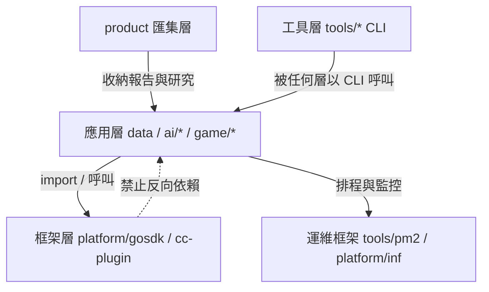

# 專案工作區 (Projects Workspace) — 管理方向 (Management Direction)

本檔為 `~/projects/` 全工作區的方向性規範 (direction)，所有 repo 的 session 均會繼承。
各 repo 細節以其自身 `CLAUDE.md` 為準；本檔只定規則與分層，不放具體內容。

## Output Style

- 繁體中文為主，術語以 local language 搭配英文圓括號。
    - 名詞/術語範例：
        - `中正紀念堂 (Chiang Kai-shek Memorial Hall)` — 位於台灣台北，以繁體中文附英文
            - `Catedral de Santa Eulalia de Barcelona (Barcelona Cathedral)` — 保留原文附英文
- 若為檔案摘要，使用該檔案的原始語言。
- 不使用粗體，一律以 `backtick` 強調。
- Mermaid 邊線文字必須雙引號包覆（`A -->|"文字"| B`）。
  衝突無法判斷時，使用 AskUserQuestions 並等待回覆。

### 輸出風格 (Output Style)

- 結論優先 (answer conclusion first)
- 簡潔回應 (concise response)
- 關係/關聯 (relations/associations) 優先採用以下格式：
    - 縮排清單 (Indented List / tree graph)
    - 極簡關係表達 (Minimalist Relationship Expression)
    - Mermaid
    - Markdown Table
    - SVG
- markdown link reference 使用 relative path

### 上下文 (Context)

- 載入 `@./CLAUDE.md` 作為專案結構，結構變更時須同步更新
- 載入 `@./README.md` 作為專案概覽，業務範圍變更時須同步更新

### 限制 (Restriction)

- 見到 `# [context_only]` 時，忽略該行至行尾的輸出
- 遇到執行錯誤時，先嘗試修復，最多重試 5 次；若仍無法解決則明確報錯並停止

### 慣例 (Convention)

既有慣例 (convention) 不得額外建立自訂選項。
例如 `gosdk` 已有 app log dir / app config dir / app data dir，service layer 不得再建 config path 指向 data dir。

### 演化 (Evolution)

- 多次遭遇相同錯誤/問題時，將解法記錄至 Memory

## 目錄佈局 (Directory Layout)

`~/projects/` 是`兩層 (two-level)` 結構：專案可放在根目錄，也可放在分類目錄之下。

```tree
~/projects/
├── <project>/              # 專案 (Project)：repo 根目錄，具備統一介面
├── <category>/             # 分類 (Category)：純容器，本身不是 repo
│   └── <project>/          # 分類下的專案，統一介面規則完全相同
└── .project_index/         # 全工作區註冊表 (projects.json + INDEX.md)
```

| 型態                 | 判定 (Detection)                                                        | 現況 (Current)                             |
| -------------------- | ----------------------------------------------------------------------- | ------------------------------------------ |
| `分類 (Category)`    | 無自身 `README.md`／`CLAUDE.md`，且直屬子目錄有 `2 個以上`專案；或人工列入 | `ai/`, `game/`, `platform/`, `tools/`      |
| `專案 (Project)`     | 具備統一介面（至少 `README.md` 或 `CLAUDE.md` 或 `.git`）                | `cc-plugin/`, `data/`, `product/` ...      |
| `子專案 (Subproject)` | 專案內部的可部署單元或子 repo，不獨立列為專案                            | `data/stock`, `product/surf_analysis` ...  |

規則：

- 分類目錄`只做歸類`，不放程式碼、不放設定、不建 `ecosystem.config.js`。
- 分類目錄`可以`有自身 `README.md`／`CLAUDE.md` 作為領域導覽（如 `game/`），此時仍以分類論處，人工列入 `.project_index/projects.json` 的 `categories`。
- 分類`不改變依賴規則`：分層 (Tiering) 由職責決定，與所在目錄無關。
- 分類深度`固定一層`：不得出現 `<category>/<category>/<project>`。
- 專案的正式位址是`實體路徑 (physical path)`；跨分類的 symlink 只是別名 (alias)，索引以實體路徑為準。

## 分層 (Tiering)

所有 repo 依職責分四層，依賴方向只能由上往下，禁止反向或跨層循環：

| 層 (Tier)             | 職責                             | 代表專案                                                                       |
| --------------------- | -------------------------------- | ------------------------------------------------------------------------------ |
| 匯集層 (Aggregation)  | 產品研究容器 + 各專案產出報告    | `product/`                                                                     |
| 應用層 (Application)  | 面向使用情境的獨立應用           | `data/`, `collections/`, `playground/`, `ai/*`, `game/*`                       |
| 框架層 (Framework)    | 服務多個專案的共用能力           | `platform/gosdk`, `platform/inf`, `platform/superset`, `cc-plugin/`, `env_setup/` |
| 工具層 (Tool)         | 獨立 CLI，以 binary 形式被呼叫   | `tools/*`（`dux`, `pm2`, `port`, `video-utils` ...）                           |



- `框架層` 服務多個專案：`platform/gosdk` (Go 共用 SDK)、`platform/inf` (LGTM 觀測後端)、`platform/superset` (VSCode 面板)、`tools/pm2` (排程/程序管理)、`cc-plugin` (skill/plugin host)、`env_setup` (機器初始化)。
- `工具層` 是獨立 CLI，以 binary 形式被呼叫 (`uv tool install` 或 `go build` 至 `~/.local/`)，不被 import。
- 專案間禁止直接互相依賴；共用邏輯一律下沉到框架層。分類目錄不構成依賴邊界。

## 統一介面 (Unified Interface)

每個 repo（含 monorepo 內的子專案）必須具備：

| 檔案                  | 必要性 | 職責                                                                                   |
| --------------------- | ------ | -------------------------------------------------------------------------------------- |
| `README.md`           | 必備   | 業務定義 (business definition)、domain flow                                            |
| `CLAUDE.md`           | 必備   | 技術脈絡 (technical context)、結構、關鍵決策                                           |
| `AGENTS.md`           | 必備   | 軟連結 `AGENTS.md -> CLAUDE.md`（一律建立，不例外）                                    |
| `README.business.md`  | 選備   | 業務價值萃取：上下游、狀態流程、約束、風險、核心/非核心                                |
| `plans/`              | 選備   | 進行中計畫，命名 `YYYY-MM-DD-<topic>.md` topic name should be meaningful to the change |
| `docs/terminology.md` | 必備   | 術語表 (terminology)：領域名詞、縮寫、狀態值的單一定義來源                             |
| `docs/memory/`        | 必備   | 歷史操作跟決策 retrospective                                                           |
| `docs/backlog/`       | 選備   | 待辦想法 (pending ideas)                                                               |
| `docs/specs/`         | 選備   | 既有設計與規格 (existing design)，統一 `YYYY-MM-DD-<topic>.md`                         |
| `docs/tutorials/`     | 選備   | 領域知識學習與概念導覽 (domain tutorials)；專案架構/流程/環境等常規指南放 `docs/` 根層 |
| `ecosystem.config.js` | 選備   | 若有常駐程序或 cron 任務，置於 repo 根目錄，由 pm2 管理                                |
| `scripts/`            | 選備   | 專案相關腳本 (project related script)                                                  |
| `tmp/`                | 選備   | 實例專屬之資料與設定 (data/config per instance, not source code/logic)                 |
| `run.sh`              | 選備   | 預設執行程序，可隨時執行 (default process, can run always)                             |
| `README.todo`         | 必備   | 待辦事項 (pending todo item)                                                           |

`README.todo` 格式規範：

```markdown
# TODO

- [ ] xxx

## <feature>

- [ ] yyy

## Archive
```

`docs/terminology.md` 格式規範：領域名詞的`單一定義來源`，README / CLAUDE.md /
程式碼與 commit message 一律引用此處的用詞，禁止同義詞漂移。

```markdown
# 術語表 (Terminology)

## <領域 Domain>

| 術語 (Term) | 英文 (English) | 定義 (Definition) | 出處 (Source) |
| ----------- | -------------- | ----------------- | ------------- |

## 縮寫 (Abbreviations)

| 縮寫 | 全稱 | 說明 |
| ---- | ---- | ---- |
```

規則：每個術語必須有程式或文件出處（檔案路徑／識別符），查無出處者不得列入；
狀態值 (status enum) 一律以程式碼中的字面值為準。

`docs/` 分流規則：`docs/tutorials/` 只放領域知識與概念導覽（教學導向、循序步驟）；
專案架構、開發流程、環境設定等常規指南放 `docs/` 根層。教學文件中的術語一律
以 `backtick` 標示並引用 `docs/terminology.md` 的定義，不另立一套說法。

`.project_index/`（`projects.json` + `INDEX.md`）為全工作區的機器可讀註冊表，
掃描`兩層`（根目錄專案 + 分類目錄下的專案），依 README/CLAUDE.md 自動探索；
新增 repo 只要符合統一介面即自動被收錄。`categories` 與每個專案的 `tags`
為人工維護，`rebuild` 不會覆寫。

## 執行與排程 (Runtime & Scheduling)

- 有常駐程序或 cron 的專案：在 repo 根目錄建 `ecosystem.config.js`，交由 `pm2` 管理；
  一次性排程任務設 `cron` + `autorestart: false`；以 `namespace` 分群 (Infra / Security / Stock ...)。
- 應用設定路徑固定 `~/.config/<app_name>/`：Go 專案透過 `gosdk/config.Default(WithAppName(...))`，
  其下 `logs/` 放 stdout/stderr、`data/` 放輸出資料。此為慣例 (convention)，不提供自訂選項。
- 指標 (metrics) 與日誌 (logs) 統一流向 `inf`（VictoriaMetrics `:8428` / Loki `:3100`），
  由 `gosdk/metric`、`gosdk/log` 預設值直接對接，專案端不另設觀測後端。

## 多應用倉庫 (Multi-app Repo / Monorepo)

以 `msgHub` 為範式，repo 內分兩類：

- `apps/*`：可部署的組合根 (composition root)，如 `apps/server`、`apps/web`。
  只有 `apps/*` 可以依賴 `packages/*`；`apps` 之間不互相 import（`web` 只經 HTTP/WS 打 `server`）。
- `packages/*`：純函式庫，不依賴任何 `apps/*`；命名 `@<repo>/<name>`，
  同族群再分子目錄（如 `packages/channels/*` → `@msgHub/channel-<name>`）。

統一介面遞迴適用：每個 `apps/*` 與重要 `packages/*` 至少有自己的 `README.md`；
`CLAUDE.md` 只放 repo 根目錄，除非某 app 的技術脈絡明顯分岔才另建。
部署面：一個 monorepo 對外只算一個 app（`~/.config/<repo_name>/`、一份 `ecosystem.config.js`），
不為每個 sub-app 各開設定目錄。

`分類 (Category)` 與 `monorepo` 不可混淆：monorepo 是`一個 repo`（一份 `.git`、
一份設定目錄、內部子專案共享版本）；分類是`檔案系統歸類`，其下每個專案各自獨立
（各自 `.git`、各自 `~/.config/<app>/`、各自 `ecosystem.config.js`）。

## 資料匯集 (Data Aggregation)

三種資料，三個去向，不混放：

| 資料類型                    | 去向                                                     | 範例                              |
| --------------------------- | -------------------------------------------------------- | --------------------------------- |
| 執行期資料 (runtime data)   | `~/.config/<app>/data/`                                  | `stock` 價格 CSV、`trifecta` 排程 |
| 指標與日誌 (metrics / logs) | `inf`（VictoriaMetrics / Loki）+ `~/.config/<app>/logs/` | gosdk 預設對接                    |
| 成果報告 (product results)  | `product/reports/<app>/YYYY-MM-DD-<topic>.md`            | 磁碟分析週報                      |
| 業務文件 (business docs)    | `product/projects/<project>/README.business.md`          | 由 `project-docs` 技能產出        |

`product` 是唯一的成果匯集點：任何專案的最終 Markdown 產出（分析報告、研究結論）
由產生端（pm2 cron 或手動）發佈到 `product/reports/<app>/`，研究型內容則封裝為 `product/pkg/<topic>/` 子專案。
個人隱私資產與原始監控 dump 不進 `product`，移往外部私有倉庫。
