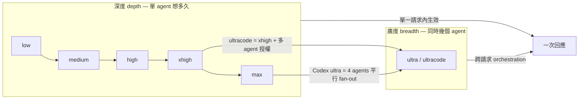

# Claude 與 Codex Reasoning Effort 差異 (Reasoning Effort: Claude vs Codex)

Status: `reference`

Date: 2026-07-23

## 結論 (Conclusion)

`ultra` / `max` / `xhigh` / `high` / `low` `不是同一把尺`。它們橫跨兩個獨立的座標軸：

| 座標軸         | 意義                               | Claude 的名字                               | Codex 的名字                                                   |
| -------------- | ---------------------------------- | ------------------------------------------- | -------------------------------------------------------------- |
| 深度 (depth)   | 單一 agent 願意花多少 token 想與做 | `low` → `medium` → `high` → `xhigh` → `max` | `none`/`minimal` → `low` → `medium` → `high` → `xhigh` → `max` |
| 廣度 (breadth) | 同時派出幾個 agent 平行處理        | `ultracode`                                 | `ultra`                                                        |

`ultra` 在兩邊`都不是 effort level`：

- Codex `ultra`：一個 mode，預設把任務 fan out 給 `4 個平行 agent`，Terminal-Bench 2.1 從 88.8% 拉到 91.9%。
- Claude `ultracode`：Anthropic 官方文件明講 —— 它出現在 Claude Code 的 effort 選單裡，但`不是額外的 API effort level`；它等於 `xhigh` effort 加上「允許 Claude Code 主動開多 agent workflow」的常駐授權（透過 mid-conversation system message 下達）。

所以「把 slider 拉到 ultra」不是「想得更深」，而是「同時開更多分身」。



---

## 一、Claude 的 effort 語意 (Claude Effort Semantics)

### 參數位置

```jsonc
{
    "model": "claude-opus-4-8",
    "max_tokens": 64000,
    "thinking": { "type": "adaptive" },
    "output_config": { "effort": "xhigh" } // 注意在 output_config 裡，不是 top-level
}
```

### 等級與模型支援

| Level    | 語意                                                     | 支援模型                                                  |
| -------- | -------------------------------------------------------- | --------------------------------------------------------- |
| `max`    | 無 token 上限的最高能力，`可能 overthinking`             | Fable 5, Mythos 5, Opus 4.8/4.7/4.6, Sonnet 5, Sonnet 4.6 |
| `xhigh`  | 長時程 agentic／coding 專用（30 分鐘以上、百萬級 token） | Fable 5, Mythos 5, Opus 4.8/4.7, Sonnet 5                 |
| `high`   | `API 預設`；等同不傳 `effort` 參數                       | 全部支援 effort 的模型                                    |
| `medium` | 平衡型，明顯省 token                                     | 全部                                                      |
| `low`    | 最省，適合 subagent 與簡單任務                           | 全部（Opus 4.5 只到 `high`）                              |

### 三個容易搞混的關鍵點

1. `effort 影響所有 token`，不只 thinking。它同時管 text 輸出、tool call 次數與 tool 參數長度。降 effort 會讓 Claude`合併 tool call、少 tool call、不寫前言、完成後只給一句話`；升 effort 會讓它`先講計畫、寫詳細變更摘要、加更多程式碼註解`。
2. `effort 是行為訊號 (behavioral signal)，不是 token 上限`。低 effort 遇到夠難的問題還是會想，只是想得比高 effort 少。真正的硬上限是另外兩個參數：
    - `max_tokens`：強制上限，模型`不知道`它存在，撞到就從中間截斷。
    - `task_budget`：advisory 上限，模型`看得到倒數`，會自己收尾（beta `task-budgets-2026-03-13`，最低 20,000）。
3. `budget_tokens 已經死了`。Opus 4.7 / 4.8、Sonnet 5、Fable 5 傳 `thinking: {type:"enabled", budget_tokens:N}` 直接回 `400`；Opus 4.6 / Sonnet 4.6 還能用但已 deprecated。取代品就是 `adaptive thinking` + `effort`。

### effort 與 adaptive thinking 的耦合

在 `high` / `xhigh` / `max`，Claude 幾乎一定會 think；在 `medium` / `low`，簡單題目它會`直接跳過 thinking`。Opus 4.8 若完全不傳 `thinking` 欄位，是`不 think` 的 —— 必須明寫 `thinking: {type: "adaptive"}`。

### Claude Code 端的操作面

| 方式          | 寫法                                                    | 生效範圍     |
| ------------- | ------------------------------------------------------- | ------------ |
| Slash command | `/effort`（開 slider）、`/effort xhigh`、`/effort auto` | 當前 session |
| 啟動 flag     | `claude --effort high`                                  | 單次 session |
| 設定檔        | `settings.json` 的 `effortLevel`                        | 常駐         |
| 環境變數      | `CLAUDE_CODE_ALWAYS_ENABLE_EFFORT=1` 等                 | 最高優先     |

優先序：`環境變數 > 明設等級 > 模型預設`。Slider 圖示為 `○ low`、`◐ medium`、`● high`、`◉ xhigh`、`⬭ max`。

---

## 二、Codex 的 effort 語意 (Codex Effort Semantics)

### 參數位置

```toml
# ~/.codex/config.toml
model = "gpt-5.6-sol"
model_reasoning_effort = "max"
plan_mode_reasoning_effort = "high"   # /plan 模式可獨立覆寫

[profiles.deep-work]
model_reasoning_effort = "xhigh"
```

```bash
codex -m gpt-5.1-codex-max -c model_reasoning_effort="xhigh"
codex -e high "Refactor the auth module"
# TUI 內：/effort high
```

### 等級隨世代改變

| 世代                               | 可用等級                                        |
| ---------------------------------- | ----------------------------------------------- |
| GPT-5 / GPT-5.1-Codex              | `minimal`, `low`, `medium`, `high`              |
| GPT-5.1-Codex-Max / GPT-5.2-Codex  | 加入 `xhigh`                                    |
| GPT-5.6 (`sol` / `terra` / `luna`) | `none`, `low`, `medium`, `high`, `xhigh`, `max` |

預設是 `medium`（OpenAI 稱為 all-day driver）。Claude `沒有` `none` / `minimal` 這兩個「幾乎不推理」的檔位，這是兩邊 ladder 最底端的實質差異。

### 相對 token 成本（第三方觀測，非官方）

| Level     | reasoning token 相對 `medium` |
| --------- | ----------------------------- |
| `minimal` | ~0.1x                         |
| `low`     | ~0.3x                         |
| `medium`  | 1x                            |
| `high`    | ~3–5x                         |
| `xhigh`   | ~8–15x                        |

此表出自社群 knowledge base，`OpenAI 未公佈官方倍率`，僅供量級參考。官方僅說明 GPT-5.1-Codex-Max 在 `medium` 就勝過 GPT-5.1-Codex 的 `medium`，且少用 30% thinking token。

### Ultra 的真實機制

- 是 `mode` 不是 level：預設 fan out `4 個平行 agent`，由 coordinator 統整。
- 效果：Terminal-Bench 2.1 `88.8% → 91.9%`。
- 代價：token 與額度燒得更兇，換的是 wall-clock 更快 —— 官方定位為 `spend-more-to-get-more lever, not an efficiency feature`。
- 取得管道：ChatGPT Work 限 Pro/Enterprise；Codex 從 Plus 起；Responses API 走 multi-agent beta。
- Desktop 若沒看到，需 `Settings > Configuration` 打開 `show-ultra-in-model-picker-slider`。

---

## 三、對照表 (Side-by-side)

| 面向           | Claude                                                 | Codex                                                           |
| -------------- | ------------------------------------------------------ | --------------------------------------------------------------- |
| 參數名         | `output_config.effort`                                 | `reasoning.effort` / `model_reasoning_effort`                   |
| 預設           | `high`                                                 | `medium`                                                        |
| 最低檔         | `low`                                                  | `none`（舊世代 `minimal`）                                      |
| 最高檔         | `max`                                                  | `max`                                                           |
| `xhigh` 定位   | 長時程 agentic 的`建議起點`                            | 非延遲敏感任務的加深檔                                          |
| `max` 定位     | frontier 問題專用，`一般任務性價比差且會 overthinking` | 最高檔，官方建議與 `xhigh` 做 A/B                               |
| 控制範圍       | 所有 token（text + tool call + thinking）              | 主要是 reasoning token                                          |
| 硬上限         | 另設 `max_tokens`（隱藏）／`task_budget`（可見）       | 由 `model_context_window` / `model_auto_compact_token_limit` 管 |
| 多 agent       | `ultracode`（= `xhigh` + 多 agent 授權）               | `ultra`（= 4 agent 平行）                                       |
| Session 內切換 | `/effort <level>`、`/effort auto`                      | `/effort <level>`                                               |
| 模式專用覆寫   | 無（skill frontmatter 可帶 `effort`）                  | `plan_mode_reasoning_effort`                                    |

---

## 四、詳細範例 (Detailed Example)

### 情境

同一個任務，在兩邊跑五個等級：

> 「`cmd/export/` 的 claude-mem 匯出在 timestamp 相同時會漏資料。找出原因並修掉，補上 regression test。」

這任務有三個階段：`定位 (locate)` → `修改 (patch)` → `驗證 (verify)`。effort 影響的正是「每階段肯投入多少 tool call 與多少推理」。

### 執行指令

```bash
# Claude 側 — 逐級跑
claude --effort low    -p "修 cmd/export 的 claude-mem 漏匯 bug，補 regression test"
claude --effort medium -p "..."
claude --effort high   -p "..."      # 等同不加 --effort
claude --effort xhigh  -p "..."
claude --effort max    -p "..."

# Codex 側 — 逐級跑
codex -e low    "修 cmd/export 的 claude-mem 漏匯 bug，補 regression test"
codex -e medium "..."                # 等同不加 -e
codex -e high   "..."
codex -e xhigh  "..."
codex -c model_reasoning_effort="max" "..."
```

### 各等級的預期行為輪廓

以下是`官方文件描述的行為差異`所推導的輪廓，不是實測數字；實際 tool call 數需自行以 `--verbose` 或 session log 量測。

| Level    | 定位階段                                                        | 修改階段                                 | 驗證階段                             | 使用者看到的輸出                                     |
| -------- | --------------------------------------------------------------- | ---------------------------------------- | ------------------------------------ | ---------------------------------------------------- |
| `low`    | 直接 grep 一次關鍵字就下手，不讀周邊檔案                        | 改最小範圍，多個編輯合併成一次 tool call | 可能不跑 test，或只跑單一 package    | 無前言，改完一句「已修正 X」                         |
| `medium` | grep + 讀 1–2 個相關檔                                          | 分開幾次編輯，順手看一眼呼叫端           | 跑 `go test ./cmd/export`            | 簡短說明改了什麼                                     |
| `high`   | 讀 cursor 邏輯、state store、呼叫鏈                             | 修主因並檢查同型別漏洞                   | 跑 `go test ./...`                   | 先講計畫，再給變更摘要                               |
| `xhigh`  | 追整條 export pipeline，含 SQLite 讀取模式與 autoincrement 假設 | 修主因 + 邊界情況 + 補註解               | 跑全測 + 手動重現 + 補多個 test case | 完整計畫、逐檔說明、風險提示                         |
| `max`    | 同 `xhigh` 但探索更廣，`可能繞去看無關的 export 路徑`           | 可能順手重構、加防禦性程式碼             | 反覆自我驗證                         | 最長；`結構化輸出任務上反而可能因 overthinking 變差` |

### 這個範例要看的三件事

1. `low 與 medium 的差別在 tool call 數，不在聰明度`。低 effort 不是變笨，是「照字面做完就收工」。Opus 4.7 之後對 effort 的遵守更嚴格 —— 低 effort 看到淺推理，`正確做法是升 effort，不是加 prompt 逼它想`。
2. `xhigh 必須配大 max_tokens`。官方建議從 `64k` 起跳。`max_tokens` 是 thinking + 回應的`總和`硬上限，設太小的症狀是 `stop_reason: "max_tokens"` 從思考中間被切斷。
3. `max 不是免費的更好`。文件明說：多數 workload 上 `max` 增加大量成本、品質提升有限，在結構化輸出或非智力密集任務上甚至會因 overthinking 變差。

### 如果改用 ultra / ultracode

同一個任務在 `ultra` 下不會變成「一個 agent 想更久」，而是變成`四個 agent 分頭做`：例如一個追 cursor 邏輯、一個追 SQLite 讀取、一個寫 test、一個做 adversarial review，最後統整。適用時機是`任務可切成獨立子問題`；如果是單一線性 bug，fan-out 只是多燒 token。

---

## 五、本機設定現況 (Local Configuration)

本 repo 內三份設定同時涉及兩套 effort 語彙：

| 檔案                   | 關鍵設定                                                                                                      | 意義                                                      |
| ---------------------- | ------------------------------------------------------------------------------------------------------------- | --------------------------------------------------------- |
| `config/settings.json` | `effortLevel: "high"`、`alwaysThinkingEnabled: true`                                                          | Claude Code 常駐 `high`（= API 預設）                     |
| `config/codex.json`    | `CLAUDE_CODE_ALWAYS_ENABLE_EFFORT: "1"`、capabilities 含 `effort,xhigh_effort,max_effort`                     | 以 Claude Code 介面驅動 `gpt-5.6-*`，宣告該端支援到 `max` |
| `config/config.toml`   | `model_reasoning_effort = "max"`、`enabled-reasoning-efforts = ["low","medium","high","xhigh","ultra","max"]` | Codex 原生端固定跑 `max`，desktop slider 六檔全開         |

值得注意的組合：`config/codex.json` 把 `ANTHROPIC_BASE_URL` 指到 `http://127.0.0.1:8317` 的本地 proxy，等於`用 Anthropic 的 effort 詞彙去驅動 OpenAI 的模型`。這條路徑上 effort 需要被 proxy 翻譯，而社群已回報過對應失敗：上游回 `level 'max' not supported, valid levels: low, medium, high, xhigh`。

也就是說 —— `Claude Code 端設 max，不保證上游真的收到 max`。若要確認，看 proxy 實際送出的 request body，不要只看本地設定值。

---

## 六、常見誤解 (Common Misconceptions)

| 誤解                        | 實情                                                                    |
| --------------------------- | ----------------------------------------------------------------------- |
| ultra 是最高的 effort level | 是`多 agent 平行模式`，與深度正交                                       |
| effort 只影響 thinking      | Claude 端`同時影響 text 與 tool call`；Codex 端主要影響 reasoning token |
| effort 是 token 上限        | 是`行為訊號`；硬上限是 `max_tokens` / `task_budget`                     |
| 兩邊的 `high` 一樣          | Claude `high` 是`預設`，Codex `high` 已經是`預設 medium 往上兩檔`       |
| `budget_tokens` 還能用      | Opus 4.7+ / Sonnet 5 / Fable 5 傳了直接 `400`                           |
| 越高越好                    | `max` 在結構化任務上可能因 overthinking 反而變差                        |
| 設定檔寫了就一定生效        | 經 proxy 時上游可能不支援該等級                                         |

---

## 參考來源 (Sources)

- [Effort — Claude Platform Docs](https://platform.claude.com/docs/en/build-with-claude/effort.md)（含 ultracode 說明）
- [Reasoning Effort Tuning: Minimal to xhigh — Codex Knowledge Base](https://codex.danielvaughan.com/2026/03/27/reasoning-effort-tuning/)
- [Building more with GPT-5.1-Codex-Max — OpenAI](https://openai.com/index/gpt-5-1-codex-max/)
- [GPT-5.6 Goes Public: GA Pricing, Ultra Mode and Access](https://www.digitalapplied.com/blog/gpt-5-6-sol-terra-luna-public-ga)
- [GPT 5.6 Has 72 Possible Configurations — Sebastian Raschka](https://sebastianraschka.com/blog/2026/gpt-5-6-configurations.html)
- [What is /effort Command in Claude Code — ClaudeLog](https://claudelog.com/faqs/what-is-slash-effort-command/)
- [cc-switch #5209 — ultra 經 proxy 的相容性問題](https://github.com/farion1231/cc-switch/issues/5209)
