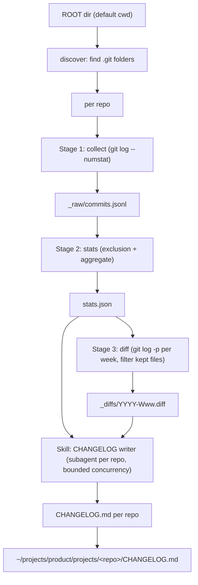

# repo-changelog: Reusable Git History Analysis & CHANGELOG Workflow

> Design spec — 2026-06-24
> Status: approved, pending implementation

## 1. Purpose

A re-usable hybrid workflow (Python CLI + Claude Code skill) that:

1. Traverses a root directory to discover nested git repos
2. Computes per-commit changed-line statistics with exclusion of non-logic changes
3. Ranks top-10 largest commits and lists their files
4. Produces committer statistics (kept-lines per author, per-author weekly breakdown)
5. Generates a `CHANGELOG.md` per repo with weekly LLM-narrated sections

## 2. Architecture



Three deterministic Python stages, one Claude Code skill for the LLM summarization.

## 3. Components

### 3.1 Python CLI: `repo-changelog`

Single entry point using `click`. Implemented as a Python package installable via `pip install -e .` or `pipx`.

**Commands:**

| Command | Does |
|---------|------|
| `discover <root>` | Lists all nested `.git` folders (max depth 6) |
| `collect <repo>` | `git log --numstat --date=short` → `_raw/commits.jsonl` |
| `stats <repo>` | Apply exclusion, compute stats, weekly buckets → `stats.json` |
| `diff <repo>` | `git log -p` per week, filter to kept files → `_diffs/YYYY-Www.diff` |
| `run <repo>` | `collect` + `stats` + `diff` in sequence |
| `run-all <root>` | `discover` + `run` for every repo |

**Options:**

- `--output <dir>`: output root (default: `~/projects/product/projects/<repo>/`)
- `--exclude-defaults <file>`: override built-in exclusion rules (`.gitignore` format)
- `--no-exclude-gitignore`: skip per-repo `.gitignore` overlay
- `--max-depth <n>`: max depth for `discover` (default: 6)

### 3.2 Exclusion Engine

Two layers applied in order, shared between Stage 2 (stats) and Stage 3 (diff filtering):

**Layer 1: Built-in defaults** (23 rules, hardcoded, drawn from wallet analysis):

```
kitex_gen/  rpc_gen/  thrift_gen/          # RPC stubs
vendor/  output/                            # 3rd-party + build
*_test.go  mock*.go                         # tests
go.sum  go.mod  BUILD.bazel  go.work.sum    # deps
go_deps.bzl  deps.bzl
*.pb.go  gen/pb/  proto_gen/               # protobuf
invoker.go  *overpass_auto_generated*       # overpass
.claude/skills/  .cursor/skills/  .ttadk/   # AI skills
skills/  openspec/  docs/superpowers/       # docs
doc_export/                                 # lark exports
*.log  access.log  coverage.out            # artifacts
prod_item_ids.txt                           # data files
allowlist/  ban_list.go  whitelist/         # block/allow lists
core_tiktok/k-*.go  core_tiktok/*_core.go   # kitex truncated
rpc_client/                                  # old RPC stubs
data/*.csv                                  # generic CSV data
```

Plus repo-specific patterns requiring `repo_name` context (see `analyze_v9.py` CSV_REPO_RULES, BW_LIST_RULES).

**Layer 2: Per-repo `.gitignore` overlay:**

- Parsed with `pathspec` library (pure Python, zero-dependency)
- Falls back to `git check-ignore --stdin` if `pathspec` unavailable
- Negation patterns (`!pattern`) supported

**Matching order:** built-in → `.gitignore` → keep. First match wins.

### 3.3 `stats.json` Schema

```json
{
  "repo": "wallet-recharge",
  "generated": "2026-06-25T10:00:00",
  "summary": {
    "total_commits": 847,
    "total_raw_lines": 12400000,
    "total_excluded_lines": 11400000,
    "total_kept_lines": 1000000,
    "excluded_pct": 92.0
  },
  "percentiles": { "P50": 2, "P75": 18, "P90": 107, "P95": 261, "P99": 1182, "Max": 61915 },
  "distribution": [ {"range": "0", "count": 380}, ... ],
  "excluded_by_category": [ {"category": "*_gen/", "lines": 6600000, "pct": 57.0}, ... ],
  "top10_commits": [
    { "hash": "abc123", "author": "...", "date": "...", "subject": "...",
      "raw_lines": 1000, "kept_lines": 500,
      "files": [ [10, 5, "path/to/file.go"], ... ] }
  ],
  "committers": [
    { "author": "duxinlong", "kept_lines": 42310, "pct": 24.8,
      "weekly": { "2026-W25": 1240, "2026-W24": 890, ... } }
  ],
  "weekly_buckets": [
    { "week": "2026-W25", "start": "2026-06-22", "end": "2026-06-28",
      "commit_count": 14, "kept_lines": 2310,
      "commits": [
        { "hash": "9de1b78", "author": "林季衛", "date": "2026-06-24",
          "subject": "feat: Web Quick Recharge", "kept_lines": 1240 }
      ],
      "diff_file": "_diffs/2026-W25.diff"
    }
  ]
}
```

### 3.4 Diff Filtering (Stage 3)

Per week: `git log -p <start>..<end>` produces full patch. Python parses the patch header (`--- a/...` / `+++ b/...`) to identify which file each hunk belongs to. Runs `is_excluded(file_path, repo_name)` — if excluded, the hunk is dropped. If kept, the hunk is written to the week's `.diff` file.

**Token budget:** no hard cap. If a week's diff exceeds 100K tokens, a `<!-- warning -->` comment is emitted in the CHANGELOG. The LLM receives the full diff regardless.

### 3.5 Claude Code Skill: `/changelog`

**Invocation:** `/changelog <root-dir>` (defaults to cwd)

**Flow:**

1. Runs `repo-changelog run-all <root>` (deterministic stages)
2. For each repo with `stats.json`, spawns a subagent (bounded to ~8 concurrent)
3. Each subagent receives `stats.json` + `_diffs/*.diff` as context
4. Subagent prompt: "For each week in this repo, write a 3-5 sentence narrative summarizing the feature changes visible in the diff. Then assemble the full CHANGELOG.md per the format spec."
5. Writes `CHANGELOG.md` to `~/projects/product/projects/<repo>/CHANGELOG.md`

**Error handling:** subagent retry once on failure; if still fails, `<!-- LLM: pending -->` placeholder.

### 3.6 CHANGELOG.md Format

```markdown
# CHANGELOG — <repo>

> Generated: <date> | Commits: N | Contributors: N
> Excluded: X% of raw line changes

## Committer Activity
| Author | Total Kept Lines | % |
|--------|-----------------|---|
| ... | ... | ... |

<details><summary>Weekly breakdown</summary>
| Author | W1 | W2 | ... |
|--------|----|----|-----|
| ... | ... | ... | ... |
</details>

## Top 10 Commits
| # | Hash | Author | Date | Lines | Subject |
|---|------|--------|------|-------|---------|
| ... | ... | ... | ... | ... | ... |

<details><summary>File lists</summary>...</details>

---

## Week of YYYY-MM-DD (ISO-Www) — N commits, N kept lines

<!-- LLM: 3-5 sentence narrative from the diff -->

### Commits
| Hash | Author | Date | Lines | Subject |
|------|--------|------|-------|---------|
| ... | ... | ... | ... | ... |
```

## 4. File Layout

```
~/projects/product/projects/<repo>/
├── CHANGELOG.md          ← final (skill writes)
├── _raw/
│   └── commits.jsonl     ← Stage 1 output
├── stats.json            ← Stage 2 output
└── _diffs/
    ├── 2026-W25.diff     ← Stage 3 output
    └── ...
```

## 5. Error Handling

| Scenario | Behavior |
|----------|----------|
| Corrupted git repo | Skip, log to `_errors.log`, continue |
| Empty repo (no commits) | Skip, note in output |
| Week diff > 100K tokens | Emit warning comment, LLM processes full diff |
| `.gitignore` missing | Skip layer 2, defaults only |
| `pathspec` not installed | Fall back to `git check-ignore --stdin` |
| Subagent fails | Retry once; if still fails, `<!-- LLM: pending -->` placeholder |
| No `.git` folders found | Exit with message, no output |

## 6. Dependencies

- Python 3.9+
- `click` (CLI framework)
- `pathspec` (`.gitignore` parsing; optional, fallback to `git check-ignore`)
- `git` CLI available in PATH
- Claude Code (for the `/changelog` skill)

## 7. Acceptance Criteria

1. `repo-changelog run-all ~/projects/wallet` produces `stats.json` for all 104 wallet repos
2. Percentiles, top-10, committer stats match `analyze_v9.py` output (within rounding)
3. `_diffs/*.diff` files contain only non-excluded hunks
4. `/changelog ~/projects/wallet` generates `CHANGELOG.md` per repo with weekly narratives
5. Works on a single-repo root (e.g. `~/projects/my-project/`) as well as a monorepo root