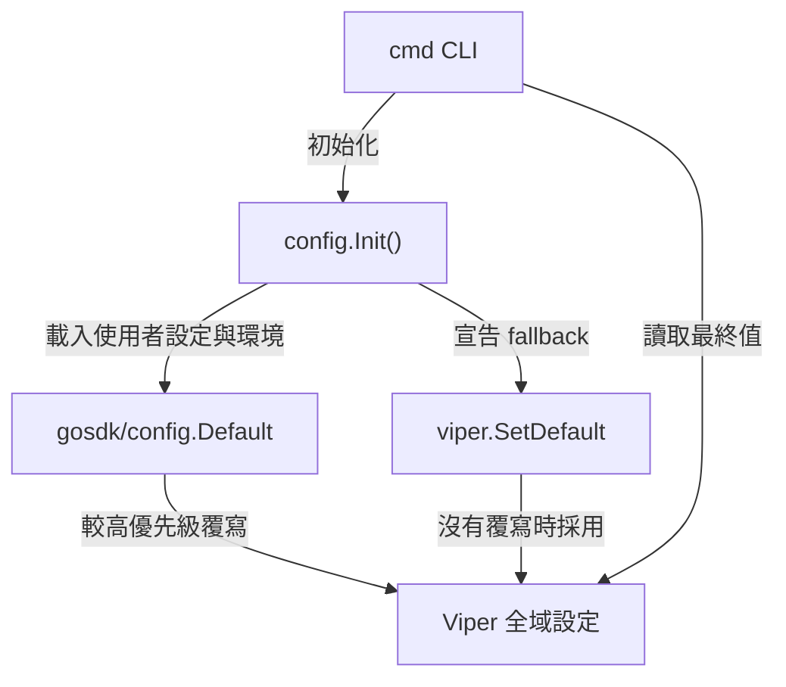

# 架構計畫 — Viper 預設值單一來源 (Architecture Plan)

Status: `completed`

## 1. 目標與範圍 (Goal & Scope)

`CLI/開發者 (CLI/Developer)` 用它 `以 Viper 直接宣告應用程式預設值，並維持使用者設定與環境變數覆寫能力`。

範圍：

- 預設值集中於 `config/config.go`。
- 使用 `viper.SetDefault` 宣告每個預設值。
- `gosdk/config.Default(config.WithAppName("cc-plugin"))` 繼續負責載入應用設定與環境覆寫。
- 移除 `config/default_settings.json`、`go:embed` 與 `config.WithDefaultValue`。

不做什麼 (Out of Scope)：

- 不新增其他設定格式或自訂設定路徑。
- 不改變既有設定鍵名稱或預設值。
- 不修改 `config` 以外的業務邏輯。
- 不在執行期持久化 `viper.SetDefault` 的值。

## 2. 架構決策 (Architecture Decision)

預設值屬於應用程式行為契約，應與使用該值的程式版本一起維護。使用額外 JSON 宣告相同預設值會形成第二個真理來源，增加同步與解析成本。

採用以下分工：

- `config.Init()`：初始化設定系統並宣告所有應用程式預設值。
- `gosdk/config.Default`：載入使用者設定與環境變數。
- `viper.SetDefault`：提供最低優先級 fallback。
- CLI 與業務模組：透過 Viper 讀取最終合併值。

設定優先級維持：

```text
明確設定／環境變數 > 使用者設定檔 > viper.SetDefault
```

## 3. 資料流 (Data Flow)



## 4. 實作結果 (Implementation Result)

- [x] `config/config.go` 直接呼叫 `viper.SetDefault`。
- [x] 移除 `go:embed` 與 `defaultSettingJSON`。
- [x] 移除 `config.WithDefaultValue` 呼叫。
- [x] 刪除 `config/default_settings.json`。
- [x] 更新 `CLAUDE.md` 與 `README.md`。

## 5. 驗證 (Verification)

- [x] `go test ./... -count=1`
- [x] `go vet ./...`
- [x] `git diff --check`
- [x] 程式碼不再引用 `default_settings.json`、`defaultSettingJSON` 或 `WithDefaultValue`。

## 6. 維護規則 (Maintenance Rules)

- 新增設定鍵時，在 `config.Init()` 增加對應的 `viper.SetDefault`。
- 不建立第二份預設設定檔。
- 使用者可覆寫的設定仍由 `gosdk/config` 與 Viper 的既有載入流程處理。
- 若未來需要型別化設定，應在 Viper 合併完成後轉換，不改變本計畫的單一預設來源。
