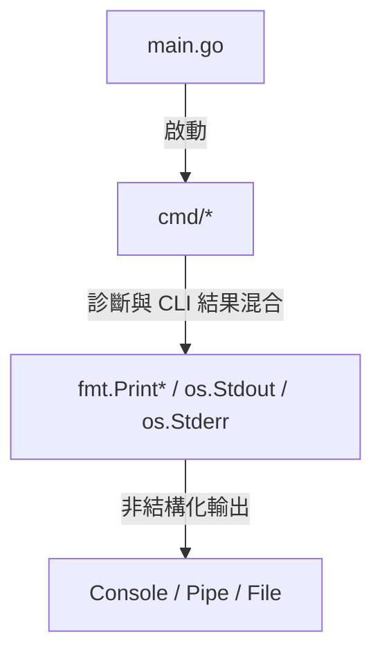
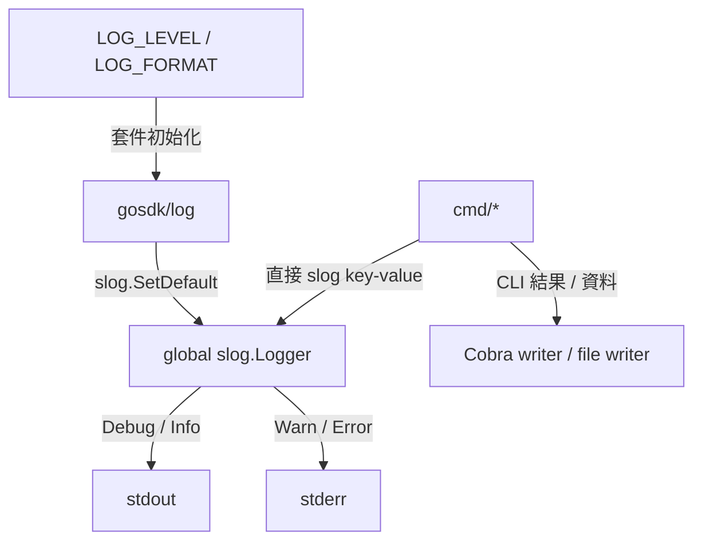

# 架構計畫 — 結構化日誌 (Structured Logging)

Status: `completed`

> 本檔已合併 `2026-07-02-structured-logging.md`，為此功能的唯一規格來源。

## 1. 目標與範圍 (Goal & Scope)

將 `cc-plugin` 的診斷日誌改為 Go 標準庫 `log/slog` 結構化輸出，使排程任務可依日誌等級過濾，並能被 `Loki` 等觀測系統解析。

核心決策：

- 呼叫端直接使用 `slog.Debug` / `slog.Info` / `slog.Warn` / `slog.Error`，不建立專案內 logging wrapper。
- `gosdk/log` 只負責安裝全域 `slog` handler；`cc-plugin` 以 side-effect import 啟動它，不經由 `gosdk/log` 輸出日誌。
- 僅遷移診斷事件；CLI 結果、JSON/CSV/Markdown 資料與檔案內容保持原有 output writer。

不做什麼 (Out of scope):

- 不在 `config/` 新增 `InitLogger`、`log.level` 或 `log.format`。
- 不在 `cc-plugin` 重複實作 handler、等級解析或 stdout/stderr 分流。
- 不修改 `gosdk/log`、Python 腳本與外部技能。
- 不實作日誌檔案輪替或專案自有觀測後端。

## 2. 參考實作與前置條件 (Reference & Prerequisite)

2026-07-16 檢查 `github.com/bizshuk/gosdk/log` 的 `master` (`31c0a77ba8f3`) 後，其行為為：

- 於 package `init()` 中建立並以 `slog.SetDefault()` 安裝全域 logger。
- 直接讀取環境變數 `LOG_LEVEL` 與 `LOG_FORMAT`，不依賴 `viper` 或 `config.Init()`。
- `LOG_LEVEL` 支援 `debug` / `info` / `warn` / `warning` / `error`，預設 `info`。
- `LOG_FORMAT` 支援 `text` / `json`，預設 `text`；非法值 fallback 至預設值。
- `Debug/Info` 輸出至 `stdout`，`Warn/Error` 輸出至 `stderr`。

本專案目前鎖定 `gosdk v0.0.0-20260531165137-bc464a416916`，該版本的 `gosdk/log` 仍使用 `zap`，無法安裝預期的 `slog` handler。實作前必須將 `gosdk` 升級至包含上述改動的版本（檢查時為 `v1.1.1-0.20260716045308-31c0a77ba8f3`），並透過 `go mod tidy` 移除不再需要的間接 `zap` 依賴。

## 3. 實作前架構 (Previous Architecture)

- `main.go` 呼叫 `config.Init()` 與 `cmd.Execute()`，尚未啟動 `gosdk/log`。
- `cmd/root.go` 在命令執行錯誤時直接寫入 `stderr`。
- `cmd/memory/retain.go` 的可繼續清理失敗為診斷警告，但目前使用 `fmt.Fprintf`。
- 其餘 `fmt.Print*` 同時包含 CLI 結果、進度提示、JSON/CSV/Markdown 資料與檔案寫入，不能批次替換。



## 4. 架構位置與邊界 (Placement & Boundaries)

```tree
main.go
├── side-effect import github.com/bizshuk/gosdk/log  # 安裝全域 handler
├── config.Init()                                   # 業務設定
└── cmd.Execute()
    └── cmd/* import log/slog                       # 直接輸出診斷日誌
```

依賴邊界：

- `main` 依賴 `gosdk/log` 的 bootstrap side effect，並依賴 `cmd`。
- `cmd` 只依賴標準庫 `log/slog`，不依賴 `gosdk/log` 的具體型別或 wrapper API。
- `config` 不承擔 logging 職責；日誌設定延續 workspace 慣例，使用 `LOG_LEVEL` / `LOG_FORMAT` 環境變數。
- 業務錯誤繼續以 `fmt.Errorf("context: %w", err)` 回傳；僅在錯誤不中斷流程時直接記錄 `slog.Warn`。

## 5. 介面與資料流 (Interfaces & Data Flow)

| 介面 (Interface) | 輸入 (Input) | 輸出 (Output) | 邊界 (Boundary) |
| :--- | :--- | :--- | :--- |
| `gosdk/log` package `init()` | `LOG_LEVEL`, `LOG_FORMAT` | 全域 `slog.Logger` | 只在 process bootstrap 執行 |
| `slog.Debug/Info/Warn/Error` | 穩定 message + key-value attrs | text 或 JSON 日誌 | 僅診斷事件 |
| Cobra/stdout/file writer | CLI 結果或匯出資料 | 原始文字、JSON、CSV、Markdown | 不經過 `slog` |



## 6. 輸出分類與遷移規則 (Output Classification)

| 類型 (Type) | 例子 | 處理 (Action) |
| :--- | :--- | :--- |
| 診斷警告 | retention 刪除失敗、state 清理失敗 | 改為 `slog.Warn("retention cleanup failed", "source_id", ..., "path", ..., "err", err)` |
| 排程完成事件 | distill 讀取、寫入與真實事實統計 | 改為 `slog.Info`，用 `sources_read`、`memories_written`、`facts_written` 等穩定欄位 |
| CLI 人類可讀結果 | reset/write/retain 成功訊息、export 進度 | 保留原始 output；未來可獨立改為 `cmd.Print*` |
| 機器可讀 stdout | `export gbrain`、`export claudemem`、`extract` 的 JSON | 必須保持純資料，不混入 `slog.Info` |
| 匯出內容 | CSV/Markdown 內容與 index file | 保留 `csv.Writer` / `fmt.Fprintf(file, ...)`，不視為日誌 |
| 終止錯誤 | Cobra `RunE` 回傳的 error | 保留錯誤鏈與單一頂層輸出，避免同一錯誤重複記錄 |

`slog` 欄位統一使用 `snake_case`，錯誤鍵固定為 `err`；使用 bare key-value pairs，例如 `slog.Error("operation failed", "err", err)`。不使用 printf-style message，也不把動態值嵌入 message。

## 7. 清晰與可擴充性檢查 (Clarity & Scalability Check)

1. `gosdk/log` 單一負責 handler 與輸出分流，`cc-plugin` 不複製底層邏輯。
2. 呼叫端依賴 Go 標準庫 API，可在不改動業務碼的情況下更換 handler。
3. CLI 結果與診斷日誌明確分離，避免破壞 pipe 與 JSON/CSV 消費者。
4. 不新增專案自有設定路徑或 logging abstraction，符合 `gosdk` 慣例。
5. JSON 格式可直接交由 `Loki` 日誌管道收集；專案不另設觀測後端。

## 8. 漸進落地步驟 (Incremental Steps)

| 步驟 (Step) | 做什麼 (What) | 驗證 (Verify) | 回滾 (Rollback) |
| :--- | :--- | :--- | :--- |
| `1. 升級 gosdk` | 更新至已採用 `slog` 的 `gosdk`，執行 `go mod tidy` | `go mod graph` 確認直接依賴新版，專案內無 `zap` 來源 | 還原 `go.mod` / `go.sum` |
| `2. 啟動全域 slog` | 在 `main.go` side-effect import `github.com/bizshuk/gosdk/log` | 使用不同 `LOG_LEVEL` / `LOG_FORMAT` 啟動 CLI，確認格式與過濾 | 移除 import |
| `3. 遷移診斷事件` | 逐檔將 retention 警告與 distill 完成事件改為直接 `slog` 呼叫 | `go test ./... -count=1` | 逐檔還原 |
| `4. 驗證輸出合約` | 測試 JSON/CSV 命令 stdout 未混入日誌，並檢查 Warn/Error 進入 stderr | stdout/stderr capture test、`jq` 與 CSV parser 通過 | 還原導致污染的 call site |
| `5. 全面驗證` | 執行靜態分析、建置與測試 | `go vet ./...`、`go build ./...`、`go test ./... -count=1` | 依步驟分批回滾 |

## 9. 驗收條件 (Acceptance Criteria)

- 專案原始碼無 `go.uber.org/zap` import 或 `zap.*` 呼叫，`go mod tidy` 後不因本專案保留 `zap`。
- 診斷事件直接使用 `log/slog`，沒有新增 wrapper 或 `config.InitLogger`。
- `LOG_LEVEL=debug` 開啟 debug，`LOG_LEVEL=error` 過濾低等級日誌。
- `LOG_FORMAT=json` 的每筆日誌均為合法單行 JSON；預設格式為 text。
- `Debug/Info` 與 `Warn/Error` 符合 `gosdk/log` 的 stdout/stderr 分流。
- JSON/CSV/Markdown 輸出與 CLI 結果不被日誌內容污染。
- `go vet ./...`、`go build ./...` 與 `go test ./... -count=1` 全數通過。

## 10. 風險與對策 (Risks & Mitigations)

| 風險 (Risk) | 對策 (Mitigation) |
| :--- | :--- |
| 導入舊版 `gosdk/log` 只初始化 `zap`，`slog` 仍為預設 handler | 將 `gosdk` 版本升級設為第一個可獨立驗證步驟 |
| `slog.Info` 由 `gosdk/log` 輸出至 stdout，可能污染機器可讀資料 | 只在不產生 stdout 資料合約的流程記錄 Info；為 export/extract 加入 capture test |
| package `init()` 只執行一次，runtime 變更環境變數不會重新設定 logger | 將 `LOG_LEVEL` / `LOG_FORMAT` 定義為 process startup 設定，不提供 runtime reload |
| 同一錯誤在業務層與 Cobra 頂層重複記錄 | 可回傳的錯誤只包裝並上傳，不在中間層先記錄 |

## 11. 實作結果 (Implementation Result)

- [x] `gosdk` 升級至 `v1.1.1-0.20260716045308-31c0a77ba8f3`。
- [x] `main.go` side-effect import `github.com/bizshuk/gosdk/log`。
- [x] `cmd/root.go` 的終止錯誤改為 `slog.Error`。
- [x] `cmd/memory/retain.go` 的可繼續清理失敗改為結構化 `slog.Warn`。
- [x] `cmd/memory/distill.go` 的排程完成事件改為結構化 `slog.Info`。
- [x] JSON、CSV、Markdown 與人類可讀 CLI 結果仍使用原始 writer。
- [x] `go mod tidy` 移除專案對 `zap` 的直接需求來源。
