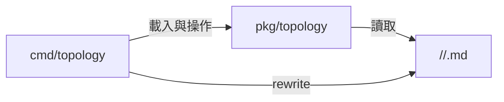

# Topology 套件與 CLI 規格 (Topology Package and CLI Specification)

Status: `completed`

## 目標與邊界 (Goal and Boundaries)

將 Markdown 知識圖譜的解析與運算自 `model/` 抽離，提供可重用的 `pkg/topology`，並以薄層 Cobra 命令公開驗證、查詢與重建能力。

- `pkg/topology` 只依賴標準庫與 `gopkg.in/yaml.v3`，不依賴 `cmd`、`config` 或 `model`。
- `cmd/topology` 負責 flag、stdout、錯誤與檔案寫入流程，不重複圖運算。
- Markdown 檔案仍是唯一資料來源，不新增資料庫或執行期狀態。



## 套件介面 (Package Interface)

| 介面 | 用途 |
| :--- | :--- |
| `LoadTopology(root)` | 解析 zone、entity、dimension、edge 與 backlink |
| `(*Topology).Verify()` | 驗證名稱、zone、kind、relation、斷鏈與 backlink |
| `(*Topology).Unlinked()` | 回傳無入邊與無出邊 entity |
| `(*Topology).BacklinksFor(name)` | 由正向邊確定性重算 backlink |
| `RenderBacklinksSection(...)` | 重寫或附加 Backlinks 區段 |
| `(*Topology).RenderIndex(existing)` | 重建 registry、Mermaid、Frontier 與 Unlinked |

## CLI 合約 (CLI Contract)

```text
cc-plugin topology verify [--root <path>]
cc-plugin topology unlinked [--root <path>]
cc-plugin topology query <entity> [--in|--out] [--depth 1|2]
cc-plugin topology backlinks [--write] [--root <path>]
cc-plugin topology index [--write] [--root <path>]
cc-plugin topology rewrite [--root <path>]
```

- `verify`：有 finding 時輸出每行一項並回傳非零狀態。
- `backlinks`、`index`：預設 dry-run；加 `--write` 才寫檔。
- `rewrite`：聚合重寫 backlinks 與 `_index.md`，供既有整合計畫的單一命令使用。
- 預設 root 為 `plugins/ultra-explore/skills/topology-builder/references`。

## 實作結果 (Implementation Result)

- [x] `model/topology*.go` 與測試移至 `pkg/topology/`。
- [x] 新增 `cmd/topology/` 命令群與整合測試。
- [x] `cmd/root.go` 註冊 `TopologyCmd()`。
- [x] 保留原先規劃的 `query`、`backlinks`、`index` 能力並新增 `rewrite` 聚合命令。
- [x] CLI 輸出使用 Cobra writer，便於測試與嵌入。

## 驗證 (Verification)

```bash
go test ./pkg/topology ./cmd/topology -count=1
go test ./... -count=1
go vet ./...
go build ./...
cc-plugin topology verify --root plugins/ultra-explore/skills/topology-builder/references
```
