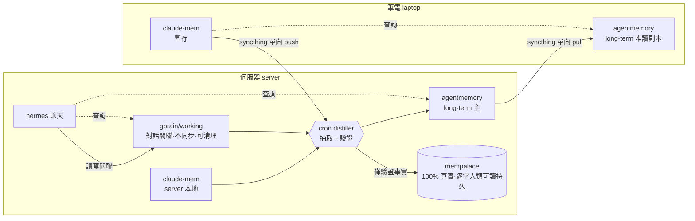

# Agent 記憶系統架構設計 (Agent Memory System Architecture)

日期：2026-05-31
狀態：設計定稿，待寫實作計畫 (writing-plans)

## 概觀 (Overview)

跨兩台機器（筆電 laptop、伺服器 server）的分層 agent 記憶系統。筆電負責產生暫存記憶並與伺服器同步；伺服器集中蒸餾 (distill) 出長期記憶與經過驗證的事實，作為日後解題的快速參考。記憶涵蓋的不只是 LLM 的 prompt/response，也包含人類生活的事實與經驗 (human life facts & experiences)。

## 硬性需求與約束 (Constraints)

- `MUST`：人類可讀記憶 (human-readable memory) 至少要在伺服器端持久化一層。本設計由 `mempalace` 的逐字內容 (verbatim) 擔任此層。
- `mempalace` 儲存 `100% 真實`的事實/經驗；它不需要與任何 agent 整合，定位為可信底本/稽核/人類可讀持久層。
- `mempalace` 寫入隔離 (write-isolated)：只有 cron distiller 能寫入，且只寫已驗證的事實。任何 agent（含 hermes）一律不直接寫 mempalace。
- 同步方式採 `syncthing/rsync`（檔案層級）。
- 蒸餾由`排程腳本/agent (cron distiller)`觸發。
- hermes 透過聊天溝通且對話不連續，需要一層機制跨對話間隔建立關聯性 (continuity)。

## 機器與部署 (Machines)

| 機器            | 角色                                  | 常駐元件                                                                                                                          |
| --------------- | ------------------------------------- | --------------------------------------------------------------------------------------------------------------------------------- |
| 筆電 (laptop)   | 產生暫存記憶、離線查詢                | claude-mem(temp)、agentmemory(long-term 唯讀副本)、Claude Code、Antigravity                                                       |
| 伺服器 (server) | 集中蒸餾、長期/真實記憶、託管多 agent | claude-mem(server 端本地)、gbrain/working、cron distiller、agentmemory(long-term 主)、mempalace、hermes、Claude Code、Antigravity |

## 元件與角色 (Components & Roles)

| 層              | 工具           | 誰寫           | 同步筆電                         | 角色                                                                   |
| --------------- | -------------- | -------------- | -------------------------------- | ---------------------------------------------------------------------- |
| 暫存·查詢(temp) | claude-mem     | 各機器 agents  | 單向 push（筆電→伺服器，供蒸餾） | session 記憶；hermes 僅能讀(MCP)，無法靠 hooks 自動寫                  |
| 對話關聯        | gbrain/working | hermes         | 否                               | 跨不連續對話建關聯；純伺服器、可在蒸餾後清理                           |
| 蒸餾            | cron distiller | —              | —                                | 讀 claude-mem＋gbrain/working → 抽取＋驗證 → 寫 agentmemory＋mempalace |
| long-term·查詢  | agentmemory    | 只有 distiller | 單向 pull（伺服器→筆電）         | 實用長期記憶，日常 recall 主力                                         |
| 真實·持久       | mempalace      | 只有 distiller | 否                               | 驗證 100% 真實子集、逐字人類可讀、不需 agent 整合（滿足 MUST）         |

信任度關係：`agentmemory ⊋ mempalace`。distiller 抽取候選事實 → 廣義實用者寫 agentmemory（long-term 查詢層）→ 其中已驗證 `100% 真實`者才升級寫 mempalace（黃金檔案）。

### 已排除 (Out of Scope)

- `memsearch`：唯一價值是跨庫聯邦檢索 (federated search)。但查詢層已明確為 agentmemory＋claude-mem，兩者各自內建搜尋，且 mempalace 不需 agent 整合，故依 YAGNI 排除。未來若需「單一端點查全部並統一排名」或「語義搜尋 gbrain/working 等非向量庫內容」再列入 Phase 2。
- `codegraph`：程式碼知識圖譜，已是獨立 MCP，與本記憶系統正交，不納入。

## 資料流 (Data Flow)

流程步驟：

1. 筆電 agents（Claude Code、Antigravity）以 claude-mem 擷取暫存記憶。
2. hermes 在伺服器以 gbrain/working 讀寫每位聯絡人/主題的 running notes，靠 wikilinks＋embedding 在不連續對話間建立關聯。
3. cron distiller 定時讀取：筆電同步來的 claude-mem 快照、伺服器本地 claude-mem、gbrain/working。
4. distiller 抽取候選事實/經驗並驗證，寫入 agentmemory（廣義 long-term），其中驗證為 100% 真實者另寫入 mempalace。
5. agentmemory 單向同步回筆電，讓筆電離線也能查長期記憶。
6. 蒸餾完成後，gbrain/working 與 claude-mem 的已消化內容最多保留 30 天後清理。

## 蒸餾器契約 (Distiller Contract)

- 排程 (schedule)：每日凌晨執行一次。
- 輸入 (input)：claude-mem 觀察紀錄（筆電快照＋伺服器本地）、gbrain/working markdown。
- 輸出 (output)：
    - agentmemory：結構化長期記憶（實體、關係、偏好、可重用經驗）。
    - mempalace：通過驗證的 `100% 真實`事實/經驗（逐字保留原句）。
- 驗證政策 (verification policy，預設、可調)：一筆候選事實升級進 mempalace 需滿足任一：
    - 跨 ≥2 來源或 ≥2 對話 session 互相佐證；或
    - 由人類明確確認；或
    - 為人類第一人稱直接陳述/觀察的生活事實。
    - agent 推論 (inference) 未驗證前只留在 agentmemory。
- 冪等性 (idempotency)：以內容指紋/實體鍵去重，重跑不產生重複記憶。
- 增量 (incremental)：以游標/時間戳只處理上次之後的新資料。
- 保留 (retention)：蒸餾消化後的 claude-mem 與 gbrain/working 內容最多保留 30 天，逾期清理；agentmemory 與 mempalace 不受此限，長期保留。

## 同步拓樸 (Sync Topology)

採 syncthing（或 rsync）做檔案層級同步，方向皆`單向`以避開衝突：

| 資料                 | 方向          | 模式                                 | 備註                           |
| -------------------- | ------------- | ------------------------------------ | ------------------------------ |
| claude-mem 資料目錄  | 筆電 → 伺服器 | send-only(筆電)/receive(伺服器)      | 推送暫存供蒸餾；不做兩台間雙向 |
| agentmemory 資料目錄 | 伺服器 → 筆電 | send-only(伺服器)/receive-only(筆電) | 筆電端唯讀查詢                 |
| gbrain/working       | 不同步        | —                                    | 純伺服器                       |
| mempalace            | 不同步        | —                                    | 純伺服器                       |

設計決策：claude-mem 與 agentmemory 皆為 SQLite/Chroma 後端，`不做雙向 live-DB 同步`（會造成資料庫損毀）。每台機器各跑自己的 claude-mem 實例；同步的是資料快照而非即時雙寫。distiller 同時讀「筆電同步來的 claude-mem 快照」與「伺服器本地 claude-mem」。

## 查詢層 (Query Layer)

- 筆電 agents：本地 `claude-mem`(temp) ＋ 同步下來的 `agentmemory`(long-term, 唯讀)。
- hermes：`agentmemory`(long-term) ＋ 自己的 `gbrain/working`（當下脈絡）；若 hermes 能接 claude-mem 的 MCP，亦可選擇性讀 claude-mem。
- mempalace 不在日常查詢路徑；作為可信底本、稽核與人類可讀持久層，需要 ground-truth 時才查。

## hermes 對話連續性 (Continuity)

hermes 每次新對話：經 gbrain/working 取回該聯絡人/主題的 running notes（wikilinks＋embedding 串接當下脈絡），並查 agentmemory 取回已蒸餾的長期事實 → 重建脈絡後回覆。聊天內容先落在 gbrain/working，之後才被蒸餾驗證進 agentmemory/mempalace，因此 mempalace 永遠乾淨。

## 嵌入模型一致性 (Embedding Consistency)

gbrain 既有設定為 `ollama:bge-m3`（1024 維）。建議 agentmemory 與 mempalace 的向量後端 (ChromaDB) 一律使用同一 ollama bge-m3，維持本地優先 (local-first) 與跨庫語義一致；變更 embedding model 需重建各庫 schema/索引。

## 開放問題與分期 (Open Questions / Phases)

- hermes ↔ gbrain/working、hermes ↔ agentmemory 的實際讀寫介面（CLI、檔案、MCP）需於實作期確認。
- 驗證政策的細節門檻（佐證數、人類確認方式）可調。
- Phase 2 候選：memsearch 聯邦檢索層；mempalace → 伺服器端可瀏覽 .md 鏡像（不同步）。

## 驗證 (Validation)

- 端到端：在筆電產生一筆暫存記憶 → 同步 → 跑 distiller → 確認 agentmemory 出現對應長期記憶、且驗證事實出現在 mempalace、agentmemory 同步回筆電可查。
- 寫入隔離：嘗試以非 distiller 路徑寫 mempalace 應被阻擋或不發生。
- 連續性：模擬 hermes 不連續對話，確認能由 gbrain/working＋agentmemory 重建脈絡。
- 冪等性：distiller 重跑同批輸入不產生重複記憶。
