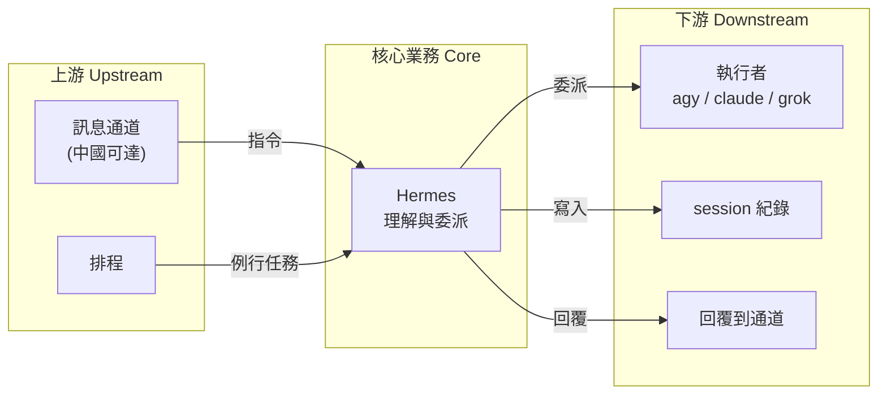
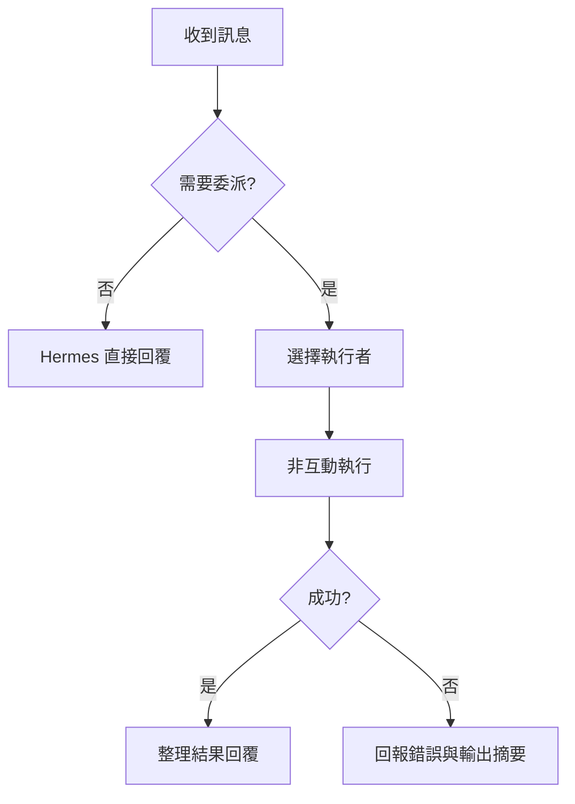

# hermes — 業務分析 (Business Analysis)

## 業務目的 (Purpose)

替使用者本人提供一個`隨時可從訊息 App 指揮`的個人代理：人在中國大陸或行動中時，
仍能透過中國可達的通道下指令，讓家中常駐機器上的 `agy`、`claude`、`grok` 完成工作並回報。

## 常見業務操作 (Common Operations)

- 使用者從聊天室交辦任務（例：修某個 repo 的 bug、整理檔案、查資料），Hermes 回覆結果
- 使用者指定執行者（「用 claude 做」「用 grok 做」），Hermes 照指定委派
- Hermes 依排程主動執行例行任務，把結果推到主通道
- 使用者在同一聊天室追問，Hermes 延續同一工作階段的脈絡

## 上下游服務 (Upstream / Downstream)

`上游 (Upstream):` 使用者在訊息通道送出的訊息；排程觸發
`本體 (Core):` Hermes 理解需求、決定自己處理或委派
`下游 (Downstream):` 執行者（agy／claude／grok）及其背後的模型服務；回覆送回訊息通道；session 紀錄寫入 Hermes 家目錄

## 狀態與流程 (Status / Flow)

尚無程式碼可取得狀態字面值；以流程圖描述主要業務流程。

## 業務約束 (Constraints)

- 通道必須中國可達（使用者需求）；Telegram、Slack、Discord、WhatsApp、Signal 排除
- 執行者限定 `agy`、`claude`、`grok` 三者（使用者需求）
- 委派必須非互動完成，否則閘道端會卡住等不到結果（上游 claude-code skill 建議 print mode）
- 只有授權使用者能下指令（上游閘道各 adapter 提供 allowlist；具體設定待通道決定）

## 風險偵測 (Risk Detection)

| 風險類別 | 結果 |
| :------- | :--- |
| 身分/合規 (KYC/AML) | 有：Feishu／DingTalk／WeCom／QQ 建 bot 需對應平台帳號與開發者身分驗證 |
| 隱私 (Privacy) | 有：對話與委派結果經中國大陸平台傳輸，受當地法規與平台審查；不應透過通道傳送機密 |
| 資料完整性 | 有：執行者以免確認模式跑時，錯誤指令可能直接改動檔案或 repo；需限制工作目錄與授權使用者 |
| 依賴風險 | 有：常駐機器、網路、通道平台、三個執行者的模型服務任一中斷，任務即無法完成 |

## 核心業務 (Core Business)

- 從中國可達的聊天室交辦任務並取得結果（訊息通道 + 任務委派）

## 非核心業務 (Non-core Business)

- 排程例行任務：讓代理主動產出報告，提升常駐價值
- session 紀錄：提供跨對話脈絡，並被 `daily-summary` 用來彙整每日工作
