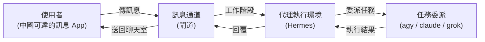

# hermes

部署並設定 [Hermes Agent](https://github.com/NousResearch/hermes-agent) 作為常駐個人代理：
從訊息 App 下指令，由 Hermes 把工作委派給本機的 `agy`、`claude`、`grok` 執行，
並把結果回傳到同一個聊天室。通道必須在中國大陸可直接使用。

現況：`空專案 (Empty project)`，只有文件；以下為要達成的業務定義，進度見 [README.todo](README.todo)。

## 業務領域 (Business Domains)

### 代理執行環境 (Agent Runtime)

在一台常駐機器上安裝 Hermes，設定它自己的推理模型、工具與記憶，
讓它能長時間待命並保留跨 session 的脈絡。

`領域流程 (Domain Flow):`

1. 安裝 Hermes 並建立 Hermes 家目錄
2. 設定推理模型與啟用的工具（至少需要 terminal 能力才能委派）
3. 以常駐程序啟動，session 紀錄寫入家目錄的資料庫

`核心實體 (Key Entities):` Hermes、Hermes 家目錄、工作階段、推理模型

---

### 任務委派 (Task Delegation)

Hermes 本身負責理解需求與拆解，實際的程式碼或檔案工作交給執行者完成。
選哪個執行者由任務性質或使用者指定決定。

`領域流程 (Domain Flow):`

1. Hermes 收到需求，判斷要自己處理還是委派
2. 以非互動模式呼叫 `agy`、`claude` 或 `grok`，指定工作目錄與提示
3. 回收執行者輸出，整理後回覆到原通道

`核心實體 (Key Entities):` 委派、執行者、工作目錄

---

### 訊息通道 (Message Channel)

使用者從手機或桌面的訊息 App 與 Hermes 對話。通道尚未決定，
唯一硬性條件是`中國可達`：Telegram、Slack、Discord、WhatsApp、Signal 被 GFW 封鎖而排除。

`領域流程 (Domain Flow):`

1. 使用者在通道內傳訊息給 Hermes 的 bot 帳號
2. 閘道收到訊息，轉成工作階段交給 Hermes
3. 回覆與 cron 結果送回同一通道或主通道

`核心實體 (Key Entities):` 閘道、通道、主通道

候選通道（上游已有 adapter，皆為中國大陸原生平台）：

| 通道 | 適用對象 | 備註 |
| ---- | ---- | ---- |
| Feishu / Lark | 個人或團隊 bot | 支援 WebSocket 長連線，本機不需對外開 port |
| DingTalk | 企業內部 bot | 支援 WebSocket (Stream) 模式 |
| WeCom（企業微信） | 企業成員 | callback 模式需可被外部呼叫的 URL |
| Weixin（個人微信） | 個人帳號 | 走 iLink Bot API |
| QQ | 個人 bot | QQBot 開放平台 |

---

## 領域關聯 (Domain Relationships)

- 訊息通道是入口，代理執行環境是決策者，任務委派是手腳。
- 三者共用`工作階段`：同一個聊天室的對話與委派結果屬於同一個 session。

## 使用方式 (Usage)

尚無可執行內容。技術脈絡與目前結構見 [CLAUDE.md](CLAUDE.md)。
