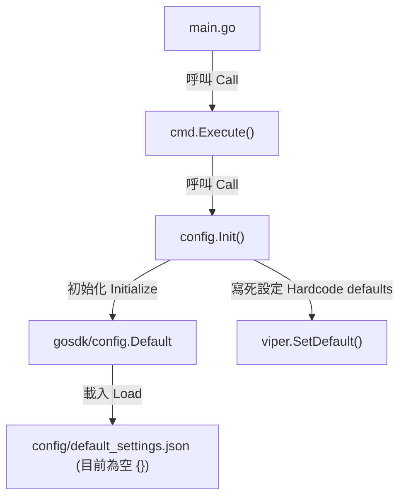
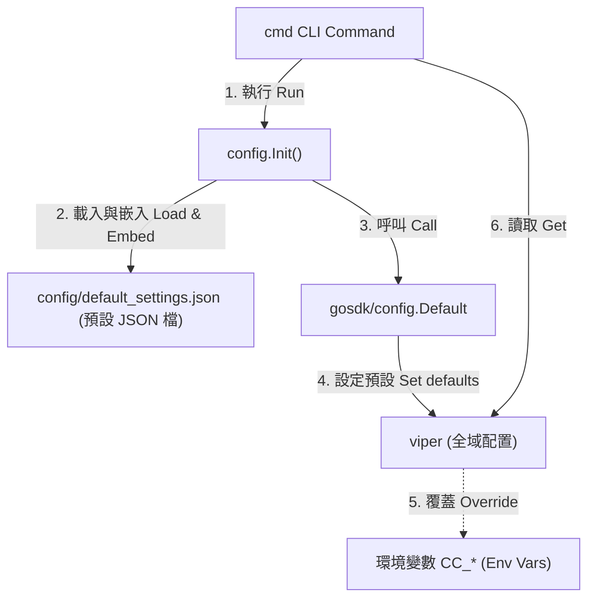

# 架構計畫 — config-externalization (Architecture Plan)

## 1. 目標與範圍 (Goal & Scope)

`CLI/開發者 (CLI/Developer)` 用它 `來將硬編碼的預設設定外化至設定檔以支援靈活配置與環境變數覆蓋`。

不做什麼 (Out of scope):
- 不做除了 `config/config.go` 預設設定之外的其他硬編碼字串（如 SQL 查詢、靜態錯誤字串）的外化。
- 不引進除了 `default_settings.json` 與 `settings.json` 之外的新設定格式或設定來源。
- 不修改目前 `config` 封裝之外的 business/CLI logic，除非是為了與 `viper` 解耦而進行的必要重構（如移除了對 `viper` 的直接依賴）。

## 2. 現況架構 (Current Architecture)

頂層結構:
- `config/`: 設定管理（`config.go`、`default_settings.json`）
- `cmd/`: CLI 進入點（`root.go`、`distill.go` 等）

進入點 (Entry Points):
- `config.Init()`: 在 CLI 啟動時被呼叫，用於初始化設定系統

相關既有模組:
- `github.com/bizshuk/gosdk/config`: 提供 `Default` 方法與配置載入骨架
- `github.com/spf13/viper`: 實際保存設定的設定庫

高改動熱點:
- `config/config.go`: 目前所有預設設定均以 `viper.SetDefault` 硬編碼在此檔案中。

## 3. 架構位置與邊界 (Placement & Boundaries)

放置位置說明:
`config/config.go` 屬於配置管理層。本計畫將此檔案中寫死的預設值轉移到同層的 `config/default_settings.json` 中，使代碼與配置分離。

依賴方向:
- 依賴方向為 `cmd` -> `config` -> `gosdk/config`。
- 其他核心業務模組（如 `model/` 或 `pkg/`）不應依賴 `config` 包，而是透過外部將具體參數（如 `dbPath`）傳遞/注入進去。

邊界:
- 職責：管理預設配置的聲明與載入，支援環境變數的綁定與覆蓋。
- 不碰：不做設定的動態修改或持久化寫入。

## 4. 介面與資料流 (Interfaces & Data Flow)

| 介面/函式名 (Interface/Function) | 輸入參數 (Inputs) | 輸出參數 (Outputs) | 錯誤處理 (Error Handling) | 說明 (Description) |
| :--- | :--- | :--- | :--- | :--- |
| `config.Init` | 無 | 無 | 內部載入/解析 JSON 失敗時由 `gosdk/config` 輸出錯誤日誌，但不中斷執行 | 初始化 Viper 配置，自嵌入的 JSON 載入預設值，並綁定環境變數 |

## 5. 清晰與可擴充性檢查 (Clarity & Scalability Check)

1. 單一職責：是。重構後，`config` 模組僅負責配置的載入與綁定，而具體的預設配置內容完全轉移至 `default_settings.json`。
2. 依賴方向：是。所有依賴方向均從 `cmd` (外層) 指向 `config`，且其他模組已被重構為透過外部參數接收設定值，不存在反向依賴。
3. 可替換：是。由於預設值外化至 JSON 中，在測試或不同部署環境下只需替換或編輯 JSON 檔即可變更預設值，無需重新編譯 Go 二進位檔。
4. 水平擴充：是。配置資訊是唯讀的靜態資源，不保存執行期狀態，無狀態設計使得多實例水平擴充完全不受影響。
5. 擴充點：是。後續若需要新增任何設定項，僅需直接在 `default_settings.json` 中宣告，無需修改 `config.go` 程式碼即可透過 `viper` 讀取到。

## 6. 漸進落地步驟 (Incremental Steps)

| 步驟 (Step) | 做什麼 (What) | 驗證 (Verify) | 回滾 (Rollback) |
| :--- | :--- | :--- | :--- |
| `1. 遷移預設值至 JSON` | 將 `config.go` 中的硬編碼預設值搬移到 `config/default_settings.json` 中。 | 檢查 `config/default_settings.json` 是否為合法 JSON。 | `git checkout config/default_settings.json` |
| `2. 清理 config.go 邏輯` | 在 `config/config.go` 中移除 `viper.SetDefault` 的硬編碼呼叫。 | 執行 `go test ./...` 確保專案編譯與測試通過。 | `git checkout config/config.go` |
| `3. 驗證預設值載入` | 修改 `default_settings.json` 中的一個預設值，並透過 CLI 執行或寫測試來讀取該值，確認其符合修改後的值。 | 讀取出的值與 JSON 修改後一致。 | `git checkout config/default_settings.json` |
| `4. 驗證環境變數覆蓋` | 設定環境變數 `CC_RETENTION_MAX_AGE_DAYS=90` 並執行程序，檢查該設定值是否被成功覆蓋為 `90`。 | 輸出值為 `90`。 | 清除該環境變數。 |

## 7. 風險與假設 (Risks & Assumptions)

- 假設：假定 `gosdk/config` 會正確地將 `default_settings.json` 作為底層預設值，並在使用者有設定 `settings.json` 或環境變數時對其進行覆蓋。
- 批註/風險：如果 `default_settings.json` 的 JSON 格式損壞，可能導致應用程式在啟動時無法正確初始化設定系統。因此在步驟 1 必須確保 JSON 格式完全正確。
