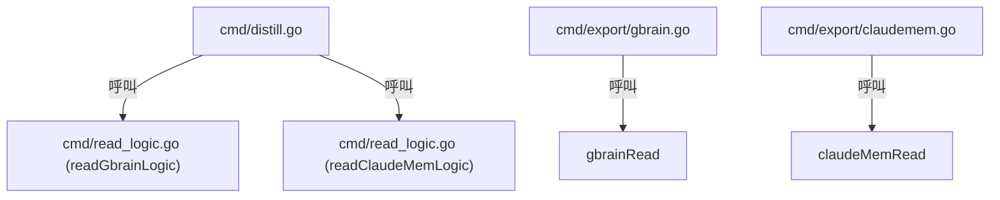
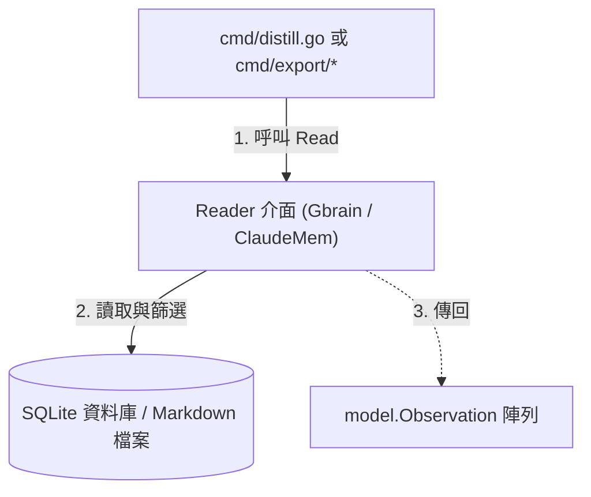

# 架構計畫 — reader-deduplication (Architecture Plan)

## 1. 目標與範圍 (Goal & Scope)

`CLI/開發者 (CLI/Developer)` 用它 `來合併重複的讀取邏輯至獨立的讀取服務中以消除代碼重複並提供統一介面`。

不做什麼 (Out of scope):
- 不做寫入狀態或 cursor 更新邏輯的合併。
- 不引進除了 `gbrain-working` 與 `claude-mem` 之外的其他資料來源。
- 不做讀取邏輯之外的 CLI 命令重構。

## 2. 現況架構 (Current Architecture)

頂層結構:
- `cmd/`: CLI commands (`distill.go`, `export/gbrain.go`, `export/claudemem.go`, `read_logic.go`)
- `model/`: State store and database models (`store.go`, `claudemem.go`, `gbrain.go`)

進入點 (Entry Points):
- `cmd/distill.go`: 呼叫 `readGbrainLogic` 與 `readClaudeMemLogic`
- `cmd/export/gbrain.go`: 呼叫 `gbrainRead`
- `cmd/export/claudemem.go`: 呼叫 `claudeMemRead`

相關既有模組:
- `cmd/read_logic.go`: 包含 `readGbrainLogic` 與 `readClaudeMemLogic`
- `cmd/export/gbrain.go`: 包含 `gbrainRead`
- `cmd/export/claudemem.go`: 包含 `claudeMemRead`

高改動熱點:
- `cmd/read_logic.go`: gbrain 與 claude-mem 讀取邏輯的集中地

## 3. 架構位置與邊界 (Placement & Boundaries)

放置位置說明:
新建 package `internal/service/reader/`。因為它包含核心業務領域的讀取操作，將其與 CLI 命令展示層 (`cmd/`) 分離並放入服務層，符合標準的分層架構。

依賴方向:
- 依賴方向為 `cmd` -> `internal/service/reader` -> `model`。
- `internal/service/reader` 只能依賴 `model`，不能反向依賴 `cmd` 或者是 `config`。

邊界:
- 職責：管理並提供從不同資料源（gbrain 和 claude-mem）讀取並轉換為觀察值 (`Observation`) 的能力。
- 不碰：不做實際的 LLM 蒸餾、Mempalace 寫入、或 CLI 輸出格式化。

## 4. 介面與資料流 (Interfaces & Data Flow)

| 介面/函式名 (Interface/Function) | 輸入參數 (Inputs) | 輸出參數 (Outputs) | 錯誤處理 (Error Handling) | 說明 (Description) |
| :--- | :--- | :--- | :--- | :--- |
| `Reader.Read` | `ctx context.Context`, `store *model.StateStore`, `fromCursor bool` | `[]model.Observation, int64, error` | 查詢/檔案讀取失敗時返回 `error` | 統一的觀察值讀取介面 |
| `NewGbrainReader` | `workingDir string` | `Reader` | 無 | 建立 gbrain 讀取器實例 |
| `NewClaudeMemReader` | `dbPath string` | `Reader` | 無 | 建立 claude-mem 讀取器實例 |

## 5. 清晰與可擴充性檢查 (Clarity & Scalability Check)

1. 單一職責：是。每個 Reader 實例僅負責自單一資料源讀取與格式化觀察值。
2. 依賴方向：是。由外層 `cmd` 依賴 `internal/service/reader`，並且 `internal/service/reader` 依賴 `model`，無循環或反向相依。
3. 可替換：是。讀取器實作了 `Reader` 介面，在測試時可輕鬆使用 mock 替換。
4. 水平擴充：是。服務本身無狀態，只進行唯讀資料轉換。
5. 擴充點：是。後續新增其他讀取器（如 `slack-mem`）只需實作 `Reader` 介面，而無需修改蒸餾或匯出框架。

## 6. 漸進落地步驟 (Incremental Steps)

| 步驟 (Step) | 做什麼 (What) | 驗證 (Verify) | 回滾 (Rollback) |
| :--- | :--- | :--- | :--- |
| `1. 建立 Reader 介面與 gbrain 讀取器` | 建立 `internal/service/reader/reader.go` 與 `gbrain.go`，將 `gbrainRead`/`readGbrainLogic` 遷移合併。 | 執行 `go test ./internal/service/reader/...` 確保單元測試通過。 | `git clean -fd internal/` |
| `2. 建立 claude-mem 讀取器` | 建立 `internal/service/reader/claudemem.go`，將 `claudeMemRead`/`readClaudeMemLogic` 遷移合併。 | 執行 `go test ./internal/service/reader/...` 確保測試通過。 | `git checkout -- internal/service/reader/claudemem.go` |
| `3. 重構 cmd/distill.go` | 將 `cmd/distill.go` 內對舊函式的呼叫替換為使用新讀取器服務。 | 執行 `cc-plugin distill` 驗證其蒸餾行為完全正常。 | `git checkout cmd/distill.go` |
| `4. 重構 cmd/export 命令` | 修改 `cmd/export/gbrain.go` 與 `cmd/export/claudemem.go`，呼叫新服務以移除重複讀取邏輯。 | 執行 `cc-plugin export` 與舊版比對，確認輸出資料總數一致。 | `git checkout cmd/export/` |
| `5. 清理與移除舊邏輯` | 刪除 `cmd/read_logic.go` 與其他地方殘留的重複函式。 | 執行 `go test ./...` 確保整個專案無編譯錯誤。 | `git checkout cmd/read_logic.go` |

## 7. 風氣與假設 (Risks & Assumptions)

- 假設：雖然讀取邏輯已搬移至 `internal/service/reader/`，但 `distill` 與 `export` 依然需要利用 `StateStore` 來維護與檢查 cursor。
- 風險：如果 `dbPath` 傳遞錯誤或目錄權限不足，可能導致 GORM/SQLite 開啟失敗。此風險已在對應的讀取器建構式與 `Read` 錯誤回傳中進行處理。
