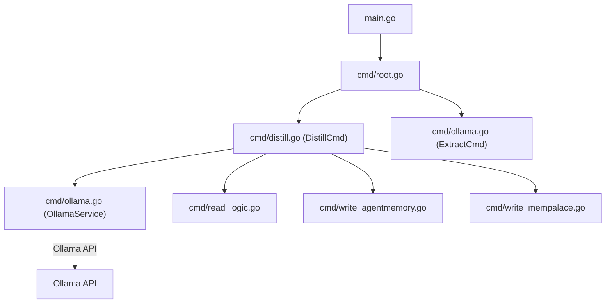
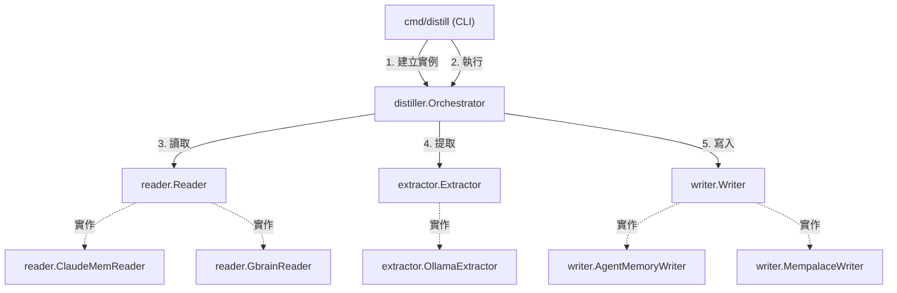

# 架構計畫 — service-layer-extraction (Architecture Plan)

## 1. 目標與範圍 (Goal & Scope)

`CLI/開發者 (CLI/Developer)` 用它 `來將業務編排邏輯自 CLI 層抽離至獨立服務層並實現依賴反轉`。

不做什麼 (Out of scope):
- 不做其他設定項（例如 llm/mempalace 設定）的解耦與重構。
- 不做 `gbrain` 與 `claudemem` 觀察值讀取邏輯的合併，僅做連線傳遞。
- 不引進除了 SQLite 之外的任何資料庫或狀態後端。

## 2. 現況架構 (Current Architecture)

頂層結構:
- `cmd/`: CLI 命令定義（進入點如 `root.go`, `distill.go`, `ollama.go`, `write_agentmemory.go`, `write_mempalace.go`, `read_logic.go`）
- `model/`: 數據庫持久化與模型（`store.go`, `cursor.go`, `seen.go`, `distilled.go`）
- `config/`: 系統配置（`config.go`）

進入點 (Entry Points):
- `cmd.Execute()` 在 `main.go`
- `cmd.DistillCmd`
- `cmd.ExtractCmd`

相關既有模組:
- `cmd/distill.go` 中的 pipeline 編排
- `cmd/ollama.go` 中的 `OllamaService` 提取
- `cmd/read_logic.go` 中的 observations 讀取
- `cmd/write_*.go` 中的 memories & facts 寫入

高改動熱點:
- `cmd/distill.go`

## 3. 架構位置與邊界 (Placement & Boundaries)

放置位置說明:
核心業務編排邏輯與 LLM 提取邏輯將自 `cmd/` 層抽離。新增 `internal/service/` 套件來放置服務層，包含 `distiller/`、`extractor/`、`reader/` 與 `writer/`。新增 `internal/service/` 定義介面，以實現依賴反轉，使 `cmd` 僅負責 CLI 的解析與 Viper 的配置讀取，隨後注入具體實作並啟動服務。

依賴方向:
- 依賴方向為 `cmd` -> `internal/service` -> `model` / `internal/service/interfaces`。
- 服務層與領域層不應依賴 `cmd` 或 `viper`，配置值應在 CLI 層解析後傳遞或經由結構體注入服務。

邊界:
- 職責：`service-layer-extraction` 負責解耦參數解析與業務邏輯，將流程編排（讀取、提取、處理、寫入、狀態更新）內聚於服務層。
- 不碰：不做資料庫 schema 變更，不修改 Ollama 的 API 請求 payload，亦不變更 memories/facts 的定義。

## 4. 介面與資料流 (Interfaces & Data Flow)

| 介面/函式名 (Interface/Function) | 輸入參數 (Inputs) | 輸出參數 (Outputs) | 錯誤處理 (Error Handling) | 說明 (Description) |
| :--- | :--- | :--- | :--- | :--- |
| `extractor.Extractor` | `ctx context.Context`, `obs []model.Observation` | `[]model.Candidate, error` | 通訊失敗或 JSON 解析失敗傳回 `error` | 從觀察值中提取記憶候選項 |
| `reader.Reader` | `ctx context.Context`, `store *model.StateStore`, `fromCursor int64` | `[]model.Observation, int64, error` | 讀取檔案或資料庫失敗傳回 `error` | 讀取原始觀察值並返回最大時間戳 |
| `writer.Writer` | `ctx context.Context`, `memories []model.Memory`, `facts []model.Fact` | `error` | 寫入遠端 API 或執行 CLI 失敗傳回 `error` | 將記憶與事實持久化寫入外部儲存庫 |

## 5. 清晰與可擴充性檢查 (Clarity & Scalability Check)

1. 單一職責：是。重構後，Cobra 模組僅負責 CLI 參數與設定檔解析，`distiller.Orchestrator` 僅負責管道流程編排，各個 `Reader` / `Writer` / `Extractor` 僅負責其對應的通訊或讀寫。
2. 依賴方向：是。服務層不再依賴 `cmd` 與全域 `viper`，所有必要參數與依賴皆透過建構子或方法注入，依賴方向由外層指向內層。
3. 可替換：是。因為定義了 `Extractor`、`Reader` 和 `Writer` 介面，可以很方便地提供 Mock 實作進行單元測試，無須執行實際 CLI 或 Ollama API。
4. 水平擴充：是。服務層本身是無狀態的 (Stateless)，資料庫連線與 API 目標 URL 皆從外部傳入，因此多個 instance 水平部署時不會產生內部狀態衝突。
5. 擴充點：是。如果後續需要新增資料來源（如 `slack-mem`）或 LLM 服務商（如 `Anthropic`），只需新增滿足介面的實作並註冊即可，不需更動 `distiller.Orchestrator` 核心編排邏輯。

## 6. 漸進落地步驟 (Incremental Steps)

| 步驟 (Step) | 做什麼 (What) | 驗證 (Verify) | 回滾 (Rollback) |
| :--- | :--- | :--- | :--- |
| `1. 定義核心介面` | 在 `internal/service/` 下建立介面定義檔，包含 `Extractor`、`Reader` 與 `Writer`。 | 執行 `go build ./internal/service/...` 編譯成功 | `git clean -fd internal/service/` |
| `2. 遷移 Reader 實作` | 將 `cmd/read_logic.go` 內的 gbrain 與 claudemem 讀取邏輯遷移至 `internal/service/reader/`，並實作 `Reader` 介面。 | 執行對應的單元測試，確認讀取邏輯編譯正常 | `git checkout cmd/read_logic.go && rm -rf internal/service/reader/` |
| `3. 遷移 Extractor 實作` | 將 `cmd/ollama.go` 的 `OllamaService` 遷移至 `internal/service/extractor/ollama.go`，實作 `Extractor` 介面，並移除 `viper` 依賴。 | 執行 `go test ./internal/service/extractor/...` 通過 | `git checkout cmd/ollama.go && rm -rf internal/service/extractor/` |
| `4. 遷移 Writer 實作` | 將 `cmd/write_agentmemory.go` 與 `cmd/write_mempalace.go` 的寫入邏輯遷移至 `internal/service/writer/`，實作 `Writer` 介面，並移除 `viper` 依賴。 | 執行 `go build ./internal/service/writer/...` 編譯成功 | `git checkout cmd/write_* && rm -rf internal/service/writer/` |
| `5. 實作 Orchestrator` | 在 `internal/service/distiller/orchestrator.go` 實作 `Orchestrator`，編排整個蒸餾管道。 | 對 `Orchestrator` 撰寫單元測試，以 Mock 驗證流程跑完 | `rm -rf internal/service/distiller/` |
| `6. 修改 CLI 入口` | 修改 `cmd/distill.go` 與 `cmd/ollama.go`，使其讀取 `viper` 設定後，建立實作對象注入給 `Orchestrator` 執行。 | 執行 `go test ./...` 通過，且執行 `cc-plugin distill` 與原先行為一致 | `git checkout cmd/` |

## 7. 風險與假設 (Risks & Assumptions)

- 假設：假定目前的 Ollama API 能在無狀態提取中穩定發揮作用，並且與重構後的 `Extractor` 介面參數對接無誤。
- 風險：如果重構過程中 `Reader` 或 `Writer` 寫入失敗，容易造成中間狀態不同步 or Cursor 資料遺失。因此在落地步驟中，務必建立充足的單元測試，且回滾時應完整重設為當前穩定的 git commit 節點。
