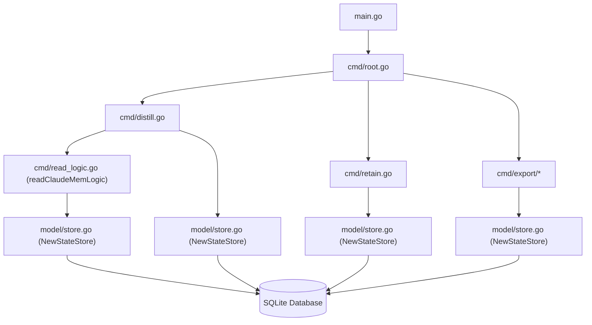
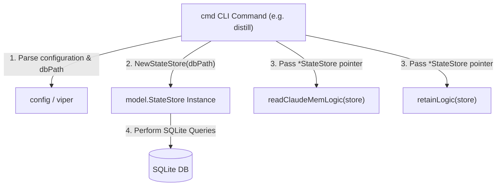

# 架構計畫 — single-state-store (Architecture Plan)

## 1. 目標與範圍 (Goal & Scope)

`CLI/排程器 (CLI/Scheduler)` 用它 `來以單一、解耦的 SQLite 連線安全地讀寫記憶狀態`。

不做什麼 (Out of scope):
- 不做其他設定項（例如 llm/mempalace 設定）的解耦與重構。
- 不做 `gbrain` 與 `claudemem` 觀察值讀取邏輯的合併，僅做連線傳遞。
- 不引進除了 SQLite 之外的任何資料庫或狀態後端。

## 2. 現況架構 (Current Architecture)

頂層結構:
- `cmd/`: Cobra CLI 命令定義（進入點如 `distill.go`, `retain.go`, `reset.go`, `export/`）
- `model/`: 領域模型與資料庫狀態管理（`store.go`, `cursor.go`, `seen.go`, `distilled.go`）

進入點 (Entry Points):
- `main.go`: 執行 `cmd.Execute()`
- `cmd/distill.go`: 蒸餾流程入口
- `cmd/retain.go`: 清理流程入口
- `cmd/reset.go`: 重置流程入口
- `cmd/export/claudemem.go` 與 `cmd/export/gbrain.go`: 匯出流程入口

相關既有模組:
- `model/store.go` (`StateStore`): 定義與管理 `sqlite` 連線與 GORM 操作
- `cmd/state.go` (`NewStateStore`): `cmd` 套件的相容包裝

高改動熱點:
- 核心 CLI 入口如 `cmd/distill.go` 與設定處理 `config/config.go` 改動較為頻繁。

## 3. 架構位置與邊界 (Placement & Boundaries)

放置位置說明:
`StateStore` 位於 `model/` 資料夾，屬於領域持久化層；而 `viper` 屬於全域配置。`NewStateStore` 直接依賴 `viper` 違反了依賴反轉原則，使得 `model` 無法在沒有配置檔環境下獨立測試。重構後，將由外層 `cmd` 解析路徑並透過參數傳遞給 `NewStateStore(dbPath string)`。

依賴方向:
- 依賴方向為 `cmd` -> `model`。
- `model` 不得反向依賴 `viper` 或 `cmd` 的任何元件。

邊界:
- 職責：`single-state-store` 僅負責管理單一 SQLite 資料庫連接的建立、遷移、操作與關閉。
- 不碰：不涉及邏輯本身的過濾、LLM 蒸餾、匯出格式化等。

## 4. 介面與資料流 (Interfaces & Data Flow)

| 介面/函式名 (Interface/Function) | 輸入參數 (Inputs) | 輸出參數 (Outputs) | 錯誤處理 (Error Handling) | 說明 (Description) |
| :--- | :--- | :--- | :--- | :--- |
| `model.NewStateStore` | `dbPath string` | `*StateStore, error` | 無法建立目錄/無法開啟 db/無法 auto-migrate 時傳回 `error` | 初始化單一 StateStore 連線 |
| `readClaudeMemLogic` | `store *model.StateStore` | `[]model.Observation, int64, error` | 查詢 Cursor 或資料庫失敗時傳回 `error` | 使用外部傳入的 store 讀取 claude-mem 觀察值 |
| `retainLogic` | `store *model.StateStore` | `error` | 查詢/刪除/更新 state 失敗時傳回 `error` | 使用外部傳入的 store 執行過期資料清理 |
| `claudeMemRead` | `store *model.StateStore`, `useCursor bool` | `[]model.Observation, int64, error` | 讀取失敗時傳回 `error` | 使用外部傳入的 store 讀取匯出 claude-mem 觀察值 |
| `gbrainRead` | `store *model.StateStore`, `workingDir string`, `useCursor bool` | `[]model.Observation, int64, error` | 讀取失敗時傳回 `error` | 使用外部傳入的 store 讀取匯出 gbrain 觀察值 |

## 5. 清晰與可擴充性檢查 (Clarity & Scalability Check)

1. 單一職責：是。新模組 (解耦後的 StateStore) 僅負責單一 SQLite 連線管理與 cursor / seen / distilled 等狀態表的持久化。
2. 依賴方向：是。所有依賴方向均從 `cmd` (外層) 指向 `model` (內層)，並且移除了 `model` 對 `viper` 的反向依賴。
3. 可替換：是。外部依賴如資料庫路徑是從外部注入的，單元測試時可以直接傳入 `:memory:` 記憶體資料庫。
4. 水平擴充：否。SQLite 本質上是單機嵌入式資料庫，主要用於 CLI 本地儲存，不適用於多實例水平擴充，但已透過單一連線避免了 database is locked 的鎖定衝突。
5. 擴充點：是。如果後續需要更換儲存後端 (如 MySQL/PostgreSQL)，只需要將 `StateStore` 介面抽象化即可，無需更改 CLI/排程層邏輯。

## 6. 漸進落地步驟 (Incremental Steps)

| 步驟 (Step) | 做什麼 (What) | 驗證 (Verify) | 回滾 (Rollback) |
| :--- | :--- | :--- | :--- |
| `1. 調整 NewStateStore 簽名` | 修改 `model/store.go` 的 `NewStateStore` 接收 `dbPath string`。移除 `viper` 依賴。 | 執行 `go test ./model/...` 通過 (需修改 model 測試的初始化) | `git checkout model/store.go` |
| `2. 更新 cmd/state.go 封裝` | 修改 `cmd/state.go` 讓 `NewStateStore()` 取得 `viper` 設定並傳給 `model.NewStateStore`，以保持向後相容。 | 執行 `go test ./cmd/...` 通過 | `git checkout cmd/state.go` |
| `3. 重構 readClaudeMemLogic` | 修改 `cmd/read_logic.go` 的 `readClaudeMemLogic` 接收 `store *StateStore`。移除內部的 `NewStateStore` 與 `store.Close()`。 | 編譯檢查無誤 | `git checkout cmd/read_logic.go` |
| `4. 重構 cmd/distill.go 流程` | 修改 `cmd/distill.go`，將建立的 `store` 傳遞給 `readClaudeMemLogic(store)`。 | 執行 `cc-plugin distill` 執行成功且無 database is locked 錯誤 | `git checkout cmd/distill.go` |
| `5. 重構 cmd/retain.go 流程` | 修改 `cmd/retain.go` 的 `retainLogic` 接收 `store *StateStore`；修改 `RetainCmd` 在 CLI 層建立與關閉 store。 | 執行 `go test ./cmd/...` 通過，且 `cc-plugin retain` 執行成功 | `git checkout cmd/retain.go` |
| `6. 重構 cmd/export 及其他命令` | 修改 `cmd/export/claudemem.go` 與 `cmd/export/gbrain.go` 確保使用解耦後的 `NewStateStore` 呼叫。 | 執行 `go test ./...` 全綠 | `git checkout cmd/` |

## 7. 風險與假設 (Risks & Assumptions)

- 假設：雖然 model 與 viper 解耦，但 CLI 層 (`cmd/`) 依然會繼續使用 `viper` 來讀取與解析設定，並將路徑展開傳入。
- 風險：重構期間如果有多個 concurrent 測試同時對實體 db 進行寫入，可能會產生鎖定。因此單元測試中 `NewStateStore` 應優先改用 `sqlite.Open(":memory:")` 或隨機臨時路徑以避免干涉。
