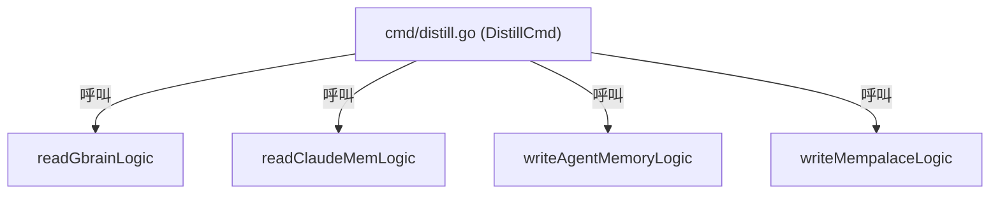
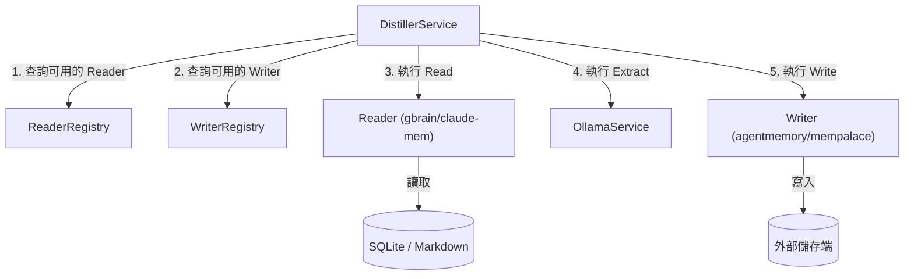

# 架構計畫 — static-registry (Architecture Plan)

## 1. 目標與範圍 (Goal & Scope)

`CLI/開發者 (CLI/Developer)` 用它 `來以動態註冊表解耦記憶來源讀取與寫入，支援靈活擴充而不修改核心邏輯`。

不做什麼 (Out of scope)：
- 不包含除 `gbrain` 與 `claude-mem` 以外的新記憶來源讀取器 (Reader) 具體實作。
- 不包含除 `agentmemory` 與 `mempalace` 以外的新儲存端寫入器 (Writer) 具體實作。
- 不對 `DistillerService` 進行多執行緒併發處理 (Concurrency) 的修改。

## 2. 現況架構 (Current Architecture)

頂層結構：
- `cmd/`：Cobra CLI 命令定義（進入點如 `distill.go`，以及資料庫連線的 `read_logic.go`、`write_agentmemory.go` 與 `write_mempalace.go`）
- `model/`：持久化領域模型與狀態管理

進入點 (Entry Points)：
- `cmd/distill.go` 內的 `DistillCmd`
- `cmd/write_agentmemory.go` 內的 `WriteAgentMemoryCmd`
- `cmd/write_mempalace.go` 內的 `WriteMempalaceCmd`

相關既有模組：
- `cmd/read_logic.go` 中的 `readGbrainLogic` 與 `readClaudeMemLogic`
- `cmd/write_agentmemory.go` 中的 `writeAgentMemoryLogic`
- `cmd/write_mempalace.go` 中的 `writeMempalaceLogic`

高改動熱點：
- `config/settings.json` 與 `cmd/distill.go`

## 3. 架構位置與邊界 (Placement & Boundaries)

放置位置說明：
註冊表介面與實作將放在 `internal/service/reader/` 與 `internal/service/writer/` 目錄中，屬於業務服務層。這樣做能將特定來源/目標的實作細節與核心編排服務 `DistillerService` 分開，滿足依賴反轉原則。

依賴方向：
- 依賴方向為 `internal/service/distiller` -> `internal/service/reader`（僅依賴 `Reader` 介面與註冊表）
- 依賴方向為 `internal/service/distiller` -> `internal/service/writer`（僅依賴 `Writer` 介面與註冊表）
- 特定 `Reader` 實作（如 `gbrain`、`claudemem`）與 `Writer` 實作（如 `agentmemory`、`mempalace`）註冊自身到各自的註冊表中。

邊界：
- 職責：`static-registry` 負責 `Reader` 與 `Writer` 的工廠註冊、實作實例生命週期管理、以及基於設定檔的動態實例取得。
- 不碰：不觸碰資料擷取、LLM 提取處理、指紋生成、或實體儲存端具體協定。

## 4. 介面與資料流 (Interfaces & Data Flow)

| 介面/函式名 (Interface/Function) | 輸入參數 (Inputs) | 輸出參數 (Outputs) | 錯誤處理 (Error Handling) | 說明 (Description) |
| :--- | :--- | :--- | :--- | :--- |
| `reader.Reader` | `ctx context.Context`, `store *model.StateStore`, `fromCursor int64` | `[]model.Observation, int64, error` | 讀取來源失敗或 cursor 查詢失敗時傳回 `error` | 記憶來源讀取介面 |
| `writer.MemoryWriter` | `ctx context.Context`, `memories []model.Memory` | `error` | 寫入 API 失敗時傳回 `error` | Memories 寫入介面 |
| `writer.FactWriter` | `ctx context.Context`, `facts []model.Fact` | `error` | 呼叫 CLI 寫入失敗或權限問題時傳回 `error` | Facts 寫入介面 |
| `reader.RegisterReader` | `name string, r Reader` | 無 | 無 | 註冊指定的 Reader 實作 |
| `reader.GetReader` | `name string` | `Reader, error` | 找不到對應的 Reader 時傳回 `error` | 根據設定取得 Reader 實例 |
| `writer.RegisterMemoryWriter` | `name string, w MemoryWriter` | 無 | 無 | 註冊指定的 MemoryWriter 實作 |
| `writer.GetMemoryWriter` | `name string` | `MemoryWriter, error` | 找不到對應的 MemoryWriter 時傳回 `error` | 根據設定取得 MemoryWriter 實例 |
| `writer.RegisterFactWriter` | `name string, w FactWriter` | 無 | 無 | 註冊指定的 FactWriter 實作 |
| `writer.GetFactWriter` | `name string` | `FactWriter, error` | 找不到對應的 FactWriter 時傳回 `error` | 根據設定取得 FactWriter 實例 |

## 5. 清晰與可擴充性檢查 (Clarity & Scalability Check)

1. 單一職責：`是`。新模組僅負責 `Reader`/`Writer` 的動態註冊與工廠實例化，不參與具體資料傳輸或蒸餾邏輯。
2. 依賴方向：`是`。`distiller` 只依賴定義在核心服務層的註冊表與抽象介面，具體實作在各自的子目錄中，並在初始化時動態向註冊表註冊，無循環依賴。
3. 可替換：`是`。外部來源與目標實作都被隔在 `Reader`、`MemoryWriter` 與 `FactWriter` 介面後。
4. 水平擴充：`是`。註冊表本身是無狀態的，僅作記憶體中的 `map` 儲存，且支援執行期隨時動態新增或替換實例。
5. 擴充點：`是`。未來若要新增 `notion-reader` 或 `slack-reader`，只需實作 `Reader` 介面並在該模組的 `init()` 中註冊，不需修改核心編排流程。

## 6. 漸進落地步驟 (Incremental Steps)

| 步驟 (Step) | 做什麼 (What) | 驗證 (Verify) | 回滾 (Rollback) |
| :--- | :--- | :--- | :--- |
| `1. 定義介面與註冊管理邏輯` | 在 `internal/service/reader/` 與 `internal/service/writer/` 建立 `registry.go` 的註冊管理邏輯與介面定義 | 執行 `go test ./internal/service/...` 通過 | `rm -rf internal/service/reader/registry.go internal/service/writer/registry.go` |
| `2. 封裝既有 Reader 實作` | 將既有的 `gbrain` 與 `claudemem` 讀取邏輯封裝為實作了 `Reader` 介面的結構，並在其 `init()` 中註冊自己 | 編譯通過，且單元測試無 regression | `git checkout internal/service/reader/` |
| `3. 封裝既有 Writer 實作` | 將既有的 `agentmemory` 與 `mempalace` 寫入邏輯封裝為實作了對應寫入器介面的結構，並在其 `init()` 中註冊自己 | 編譯通過，且單元測試無 regression | `git checkout internal/service/writer/` |
| `4. 重構 Distiller 核心編排` | 修改 `DistillerService` 自 `settings.json` 讀取 `distiller.sources` 與 `distiller.stores` 設定，並動態從註冊表取得實例進行處理，替換原先硬編碼的調用 | 手動執行 `cc-plugin distill`，比對日誌輸出，確認功能與資料完全正常 | `git checkout internal/service/distiller/` |

## 7. 風險與假設 (Risks & Assumptions)

- 假設：雖然使用了動態註冊表，但目前所有的 Reader/Writer 實作依然在編譯期靜態連結（透過 `import _ "..."` 載入以執行 `init()`），並非動態連結庫 (Dynamic Link Library) 或 plugin 機制。
- 風險：如果設定檔中的 `sources` 或 `stores` 包含未註冊的名稱，將會在取得實例時回傳錯誤，導致 distill 流程中斷。對策：在取得實例失敗時回傳清晰的錯誤訊息，並在初始化時提供已註冊項目的清單以便診斷。
