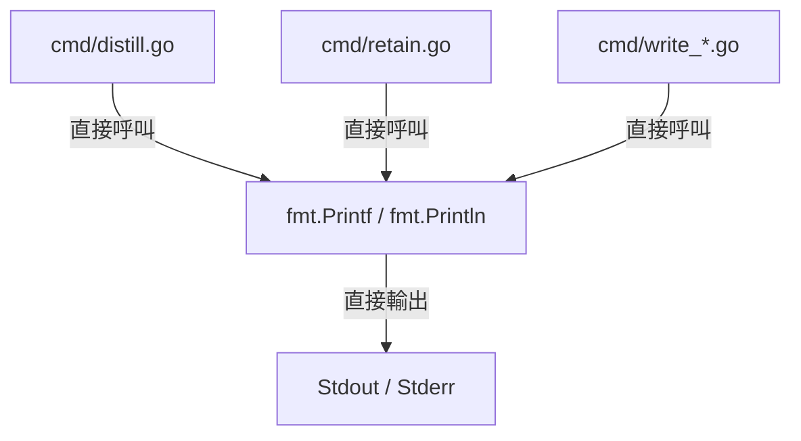
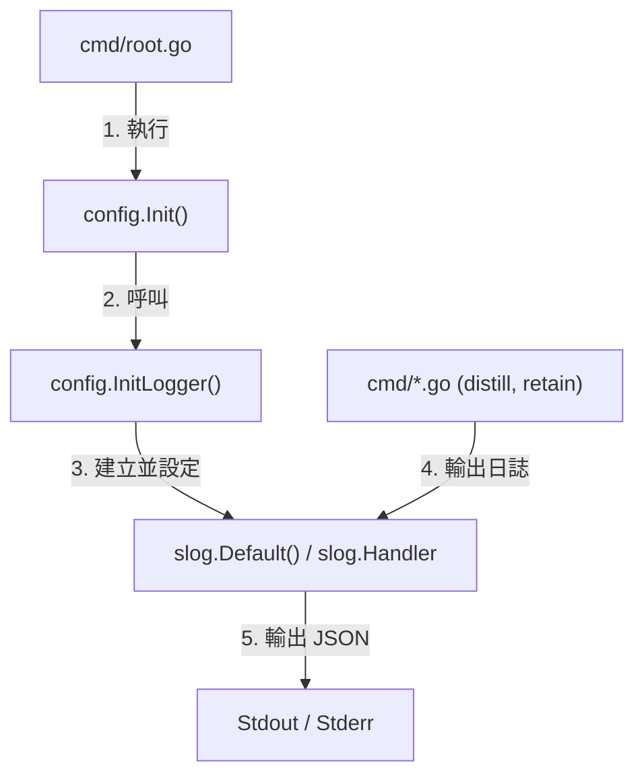

# 架構計畫 — structured-logging (Architecture Plan)

## 1. 目標與範圍 (Goal & Scope)

`CLI/開發者 (CLI/Developer)` 用它 `來將全域日誌輸出遷移至結構化的 log/slog，以支援現代觀測性與日誌等級過濾`。

不做什麼 (Out of scope):
- 不修改底層 `gosdk/log` 的基礎設定，直接由 `cc-plugin` 連接至 `gosdk/log` 提供的標準 `zap` 全域實例或原生 `slog` 處理器。
- 不為外部輔助技能（如 Apple calendar、reminders、python 腳本）提供整合，僅針對 `cc-plugin` 的 Go CLI 工具做修改。
- 不做日誌寫入檔案邏輯，僅設定輸出至 `stdout` 或 `stderr`。

## 2. 現況架構 (Current Architecture)

頂層結構:
- `cmd/`: Cobra CLI 命令定義（進入點如 `distill.go`, `retain.go`, `write_*.go`）
- `config/`: 系統設定管理與初始化（`config.go`）

進入點 (Entry Points):
- `main.go`: 執行 `cmd.Execute()`
- `cmd/distill.go`: 蒸餾流程入口
- `cmd/retain.go`: 清理流程入口

相關既有模組:
- `fmt`: 用於輸出日誌的 Go 標準庫

## 3. 架構位置與邊界 (Placement & Boundaries)

放置位置說明:
日誌功能位於 `config/` 與 `cmd/`。在 `config.Init()` 中對 `slog` 進行全域設置（如設定預設 Handler），而在 `cmd/` 各個子命令模組中直接呼叫 `slog` 套件進行日誌輸出。

依賴方向:
- 依賴方向為 `cmd` -> `slog`。
- `slog` 為 Go 內建標準庫，無需額外引進第三方包。

邊界:
- 職責：管理日誌等級與輸出格式的初始化，提供統一、結構化的日誌呼叫。
- 不碰：業務邏輯與錯誤回復邏輯。

## 4. 介面與資料流 (Interfaces & Data Flow)

| 介面/函式名 (Interface/Function) | 輸入參數 (Inputs) | 輸出參數 (Outputs) | 錯誤處理 (Error Handling) | 說明 (Description) |
| :--- | :--- | :--- | :--- | :--- |
| `config.InitLogger` | `levelStr string`, `formatStr string` | `error` | 無法解析日誌等級時傳回 `error` | 初始化 `slog` 的全域 Handler |
| `slog.Info` | `msg string`, `args ...any` | 無 | 無 | 輸出 Info 層級日誌 |
| `slog.Debug` | `msg string`, `args ...any` | 無 | 無 | 輸出 Debug 層級日誌 |
| `slog.Error` | `msg string`, `args ...any` | 無 | 無 | 輸出 Error 層級日誌並攜帶錯誤內容 |

## 5. 清晰與可擴充性檢查 (Clarity & Scalability Check)

1. 單一職責：是。`slog` 處理器只負責日誌的格式化與輸出。
2. 依賴方向：是。所有依賴均由外層業務碼指向標準庫 `slog`，無反向依賴。
3. 可替換：是。透過 `slog.SetDefault` 可以輕易更換不同的日誌後端或 Handler（例如自訂的 JSONHandler、ConsoleHandler 或橋接至第三方日誌庫）。
4. 水平擴充：是。日誌輸出為無狀態，支援多實例高併發輸出。
5. 擴充點：是。若日誌需流向 `Loki`，只需在 `slog.Handler` 中增加輸出轉接器，無需更改業務呼叫端。

## 6. 漸進落地步驟 (Incremental Steps)

| 步驟 (Step) | 做什麼 (What) | 驗證 (Verify) | 回滾 (Rollback) |
| :--- | :--- | :--- | :--- |
| `1. 新增日誌設定與初始化` | 在 `config/config.go` 中新增 `log.level` 與 `log.format` 預設設定，並實作 `config.InitLogger` 初始化 `slog` 預設 Handler。 | 執行 `go test ./config/...` 通過 | `git checkout config/` |
| `2. 在 root.go 呼叫初始化` | 修改 `cmd/root.go` 的 `init()`，在 `config.Init()` 後呼叫日誌初始化邏輯。 | 編譯檢查無誤 | `git checkout cmd/root.go` |
| `3. 遷移 distill.go 日誌` | 將 `cmd/distill.go` 中的 `fmt.Printf` / `fmt.Println` 替換為 `slog.Info` 或 `slog.Debug` | 執行 `cc-plugin distill` 無 error 且正常輸出日誌 | `git checkout cmd/distill.go` |
| `4. 遷移 retain.go 及其他命令` | 將 `cmd/retain.go` 及其餘命令 (`cmd/write_*.go`) 中的 `fmt.Printf` 替換為 `slog` 對應的日誌方法。 | 執行 `go test ./cmd/...` 通過 | `git checkout cmd/` |
| `5. 驗證日誌過濾` | 透過 `LOG_LEVEL=debug` 環境變數執行 `cc-plugin distill`，驗證 debug 層級日誌正常顯示。 | 確認輸出格式為 JSON，且 debug 日誌存在 | 還原設定值 |

## 7. 風險與假設 (Risks & Assumptions)

- 假設：雖然 `slog` 在 Go 1.21 引入，但由於專案使用 Go 1.26.3，故無版本相容性風險。
- 風險：如果直接使用 `slog.JSONHandler` 輸出，原有的 console 可讀性會降低。為此，在本地 `PROFILE` 不為 `prod` 時，預設使用 `slog.NewTextHandler` 以維持良好的 console 體驗。
