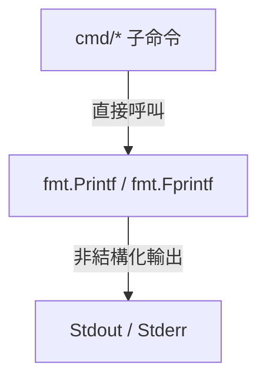
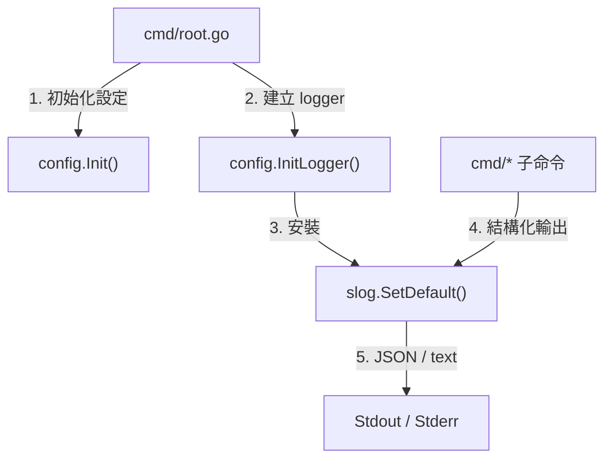

# 架構計畫 — structured-logging (Architecture Plan)

## 1. 目標與範圍 (Goal & Scope)

`CLI/開發者 (CLI/Developer)` 用它 `來將全域日誌輸出遷移至結構化的 log/slog，以支援現代觀測性與日誌等級過濾`。

不做什麼 (Out of scope):

- 不修改底層 `gosdk/log`。
- 不為外部輔助技能或 Python 腳本提供整合。
- 不做日誌檔案輪替；日誌僅輸出至 `stdout` 或 `stderr`。

## 2. 現況架構 (Current Architecture)

- `main.go`: 執行 `cmd.Execute()`。
- `cmd/root.go`: 初始化設定並註冊 Cobra 子命令。
- `cmd/*.go`: 個別命令直接使用 `fmt.Printf`、`fmt.Println` 或 `fmt.Fprintf`。
- `config/config.go`: 管理全域設定，尚未提供 logger 初始化介面。

## 3. 架構位置與邊界 (Placement & Boundaries)

- `config.InitLogger` 只負責解析日誌等級與格式，建立 `slog.Handler`。
- `cmd/root.go` 在設定初始化後安裝預設 logger。
- 各子命令只呼叫 `slog.Debug`、`slog.Info`、`slog.Warn`、`slog.Error`，不自行建立 handler。
- 依賴方向固定為 `cmd` → `config` → Go 標準庫 `log/slog`。

## 4. 介面與資料流 (Interfaces & Data Flow)

| 介面/函式 (Interface/Function) | 輸入 (Input) | 輸出 (Output) | 錯誤處理 (Error Handling) |
| :--- | :--- | :--- | :--- |
| `config.InitLogger` | `level string`, `format string`, `writer io.Writer` | `*slog.Logger, error` | 不支援的 level/format 回傳錯誤 |
| `slog.Logger` | `message` 與結構化欄位 | JSON 或 text log | 呼叫端仍以 `%w` 包裝業務錯誤 |

## 5. 清晰與可擴充性檢查 (Clarity & Scalability Check)

1. `config.InitLogger` 只管理 logger 建立，不承載命令業務邏輯。
2. `slog` 為 Go 標準庫，不新增第三方依賴。
3. 測試可注入 `bytes.Buffer`，不需攔截全域 stdout。
4. 未來若需送往 `Loki`，可更換 handler，不需修改呼叫端。

## 6. 漸進落地步驟 (Incremental Steps)

| 步驟 (Step) | 做什麼 (What) | 驗證 (Verify) | 回滾 (Rollback) |
| :--- | :--- | :--- | :--- |
| `1. 新增 logger 初始化` | 在 `config/` 實作 `InitLogger`，支援 JSON/text 與四種等級 | `go test ./config/...` | 還原 `config/` 變更 |
| `2. 接入 CLI root` | 在設定初始化後呼叫 `slog.SetDefault` | `go test ./cmd/...` | 還原 `cmd/root.go` |
| `3. 遷移非業務輸出` | 將保留中的 CLI 命令輸出逐步改為具名欄位 | `go test ./...` | 逐檔還原 |
| `4. 驗證格式與過濾` | 以測試 buffer 驗證 JSON 可解析、debug 等級可開關 | logger 測試通過 | 還原 logger 設定 |

## 7. 風險與假設 (Risks & Assumptions)

- CLI 的人類可讀結果不應全數轉成 log；資料輸出與操作結果仍走 stdout，診斷資訊才走 logger。
- 全域 logger 會影響所有命令，初始化錯誤必須在 Cobra 執行前明確回傳。
