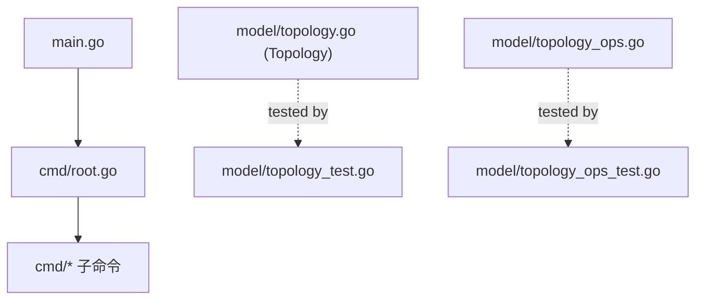
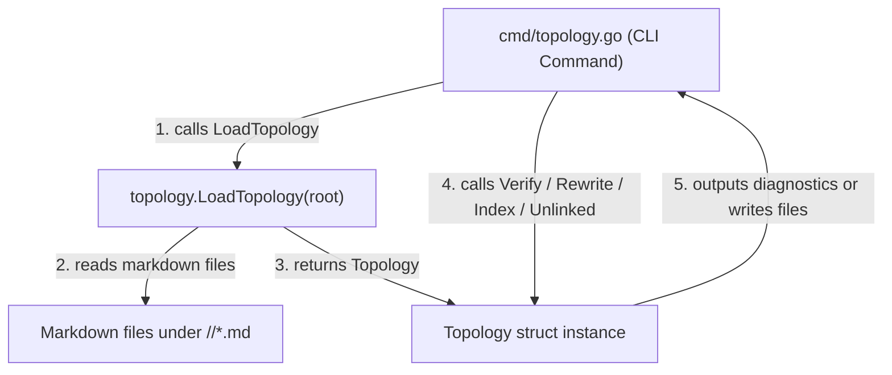

# 架構計畫 — topology-extraction (Architecture Plan)

## 1. 目標與範圍 (Goal & Scope)

`CLI/開發者 (CLI/Developer)` 用它 `來將知識圖譜解析邏輯自核心模型層抽離至獨立套件並提供 CLI 命令進行驗證與操作`。

不做什麼 (Out of scope):
- 不修改知識圖譜解析（Topology）的核心演算法與 AST 樹狀結構走訪邏輯。
- 不引進除了 `pkg/topology/` 之外的額外套件（例如不引入外部圖資料庫）。
- 不變更其他 CLI 子命令或持久化流程。

## 2. 現況架構 (Current Architecture)

頂層結構:
- `model/`: 領域資料結構，且目前包含了拓撲解析邏輯（`topology.go`, `topology_ops.go`）。
- `cmd/`: Cobra CLI 命令定義（進入點如 `root.go` 等）。

進入點 (Entry Points):
- `main.go`: 執行 `cmd.Execute()`。

相關既有模組:
- `model/topology.go`: 定義與載入拓撲圖模型（例如 `Topology`, `TopoEntity`, `LoadTopology` 等）。
- `model/topology_ops.go`: 提供拓撲驗證與連結渲染邏輯（例如 `Verify`, `BacklinksFor`, `RenderBacklinksSection`, `RenderIndex`, `Unlinked` 等）。

高改動熱點:
- 目前拓撲相關檔案沒有直接被核心流程引用，僅在單元測試 `topology_test.go` 與 `topology_ops_test.go` 中運行。

## 3. 架構位置與邊界 (Placement & Boundaries)

位置說明:
`Topology` 相關的檔案 `topology.go` 與 `topology_ops.go` 目前位於 `model/` 套件中，這違反了單一職責原則。重構後將這些解析與計算邏輯移至 `pkg/topology/` 套件下，使其成為一個純粹的工具庫。同時，在 `cmd/` 套件下新增 `cmd/topology.go`，提供外部呼叫的命令行介面，保持架構層級的清晰。

依賴方向:
- 依賴方向為 `cmd` -> `pkg/topology`。
- `pkg/topology` 屬於獨立套件，不依賴 `model`、`config`、`cmd` 或 any other 專案內部套件。

邊界:
- 職責：`pkg/topology` 負責載入與解析本地 Markdown 知識圖譜，驗證維度、關係邊、反向連結，並產出/重寫對應的 Markdown index 與 backlinks 區段。
- 不碰：不觸及其他 CLI 子命令、設定載入或持久化流程。

## 4. 介面與資料流 (Interfaces & Data Flow)

| 介面/函式名 (Interface/Function) | 輸入參數 (Inputs) | 輸出參數 (Outputs) | 錯誤處理 (Error Handling) | 說明 (Description) |
| :--- | :--- | :--- | :--- | :--- |
| `topology.LoadTopology` | `root string` | `*Topology, error` | 讀取目錄或解析失敗時傳回 `error` | 載入指定目錄下的 Markdown 檔案建圖 |
| `(*Topology).Verify` | 無 | `[]string` | 無 (傳回診斷 findings 陣列) | 驗證圖的完整性與連結規則 |
| `(*Topology).BacklinksFor` | `name string` | `[]string` | 無 | 計算指定實體的所有反向連結 |
| `topology.RenderBacklinksSection` | `content string, lines []string` | `string` | 無 | 渲染反向連結段落至 Markdown 內容中 |
| `(*Topology).RenderIndex` | `existing string` | `string` | 無 | 產生或重寫 `_index.md` 索引檔內容 |
| `(*Topology).Unlinked` | 無 | `noInbound, noOutbound []string` | 無 | 尋找圖中孤立或未連接的實體 |

## 5. 清晰與可擴充性檢查 (Clarity & Scalability Check)

1. 單一職責：是。新模組 `pkg/topology` 僅負責 Markdown 知識圖譜的圖結構載入、解析與驗證，與其他狀態管理分離。
2. 依賴方向：是。`pkg/topology` 沒有引用任何 `model`、`cmd` 或 `config` 資源，僅有外層 CLI 引用它。
3. 可替換：是。路徑與檔案讀取對象由外部注入，單元測試時可以使用暫存目錄與 mock 檔案。
4. 水平擴充：不適用。作為本地 CLI 的靜態分析工具，無需考慮無狀態/多實例部署之水平擴充需求。
5. 擴充點：是。如果後續要支援其他知識圖譜標準（例如 Obsidian、Logseq 格式），可直接在 `pkg/topology` 內部抽換或擴充解析器，CLI 層程式碼完全不需要變更。

## 6. 漸進落地步驟 (Incremental Steps)

| 步驟 (Step) | 做什麼 (What) | 驗證 (Verify) | 回滾 (Rollback) |
| :--- | :--- | :--- | :--- |
| `1. 建立獨立工具目錄` | 在 `pkg/` 底下建立 `pkg/topology/` 目錄。 | 建立目錄完成 | `rm -rf pkg/topology/` |
| `2. 搬遷程式碼檔案` | 將 `model/topology.go`, `model/topology_ops.go` 與對應的 `*_test.go` 移至 `pkg/topology/`。 | 檔案搬遷完成 | `git checkout model/` |
| `3. 修改 Package 宣告與 Imports` | 將搬遷後檔案的 package 名稱改為 `topology`，並修復 imports 以確保可單度編譯。 | 執行 `go test ./pkg/topology/...` 通過 | `git checkout model/` 且清理 `pkg/topology` |
| `4. 建立 cmd/topology.go` | 在 `cmd/` 下建立 `topology.go` 檔案，引入 `pkg/topology` 並定義 `verify`, `rewrite`, `unlinked` 等 Cobra 子指令。 | 執行 `go test ./cmd/...` 通過 | `git checkout cmd/` |
| `5. 註冊子命令至 Root` | 在 `cmd/root.go` 註冊 `topology` 子命令。 | 執行 `go build -o cc-plugin main.go` 後執行 `cc-plugin topology --help` 出現對應命令 | `git checkout cmd/root.go` |
| `6. 全鏈路驗證` | 執行 `cc-plugin topology verify --root plugins/general/skills/topology-builder/references`。 | 確認無 error 回傳或正常列出違規 findings | 無須回滾 |

## 7. 風險與假設 (Risks & Assumptions)

- 假設：假定知識圖譜的檔案格式均符合現行維度與反向連結規範。
- 風險：如果 Markdown 檔案中有非常規語法或未預期的 formatting，可能導致 parser 解析不全。為此，`Verify()` 命令在解析出錯時應提供明確的文件行號提示，並可容忍未標記的 section。
