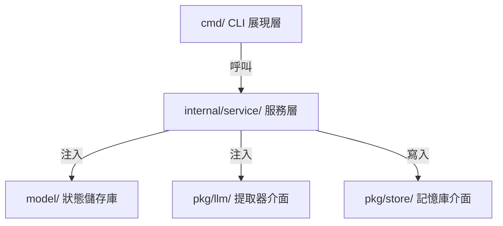

# Feature: 服務層抽取與依賴反轉 (Service Layer Extraction & Dependency Inversion)

## 問題陳述 (Problem Statement)

`cmd/` 目錄同時承擔「CLI 參數解析」與「業務流程編排」兩種職責，導致：

- 無法在非 CLI 環境下重用蒸餾邏輯
- 單元測試被迫啟動完整的 Cobra 命令
- `viper` 全域設定在 `model/`、`cmd/`、`config/` 三處被直接呼叫

具體痛點：

- [cmd/distill.go](../cmd/distill.go#L34-L156) 的 `RunE` 函式中，Cobra 命令列工具直接編排了讀取觀察值、呼叫 Ollama 服務、進行指紋過濾、寫入 API 與呼叫外部 CLI
- [cmd/ollama.go](../cmd/ollama.go) 中 `OllamaService` 與 `ExtractCmd` 放在同一檔案，直接讀取 `viper` 全域設定
- `cmd.DistillCmd` 直接依賴具體的 `NewOllamaService` 實作，未來切換 LLM 供應商需修改 distill 核心代碼

## 目標架構 (Target Architecture)



## 介面契約 (Interface Contracts)

```go
// pkg/llm/extractor.go
type Extractor interface {
    Extract(ctx context.Context, obs []model.Observation) ([]model.Candidate, error)
}

// pkg/reader/reader.go
type Reader interface {
    Read(ctx context.Context, store *model.StateStore) ([]model.Observation, int64, error)
}

// pkg/writer/writer.go
type Writer interface {
    Write(ctx context.Context, memories []model.Memory, facts []model.Fact) error
}
```

## 受影響檔案 (Affected Files)

| 原始路徑 | 新路徑 | 職責 |
| :--- | :--- | :--- |
| `cmd/distill.go` (混合邏輯) | `cmd/distill.go` (CLI) + `internal/service/distill.go` (Service) | CLI 僅保留參數解析，蒸餾流程移至服務 |
| `cmd/ollama.go` | `internal/service/extractor/ollama.go` | `OllamaService` 實作 `Extractor` 介面 |
| `cmd/read_logic.go` | `internal/service/reader/` | 拆分為 `gbrain.go` 與 `claudemem.go` |
| `cmd/write_*.go` | `internal/service/writer/` | 封裝成各自的 `Writer` 實作 |

## 實作步驟 (Implementation Steps)

1. 在 `internal/service/` 下建立 `distiller/`、`reader/`、`writer/`、`extractor/` 子目錄
2. 定義 `Extractor`、`Reader`、`Writer` 介面契約（置於 `pkg/llm/`、`internal/service/reader/`、`internal/service/writer/`）
3. 將 `cmd/distill.go` 中的蒸餾編排邏輯遷移至 `internal/service/distiller/orchestrator.go`
4. 將 `OllamaService` 從 `cmd/ollama.go` 遷移至 `internal/service/extractor/ollama.go`，並宣告其滿足 `Extractor` 介面
5. 重構 `cmd/distill.go` 與 `cmd/ollama.go`，使其僅負責 Viper 參數綁定並呼叫對應服務

## 驗證方式 (Verification)

- 執行 `go test ./internal/service/...` 確認服務層測試綠燈
- 對 `DistillerService` 補上特徵測試 (Characterization Test) 與 Mock 測試
- 手動執行 `cc-plugin distill` 確認外部行為無變化

## 來源 (Source Plans)

- [`architecture-cc-plugin.md`](architecture-cc-plugin.md) §3, §4, §6 Phase 3
- [`architecture-cc-plugin-evolution.md`](architecture-cc-plugin-evolution.md) §3, §5
- [`architecture-cc-plugin-decoupling.md`](architecture-cc-plugin-decoupling.md) §3, §5
- [`architecture-system-modularization.md`](architecture-system-modularization.md) §3, §4
- [`architecture-cc-distiller.md`](architecture-cc-distiller.md) §3, §4, §6 第二階段