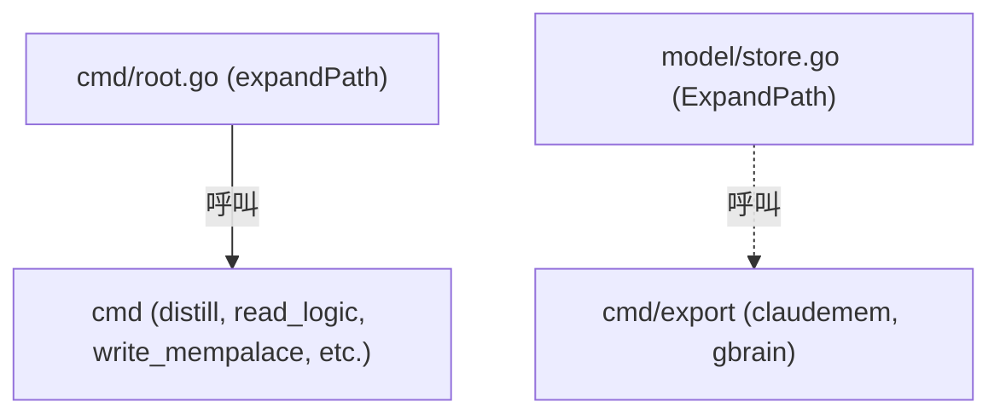
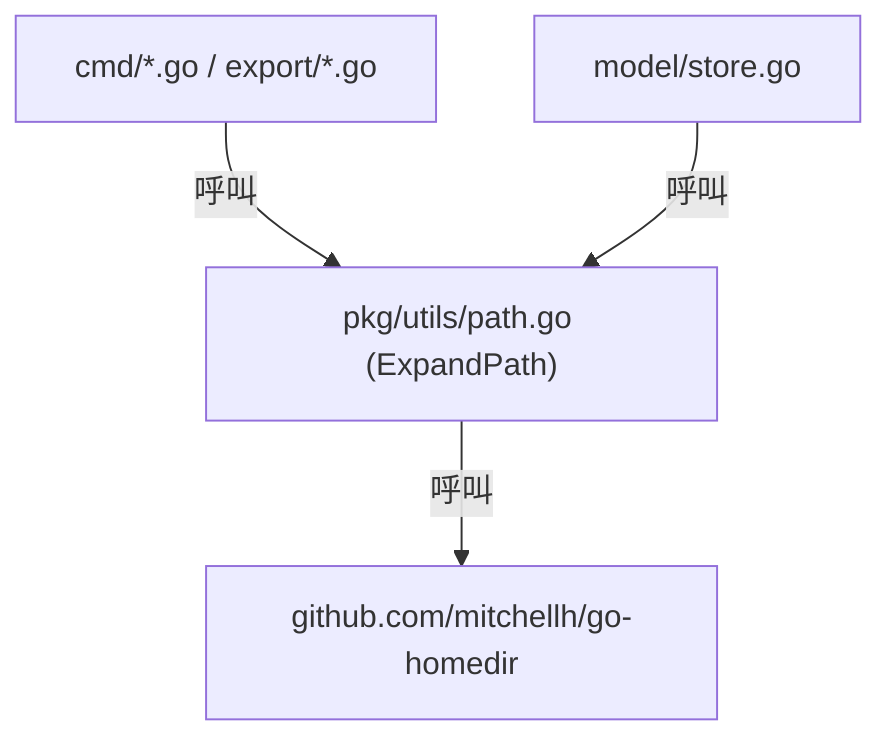

# 架構計畫 — utility-extraction (Architecture Plan)

## 1. 目標與範圍 (Goal & Scope)

`開發者 (Developer)` 用它 `來將公用路徑展開程式碼從 CLI 與領域模型層抽離至 pkg/utils，並收斂臨時目錄路徑，以減少代碼冗餘與分層依賴`。

不做什麼 (Out of Scope)：
- 不對除了 `expandPath` 以外的其他輔助工具進行抽離。
- 不修改 any 其他的 CLI 命令業務邏輯或外部 API 呼叫。
- 不在此 feature 中進行其他的結構化日誌遷移或狀態庫重構。

## 2. 現況架構 (Current Architecture)

現況下，`expandPath` 實作在 `cmd/root.go` 且為 package 內 private 函數，而 `ExpandPath` 實作在 `model/store.go` 且為 public 導出函數。這導致 `model` (領域層) 反向被依賴為工具提供者，且代碼重複。

相關模組清單：
- [cmd/root.go](file:///Users/shuk/projects/cc-plugin/cmd/root.go)
- [model/store.go](file:///Users/shuk/projects/cc-plugin/model/store.go)
- [cmd/distill.go](file:///Users/shuk/projects/cc-plugin/cmd/distill.go)
- [cmd/read_logic.go](file:///Users/shuk/projects/cc-plugin/cmd/read_logic.go)
- [cmd/retain.go](file:///Users/shuk/projects/cc-plugin/cmd/retain.go)
- [cmd/write_mempalace.go](file:///Users/shuk/projects/cc-plugin/cmd/write_mempalace.go)
- [cmd/export/claudemem.go](file:///Users/shuk/projects/cc-plugin/cmd/export/claudemem.go)
- [cmd/export/gbrain.go](file:///Users/shuk/projects/cc-plugin/cmd/export/gbrain.go)
- [config/config.go](file:///Users/shuk/projects/cc-plugin/config/config.go)

## 3. 架構位置與邊界 (Placement & Boundaries)

新建 `pkg/utils/path.go` 放置 `utils.ExpandPath`。符合 `Go 開發工具包/工具層` 只能由上往下依賴，且工具套件不依賴任何業務與模型之原則。

依賴方向：
- `cmd/*` 與 `cmd/export/*` -> `pkg/utils`
- `model/*` -> `pkg/utils`
- `pkg/utils` -> 無內部模組之依賴

邊界：
- `pkg/utils` 僅提供與領域和業務無關的通用輔助工具，不包含任何資料庫狀態與設定初始化邏輯。

## 4. 介面與資料流 (Interfaces & Data Flow)

| 介面/函式 (Interface/Function) | 輸入 (Input) | 輸出 (Output) | 錯誤處理 (Error Handling) |
| :--- | :--- | :--- | :--- |
| `utils.ExpandPath` | `path string` | `string` | 內部捕捉並返回原路徑 |

## 5. 清晰與可擴充性檢查 (Clarity & Scalability Check)

1. 單一職責：新模組只有一個變更理由？
   是，`pkg/utils/path.go` 僅負責路徑處理與展開，無其他變更理由。
2. 依賴方向：沒有內層指向外層？沒有循環相依？
   是，`pkg/utils` 為最底層，不依賴任何內部模組，無循環依賴。
3. 可替換：外部依賴（DB、第三方服務）都隔在介面後？
   是，路徑展開為無狀態的純函數，不依賴任何資料庫或外部 HTTP 服務。
4. 水平擴充：無狀態、可多實例部署？
   是，無狀態工具。
5. 擴充點：下一個同類 feature 可以不改核心就加入？
   是，若未來有其他通用工具，可在 `pkg/utils` 新增檔案（例如 `string.go`、`math.go` 等），不會影響 `path.go`。

## 6. 漸進落地步驟 (Incremental Steps)

| 步驟 (Step) | 做什麼 (What) | 驗證 (Verify) | 回滾 (Rollback) |
| :--- | :--- | :--- | :--- |
| 1 | 建立 `pkg/utils/path.go` 並實作 `ExpandPath` | 執行 `go test ./pkg/utils` 測試（新增測試檔） | 刪除 `pkg/utils/path.go` |
| 2 | 修改 `model/store.go` 移除其 `ExpandPath` 並調用 `pkg/utils` | 執行 `go test ./model/...` 確認編譯與測試通過 | `git restore model/store.go` |
| 3 | 修改 `cmd/export/*.go` 改為調用 `pkg/utils.ExpandPath` | 執行 `go test ./cmd/export/...` 確認編譯通過 | `git restore cmd/export/` |
| 4 | 修改 `cmd/root.go` 移除 `expandPath` 實作並將 `cmd` 內所有呼叫端改為 `pkg/utils.ExpandPath` | 執行 `go test ./cmd/...` 確認編譯與測試通過 | `git restore cmd/` |
| 5 | 修改 `config/config.go` 中的 `temp_dir` 預設值為 `~/.cache/cc-plugin/mempalace-temp` | 啟動 distill 或 mempalace CLI，檢查是否在 `~/.cache/cc-plugin/` 建立臨時目錄 | `git restore config/config.go` |

## 7. Risks & Assumptions (風險與假設)

- 假設 `mitchellh/go-homedir` 的行為在所有 macOS/Unix 系統上都一致，不影響現有的設定檔與狀態資料庫載入。
- 臨時目錄變更至 `~/.cache/cc-plugin/mempalace-temp` 後，需確保應用有權限對該目錄進行讀寫（通常在使用者家目錄下，權限無虞）。
