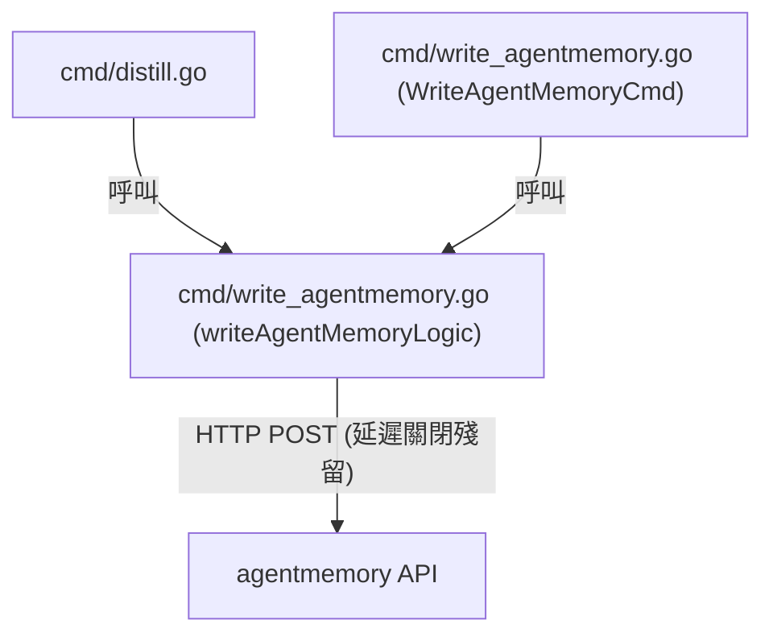
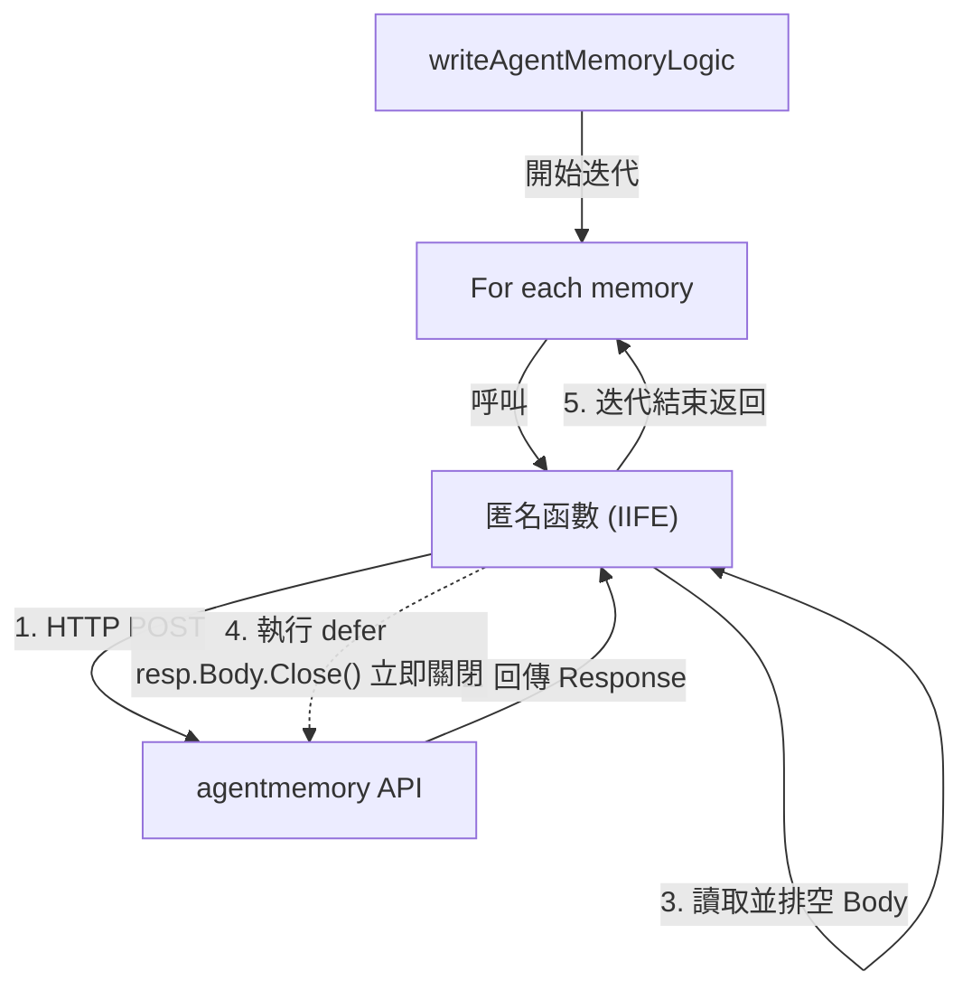

# 架構計畫 — resource-leak-fix (Architecture Plan)

## 1. 目標與範圍 (Goal & Scope)

`開發者 (Developer)` 用它 `來修復 writeAgentMemoryLogic 中迴圈內 defer 導致的連線與檔案描述符資源洩漏，確保大量記憶寫入時系統的穩定性`。

不做什麼 (Out of Scope)：
- 不修改 `writeAgentMemoryLogic` 以外的任何業務邏輯。
- 不更改 `agentmemory` API 端點與資料結構。
- 不涉及 SQLite 狀態庫或 distill 核心邏輯。

## 2. 現況架構 (Current Architecture)

現況下，在 `cmd/write_agentmemory.go` 的 `writeAgentMemoryLogic` 函數中，`defer resp.Body.Close()` 被放置於 `for` 迴圈內部。在 Go 中，`defer` 延遲調用僅於當前包裝函數返回時執行，而非於當前迴圈迭代結束時執行。這會導致批次發送大量記憶（例如上千筆）時，多個 HTTP 回應主體同時保持開啟，造成網路連線與檔案描述符累積，進而觸發系統的 `too many open files` 錯誤與記憶體洩漏風險。

現況架構與呼叫關係：

相關既有模組：
- [cmd/write_agentmemory.go](file:///Users/shuk/projects/cc-plugin/cmd/write_agentmemory.go)
- [cmd/distill.go](file:///Users/shuk/projects/cc-plugin/cmd/distill.go)

## 3. 架構位置與邊界 (Placement & Boundaries)

位置說明：
此變更將直接在 `cmd/write_agentmemory.go` 內的 `writeAgentMemoryLogic` 中實作。在後續重構中，此函數將被遷移至服務層，但其內部 HTTP 請求的關閉語法與邊界將保持不變。

依賴方向：
- `cmd/write_agentmemory.go` -> `net/http` (標準庫)
- `cmd/write_agentmemory.go` -> `model` (領域模型)

邊界：
- 僅限於 `writeAgentMemoryLogic` 內部單個 HTTP 請求生命週期的正確管理。
- 不觸及 `model/store.go` 狀態庫、`OllamaService` 抽取服務以及與 mempalace 寫入相關的流程。

## 4. 介面與資料流 (Interfaces & Data Flow)

| 介面/函式 (Interface/Function) | 輸入 (Input) | 輸出 (Output) | 錯誤處理 (Error Handling) | 說明 (Description) |
| :--- | :--- | :--- | :--- | :--- |
| `writeAgentMemoryLogic` | `memories []model.Memory, url string` | `error` | HTTP 發送失敗或 API 回傳非 2xx/201 時回傳 `error` | 批次寫入記憶至 agentmemory 服務 |

修改後的資料流：

## 5. 清晰與可擴充性檢查 (Clarity & Scalability Check)

1. 單一職責：是。新結構中，匿名函數僅負責單個 HTTP 請求生命週期的正確管理，變更理由單一。
2. 依賴方向：是。無循環相依，僅由外層 CLI/服務層調用標準庫與模型層。
3. 可替換：是。API 端點從外部傳入，便於單元測試中替換為 mock 的 HTTP 伺服器。
4. 水平擴充：是。由於資源（連線與檔案描述符）在每次迭代中及時釋放，程式在處理超大批次（1000+）資料時能保持極佳的水平擴充效能。
5. 擴充點：是。若未來需支援不同的 HTTP headers 或 API 認證機制，可在單個請求的匿名函數內獨立修改，不影響批次處理的外層結構。

## 6. 漸進落地步驟 (Incremental Steps)

| 步驟 (Step) | 做什麼 (What) | 驗證 (Verify) | 回滾 (Rollback) |
| :--- | :--- | :--- | :--- |
| 1 | 建立單元測試 `cmd/write_agentmemory_test.go`，模擬大批次寫入（例如 1000 筆）並調用 `writeAgentMemoryLogic` | 執行 `go test ./cmd/...` 通過 | `rm cmd/write_agentmemory_test.go` |
| 2 | 修改 `writeAgentMemoryLogic`，將迴圈內部的 HTTP Post 呼叫與 `defer resp.Body.Close()` 封裝至匿名函數中 | 執行 `go test ./cmd/...` 通過 | `git checkout cmd/write_agentmemory.go` |
| 3 | 在測試中使用 `net/http/httptest` 建立 mock 伺服器，模擬寫入成功/失敗，並驗證連線及時關閉 | 測試通過，且在高併發下無 FD 累積 | `git checkout cmd/` |

## 7. 風險與假設 (Risks & Assumptions)

- 假設：假定 agentmemory 伺服器支援連線複用 (Connection Keep-Alive)。在正確排空 (drain) 且關閉 `Body` 後，Go 的 `http.Client` 會自動將 TCP 連線放回連線池，有助於提高寫入效能。
- 風險：如果 mock 測試中的連線未被正常複用，可能導致 local port 耗盡。需確保 `io.Copy(io.Discard, resp.Body)` 有被正確執行以完全排空回應主體。
