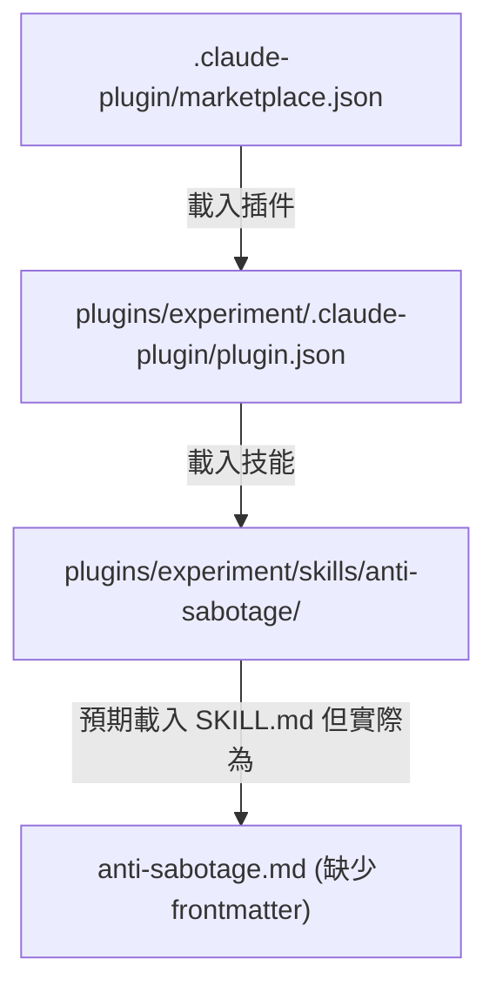
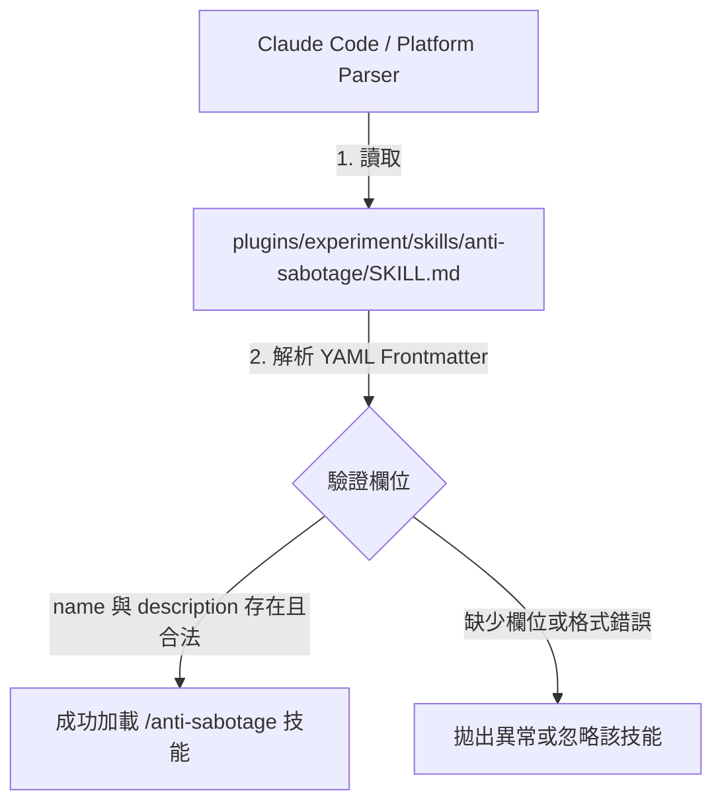

# 架構計畫 — skill-md-renaming (Architecture Plan)

## 1. 目標與範圍 (Goal & Scope)

`開發者 (Developer)` 用它 `來將特定插件的技能 markdown 檔重命名為標準的 SKILL.md 並加上 frontmatter，以符合 agentskills.io 規範與平台自動發現機制`。

不做什麼 (Out of Scope)：
- 不修改 `anti-sabotage` 技能內部的具體查驗與邏輯。
- 不新增或修改 Go / Python 的 CLI 編譯代碼或執行流程。
- 不涉及 Go CLI 或資料持久化邏輯。

## 2. 現況架構 (Current Architecture)

現況下，在 `plugins/experiment/skills/anti-sabotage/` 目錄中，技能的主說明文件命名為 `anti-sabotage.md`，且檔案頂端缺少符合 `agentskills.io` 規範的 YAML frontmatter 詮釋資料。這會導致 `Claude Code` 或其他 `skills` 平台在掃描插件目錄時，無法依據統一的 `SKILL.md` 命名慣例自動探索此技能，或因為缺少 `name` 與 `description` 等必要 frontmatter 欄位而無法載入。

現況架構與呼叫關係：

相關既有模組：
- [plugins/experiment/skills/anti-sabotage/anti-sabotage.md](../plugins/experiment/skills/anti-sabotage/anti-sabotage.md)
- [plugins/experiment/.claude-plugin/plugin.json](../plugins/experiment/.claude-plugin/plugin.json)
- [.claude-plugin/marketplace.json](../.claude-plugin/marketplace.json)

## 3. 架構位置與邊界 (Placement & Boundaries)

位置說明：
此變更將直接在 `plugins/experiment/skills/anti-sabotage/` 目錄下實作。重命名檔案並修改其 header 以符合 metadata 標準。

依賴方向：
- `plugin.json` -> `SKILL.md` (透過目錄自動尋找)
- `marketplace.json` -> `plugin.json`

邊界：
- 僅限於 `anti-sabotage` 技能的檔案名稱、frontmatter 宣告與相關 manifest 設定的修正。
- 不涉及 `cmd/` 下的 CLI 邏輯或 `model/` 資料結構。

## 4. 介面與資料流 (Interfaces & Data Flow)

| 介面/合約 (Interface/Contract) | 輸入 (Input) | 輸出 (Output) | 錯誤處理 (Error Handling) | 說明 (Description) |
| :--- | :--- | :--- | :--- | :--- |
| `SKILL.md` metadata | YAML frontmatter (`name`, `description`) | YAML / Markdown parse | YAML validation error | 符合 `agentskills.io` 規範的技能詮釋資料 |

修改後的資料流：

## 5. 清晰與可擴充性檢查 (Clarity & Scalability Check)

1. 單一職責：是。新結構僅修正單個技能的檔名與 frontmatter，讓其僅具備宣告技能詮釋資料的職責。
2. 依賴方向：是。無循環相依。Manifest 指向技能目錄，技能目錄下有標準檔名的詮釋資料檔。
3. 可替換：是。透過標準化的 `SKILL.md` 介面，此技能可容易地被移植、複製或在不同的 plugin/agent environment 中直接加載。
4. 水平擴充：是。未來新增任何技能時，均使用相同的 `SKILL.md` 命名與 YAML 格式，平台無需修改任何 parser 邏輯即可自動識別。
5. 擴充點：是。若未來需支援額外的 metadata 欄位（如 `platforms`, `user-invocable`），僅需在 YAML frontmatter 中新增對應的 key-value 對，不影響現有的 parser 行為。

## 6. 漸進落地步驟 (Incremental Steps)

| 步驟 (Step) | 做什麼 (What) | 驗證 (Verify) | 回滾 (Rollback) |
| :--- | :--- | :--- | :--- |
| 1 | 在 `plugins/experiment/skills/anti-sabotage/` 中建立臨時備份，並執行 `git mv` 將 `anti-sabotage.md` 重新命名為 `SKILL.md` | 檔案目錄下出現 `SKILL.md` 且 `anti-sabotage.md` 消失 | `git mv plugins/experiment/skills/anti-sabotage/SKILL.md plugins/experiment/skills/anti-sabotage/anti-sabotage.md` |
| 2 | 在 `SKILL.md` 的頂端加入符合 standard/full 規範的 YAML frontmatter | 執行 `npx skills add .` 或使用 yaml parser 進行 schema 檢驗，確保 frontmatter 無語法錯誤 | 移除 `SKILL.md` 頂部的 frontmatter 內容 |
| 3 | 檢查並更新 `plugins/experiment/.claude-plugin/plugin.json` 中的 `skills` 陣列，確認路徑無誤且包含該目錄 | 執行 `jq -e . plugins/experiment/.claude-plugin/plugin.json` 通過 | `git checkout plugins/experiment/.claude-plugin/plugin.json` |
| 4 | 檢查 `.claude-plugin/marketplace.json` 以確保包含 `experiment` 插件，且相關關鍵字與描述為最新 | 執行 `jq -e . .claude-plugin/marketplace.json` 通過 | `git checkout .claude-plugin/marketplace.json` |

## 7. 風險與假設 (Risks & Assumptions)

- 假設：假定 `Claude Code` 平台符合 `agentskills.io` 的 `SKILL.md` 標準，能自動讀取目錄下的 `SKILL.md` 並解構其 frontmatter 的 `name` 與 `description`。
- 風險：如果 `SKILL.md` frontmatter 的 `name` 欄位與資料夾名稱不一致（即不是 `anti-sabotage`），平台將無法載入或會報錯。對策：確保 frontmatter 中的 `name` 欄位為 `anti-sabotage` 且目錄名亦為 `anti-sabotage`。
