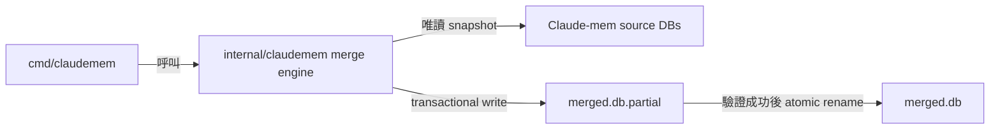
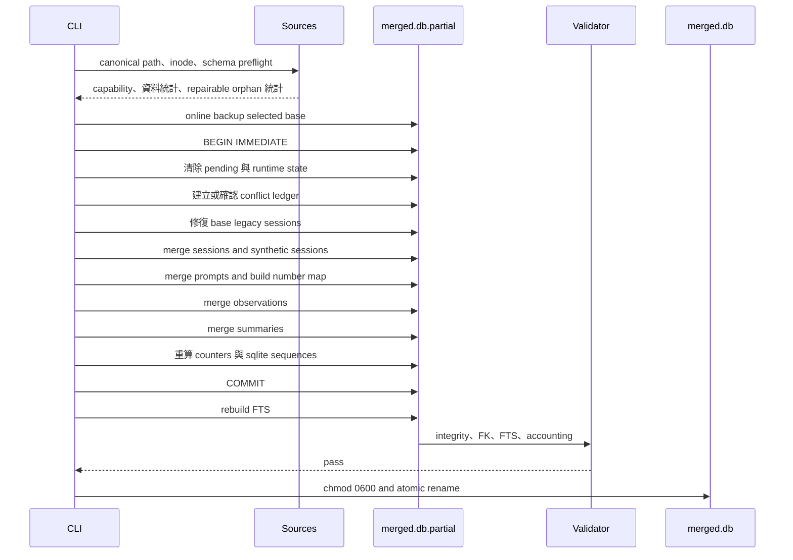

# Claude-mem 多資料庫無衝突整併設計

日期：`2026-07-16`

狀態：`approved, pending implementation` — 2026-07-22 驗證 `cmd/export/` 尚無 merge 實作，
故自 `docs/specs/` 移入 `plans/`；實作完成後回收至 `docs/specs/`。

## 1. 目標與範圍 (Goal & Scope)

新增 `cc-plugin claudemem merge`，將兩個以上 Claude-mem SQLite 資料庫整併成新的資料庫檔案。所有來源保持唯讀；來源的 SQLite integer ID 不視為跨資料庫識別，合併結果必須重新配置 ID、修復可辨識的 legacy orphan、去除重複內容並以確定性規則處理內容衝突。

成功條件：

- 相同來源組合與順序可重跑，不產生重複資料。
- 多個來源使用相同 integer ID 時不發生碰撞或資料遺失。
- 相同 logical session 可跨來源合併。
- 不同 logical sessions 使用相同 `memory_session_id` 時可確定性重新映射。
- 來源包含 Claude-mem 歷史 orphan 時，output 可修復關聯並通過 foreign-key check。
- Output 只在完整性驗證全部通過後出現。
- 任一失敗不得修改來源或留下看似成功的 output。

不在本次範圍：

- 不直接修改正在使用的 `~/.claude-mem/claude-mem.db`。
- 不提供 live in-place merge。
- 不以 JSON export/import 作為主要搬移格式。
- 不合併 `pending_messages`、FTS index data、worker runtime state。
- 不取代或重構既有 `export claudemem`；該命令暫時維持既有契約。
- 不負責啟停 Claude-mem worker 或自動替換正式資料庫。
- 不處理 Chroma/vector store；output 啟用後由 Claude-mem 自行重新同步。

為保存無法放回 Claude-mem 單值欄位的 conflicting variants，output 會加入 tool-owned namespaced table `cc_plugin_merge_conflicts`。該表不改動 Claude-mem `schema_versions`，也不被 Claude-mem runtime 使用。

## 2. 現況證據 (Current Evidence)

本設計以本機實際 Claude-mem `13.11.0`、schema version `40` 驗證：

| 業務資料表 | 筆數 | 主要內容 |
| ---------- | ---: | -------- |
| `sdk_sessions` | 468 | Session identity、project、platform、起訖時間與狀態 |
| `user_prompts` | 1,695 | Prompt text、prompt number 與 session 關聯 |
| `observations` | 9,063 | Title、facts、narrative、concepts、files 與模型 metadata |
| `session_summaries` | 1,394 | Request、investigated、learned、completed、next steps 與 notes |
| `pending_messages` | 0 | Worker queue；不屬於可攜知識 |

現有 `export claudemem` 只讀取 `observations.id`、`created_at_epoch`、`text`。本機全部 `9,063` 筆 observation 的 `text` 皆為空，實際內容位於 hierarchical fields，因此該輸出不能作為完整備份或可靠 merge 來源。

本機資料庫的 SQLite `integrity_check` 為 `ok`，但存在歷史 foreign-key orphan：

| 問題 | 數量 |
| ---- | ---: |
| Orphan observations | 5,183 |
| Orphan session summaries | 680 |
| 缺少 parent 的 distinct `memory_session_id` | 987 |
| 同一 orphan memory session 跨多個 project | 0 |
| Duplicate prompt key | 0 |
| Missing observation content hash | 0 |

因此 source preflight 不能要求原始 foreign-key check 為零；必須區分可修復的 legacy child-to-session orphan 與其他未知 corruption。

另以 schema version `32` 備份確認主要四張業務表可映射。Version `32` 與 `40` 的主要差異為：

- `user_prompts.session_db_id`
- `observations.synced_at`
- `session_summaries.synced_at`
- `user_prompts.synced_at`

## 3. 方案比較與決策 (Decision)

| 方案 | 優點 | 缺點 | 決策 |
| ---- | ---- | ---- | ---- |
| Offline staging merge | 來源唯讀、可回滾、可完整驗證 | 完成後需手動替換正式 DB | 採用 |
| In-place merge | 少一次檔案搬移 | 與 worker 同時寫入風險高，回滾複雜 | 不採用 |
| JSON export/import | 方便跨機器傳輸 | Native importer 遺漏欄位且 summary dedupe 契約不完整 | 不採用 |

Output SQLite DB 本身就是完整可攜 artifact。一般備份與搬移不再額外設計 archive format。

## 4. CLI Contract

```bash
cc-plugin claudemem merge \
  --source machine-a.db \
  --source machine-b.db \
  --output merged.db
```

契約：

- `--source` 可重複，至少提供兩個不同 SQLite database inode。
- `--output` 必填。
- Output 不得與任何 source 為相同 canonical path 或 inode。
- Output 已存在時拒絕，不覆寫。
- Symlink、hardlink 與重複 source 以 inode 去重；去重後不足兩個來源時拒絕。
- Effective precedence 固定為 selected base 第一，其餘 sources 依 CLI 順序排列。
- Schema version 最高的 source 成為 output 基底；同 version 時取最先出現者。
- 成功摘要寫 stdout；診斷及進度寫 stderr。

範例成功摘要：

```text
Sessions:     inserted=987 deduplicated=468 remapped=0 recovered=987
Prompts:      inserted=1695 deduplicated=0 renumbered=0
Observations: inserted=9063 deduplicated=0 conflicts=0
Summaries:    inserted=1394 deduplicated=0
Validation:   integrity=ok foreign_keys=ok fts=ok accounting=ok
Output:       ./merged.db
```

## 5. 架構位置與邊界 (Placement & Boundaries)

```tree
cmd/claudemem/
├── claudemem.go       # claudemem top-level Cobra command
└── merge.go           # CLI flags、輸出與錯誤呈現

internal/claudemem/
├── schema.go          # Schema capability inspection 與 adapters
├── reader.go          # Source snapshot transaction 與 canonical records
├── snapshot.go        # SQLite online backup
├── fingerprint.go     # Canonical JSON 與 SHA-256
├── merge.go           # Session、prompt、observation、summary merge
├── conflicts.go       # Tool-owned conflict ledger
├── verify.go          # Output verification 與 accounting
└── *_test.go
```

依賴方向：



`cmd/claudemem` 不包含 SQL 或 merge rules；`internal/claudemem` 不依賴 Cobra/Viper。Schema adapter 只處理來源欄位差異，不執行或偽造 Claude-mem migration。

## 6. Schema 相容策略 (Schema Compatibility)

Preflight 讀取：

- `schema_versions`
- `sqlite_master`
- 四張業務表的 `PRAGMA table_info`
- Foreign keys、unique indexes 與 FTS triggers

支援條件由「version 上限 + capability fingerprint」共同判斷：

- Version `32` 與 `40` 為已驗證端點。
- 中間版本只有在欄位集合符合已知 capability 組合時接受。
- 高於工具支援上限的 schema 拒絕。
- 同 version 但必要欄位、constraint 或型別不符時拒絕。
- Optional `session_db_id`、`synced_at` 由 adapter 處理。
- 不存在於 output base schema 的來源欄位不得靜默丟棄；遇到未知業務欄位即拒絕。

Output 沿用 base source 的完整 schema 與 `schema_versions`。工具不得自行將 schema version 提升至未由 Claude-mem migration 建立的值。

唯一允許的 extension 是 exact-schema `cc_plugin_merge_conflicts`。Capability inspection 必須驗證該表的完整欄位與 constraint，使先前 merge output 可再次作為 source；其他未知 `cc_plugin_*` 或 business table/column 仍須拒絕。

## 7. 一致性 Snapshot 與 Output 建立

所有來源使用 SQLite URI `mode=ro` 開啟，保留 WAL 可見性。每個非 base source 在讀取期間持有 read transaction，確保跨表一致 snapshot。

Base source 透過 `github.com/mattn/go-sqlite3.SQLiteConn.Backup` 複製至與 output 相同目錄的 temporary path：

```text
.<output-name>.<random>.partial
```

Current dependency `github.com/mattn/go-sqlite3 v1.14.22` 已提供 online backup API。不可使用一般 file copy 建立 live source snapshot，避免遺漏未 checkpoint WAL。

Schema inspection、row counts 與實際讀取必須發生在同一 source snapshot。Base accounting 在 backup 完成後改由 partial 計算，避免 live source 在 preflight 與 copy 之間新增資料造成統計不一致。

Temporary file 建立權限為 `0600`。成功驗證後以 same-filesystem atomic rename 產生正式 output。

## 8. Canonical Identity 與基底優先

### 8.1 Logical session

Session 的跨資料庫 identity：

```text
(normalized platform_source, content_session_id)
```

規則：

1. Logical key 相同時視為同一 session。
2. Logical key 不同但 `memory_session_id` 相同時視為 collision。
3. Collision session 的 destination memory ID 為 `merge-` 加 logical key SHA-256；若該值仍被不同 logical key 使用，加入 deterministic counter 再 hash。
4. Integer `id` 永不跨資料庫沿用。
5. Base source 的非空 scalar 欄位優先；後續來源只能補空值。
6. 後續來源提供不同的非空 scalar 時，base value 留在主表，variant 寫入 conflict ledger。
7. `started_at` 取最早值，`completed_at` 取最晚值。
8. Status：任何來源為 `active` 則為 `active`；否則任何來源為 `completed` 則為 `completed`；其餘為 `failed`。
9. `worker_port` 全部清空；output 不是任何來源 worker 的 runtime。
10. `prompt_counter` 在 prompt merge 後重算。

### 8.2 Project 差異

Session `project` 以 base precedence 選出 destination project。Observation/summary 保留來源 `project`，避免丟失原始歸屬：

- Child `project` 等於 destination project：保留既有 `merged_into_project`。
- Child `project` 不同且 `merged_into_project` 為空：設為 destination project。
- Child 已有不同的 `merged_into_project`：保留既有值，其他 aliases 寫入 conflict ledger。

Claude-mem 查詢使用 `project OR merged_into_project`，因此此規則同時保留來源 project 與 destination project 的可搜尋性。

### 8.3 Conflict ledger

```sql
CREATE TABLE IF NOT EXISTS cc_plugin_merge_conflicts (
    id INTEGER PRIMARY KEY AUTOINCREMENT,
    entity_type TEXT NOT NULL,
    entity_key TEXT NOT NULL,
    field TEXT NOT NULL,
    value_json TEXT NOT NULL,
    value_hash TEXT NOT NULL,
    source_fingerprint TEXT NOT NULL,
    observed_at_epoch INTEGER NOT NULL,
    UNIQUE(entity_type, entity_key, field, value_hash)
);
```

- `entity_key` 使用 logical/canonical identity，不使用 destination integer ID。
- `value_json` 保存無法放入 Claude-mem 主欄位的完整 variant。
- `value_hash` 由 canonical value 計算，使重跑 merge 冪等。
- Unique key 不包含 source fingerprint；相同 variant 從不同 cloned sources 出現時只保存一次。
- `source_fingerprint` 是 schema capability fingerprint 加上四張業務表 sorted canonical row hashes 的 SHA-256；不包含 source path 或原始私人文字。
- `observed_at_epoch` 取 variant 所屬 source entity 的時間；session 使用 `started_at_epoch`。不得使用 merge 執行時間，以維持 deterministic output。
- Table 不建立指向 Claude-mem tables 的 foreign key，避免 Claude-mem migration 重建主表時破壞 tool-owned ledger。
- Merge output 再次作為 source 時，既有 conflict rows 一併保留並去重。

## 9. Legacy Orphan 修復

### 9.1 Observation/summary orphan

每個 child 已使用但 `sdk_sessions` 不存在的 `memory_session_id` 建立 synthetic session：

```text
platform_source    = claude
content_session_id = legacy:<SHA-256(memory_session_id)>
memory_session_id  = 原值；若碰撞則依 logical session collision 規則 remap
project            = base precedence 選出的 child project
started_at         = 最早 child created_at
completed_at       = 最晚 child created_at
status             = completed
user_prompt        = NULL
custom_title       = NULL
worker_port         = NULL
prompt_counter      = 最大 child prompt_number
```

跨來源同一 orphan `memory_session_id` 使用相同 synthetic logical key，因此 cloned data 可去重。Child 原有 project 依第 8.2 節處理。

### 9.2 User prompt orphan

所有正常與 observation/summary synthetic sessions 完成映射後，再處理 orphan prompts：

1. 以 `(claude, content_session_id)` 尋找任一來源已提供的 session。
2. 找到時映射至該 destination session。
3. 全部來源都找不到時建立 synthetic session：

```text
platform_source    = claude
content_session_id = prompt 原值
memory_session_id  = legacy-prompt:<SHA-256(logical key)>
project            = legacy-unknown
started_at         = 最早 prompt created_at
completed_at       = 最晚 prompt created_at
status             = completed
```

Synthetic identity 只由內容決定，不得因 source 處理順序而改變。

## 10. User Prompt Merge

Canonical fingerprint：

```text
SHA-256(logical_session + prompt_text + created_at_epoch)
```

規則：

1. Fingerprint 已存在時去重，source prompt 映射至既有 destination prompt number。
2. Source prompt number 未被使用時保留。
3. Source prompt number 已被不同 fingerprint 使用時，配置 destination session 的 `max(prompt_number)+1`。
4. 同一 source session 內若已有相同 prompt number、不同 prompt payload，因 observations/summaries 只引用 number 而無法無歧義判斷，preflight 拒絕該來源。
5. 建立 source `(session, prompt_number)` 至 destination prompt number mapping，供 children 使用。
6. Imported prompt 的 `synced_at` 設為 `NULL`；base 原有 prompt 保留原值。

## 11. Observation Merge

Claude-mem native content hash：

```text
SHA-256(memory_session_id + NUL + title + NUL + narrative)[0:16]
```

所有 observation 都以 destination memory session ID 重算 native content hash。

Full payload fingerprint 包含：

- Destination logical session
- `type`
- `title`
- `subtitle`
- Canonical `facts`
- `narrative`
- Canonical `concepts`
- Canonical `files_read`
- Canonical `files_modified`
- `agent_type`
- `agent_id`
- `generated_by_model`
- Canonical `metadata`
- `created_at_epoch`

不包含 integer ID、project alias、prompt number、relevance count、content hash 與 sync state。

規則：

1. Native hash 與 full payload fingerprint 都相同：去重。
2. Native hash 相同但 payload 不同：視為同一 Claude-mem observation identity 的 conflicting variants。
3. Existing/base row 保持主要 scalar values。
4. `facts`、`concepts`、`files_read`、`files_modified` 做 canonical JSON union；保留原順序並依 canonical item hash 去重。
5. `relevance_count` 取最大值。
6. 不同 scalar/metadata variants 寫入 `cc_plugin_merge_conflicts`。
7. Conflict entry 保存 field、canonical value、value SHA-256 與 source fingerprint；相同 entry 不重複加入。
8. Source metadata 不是 JSON object 時仍以 JSON string value 保存於 ledger，不修改原字串。
9. Prompt number 依 prompt mapping 調整；不存在對應 prompt 時保留 source number，並計入 unresolved reference 統計，因 schema 本身沒有 prompt foreign key。
10. Imported row 的 `synced_at` 設為 `NULL`；base row 保留原值。

使用 namespaced conflict ledger 保存 variants，避免破壞 Claude-mem `(memory_session_id, content_hash)` native unique identity，也能保存 sessions/summaries 無 metadata 欄位時的衝突內容。

## 12. Session Summary Merge

同一 session 可有多筆 summary；本機最高為單一 session `28` 筆，因此不得沿用 native importer 的 one-summary-per-session dedupe 行為。

Canonical fingerprint：

```text
SHA-256(
  logical_session + request + investigated + learned + completed +
  next_steps + files_read + files_edited + notes + created_at_epoch
)
```

規則：

- Fingerprint 相同：去重。
- Fingerprint 不同：全部保留。
- Prompt number 依 prompt mapping 調整；沒有對應 prompt 時保留 source number。
- Project/merged project 依第 8.2 節處理。
- Imported summary 的 `synced_at` 設為 `NULL`；base row 保留原值。
- Integer ID 重新配置。

## 13. Transaction 與資料流 (Data Flow)



清除與重算規則：

- `DELETE FROM pending_messages`
- `UPDATE sdk_sessions SET worker_port = NULL`
- `prompt_counter` 設為該 session 最大 prompt number；無 prompt 時為 `0`
- `sqlite_sequence` 必須大於等於各 AUTOINCREMENT table 的 `MAX(id)`
- FTS 以 external-content rebuild command 重建，不直接搬移 FTS storage tables
- `cc_plugin_merge_conflicts` 依 unique canonical key 去重

## 14. Preflight 與錯誤分類

| 情況 | 行為 |
| ---- | ---- |
| `PRAGMA integrity_check != ok` | 拒絕來源 |
| Known observation/summary-to-session orphan | 接受並建立 synthetic session |
| Orphan prompt | 延後解析；必要時建立 synthetic session |
| 其他 unknown foreign-key violation | 拒絕來源 |
| Source prompt key 本身有歧義 | 拒絕來源 |
| 缺少必要 table/column/index | 拒絕來源 |
| 支援的舊 schema capability | 經 adapter 讀取 |
| 高於支援上限或未知 business column | 拒絕來源 |
| Output 已存在或與 source alias | 拒絕，不建立 partial |

錯誤必須附 source path、phase 與可操作原因，並以 `%w` 保留 error chain。不得輸出 prompt、narrative、facts 等私人內容；衝突只輸出 row identity 與 hash。

## 15. 驗證門檻 (Verification Gates)

Atomic rename 前必須全部成立：

```text
PRAGMA integrity_check = ok
PRAGMA foreign_key_check = 0 rows
logical session key 無重複
memory_session_id 無重複
每個 observation/summary/prompt 都有 parent session
每個 session 的 user prompt number 無衝突
每個 source row 都被 accounting 為 base / inserted / deduplicated / merged
FTS content row count 與業務表一致
FTS query 可命中新插入的 observation、summary 與 prompt fixture
pending_messages = 0
worker_port 全部為 NULL
output mode = 0600
```

Accounting invariant：

```text
source_rows = base_rows + inserted + deduplicated + conflict_merged
```

每個 source/table 分別計算，不以全域總數掩蓋漏資料。

失敗時：

- Preflight 失敗不建立 partial。
- Merge 失敗 rollback。
- Verification 失敗不 rename。
- 所有 error/cancel path 關閉 DB handles 並刪除 partial。
- Production source connections 同時使用 SQLite `mode=ro` 與 `PRAGMA query_only=ON` 強制唯讀。
- Quiescent test fixtures 以前後 checksum 證明工具沒有寫入；live source 可能被外部 worker 合法更新，不以 file checksum 誤判工具寫入。

## 16. 測試策略 (Testing)

必要測試：

1. 兩份完全相同 DB：output 不增加重複資料。
2. 不同 DB 使用相同 integer IDs：所有資料保留並重新配置 ID。
3. 同 logical session 分散於兩個 DB：合併成一個 session。
4. 不同 logical sessions 使用同一 `memory_session_id`：deterministic remap。
5. Prompt number collision：重新編號且 child references 同步。
6. Source prompt key 自身歧義：preflight 拒絕。
7. Observation exact duplicate：去重。
8. Observation native hash 相同但 payload 不同：arrays union、scalar variants 進 conflict ledger。
9. 同 session 多筆 summaries：全部保留。
10. Legacy observation/summary orphan：建立 synthetic sessions 後 foreign-key check 通過。
11. Orphan prompt 可被其他來源 session 補上：不建立多餘 synthetic session。
12. 無法補上的 orphan prompt：建立 `legacy-unknown` session。
13. Schema `32 + 40` capability fixtures：合併成功。
14. 未支援新 schema 或未知 business column：不產生 output。
15. Source 有未 checkpoint WAL：online backup 包含 committed rows。
16. Merge 中途 injected error：無正式 output，partial 清除，來源 checksum 不變。
17. Verification failure：不 rename。
18. 將相同 sources 再併入第一次結果：table semantic checksums 與筆數不變。
19. FTS rebuild 後可搜尋所有三類新增內容。
20. Project 不同時保留 source project 並設定 destination alias。
21. Symlink/hardlink duplicate source：正確去重或拒絕。
22. Output permission 為 `0600`。
23. Session/summary/project 三方 scalar conflict：主表 base wins，所有 variants 存在 ledger。
24. 既有 merge output 再作為 source：ledger rows 冪等保留。

測試 fixture 不得使用使用者真實 prompt 或 memory content。

## 17. 備份與正式替換

備份不新增 CLI feature。建議一律使用 SQLite backup 產生單一檔案：

```bash
sqlite3 ~/.claude-mem/claude-mem.db \
  ".backup '/path/to/claude-mem-backup.db'"
```

一般 `cp` 只在 worker 已乾淨停止、WAL 已 checkpoint 且沒有未合併 `-wal` 內容時安全。正式替換流程：

1. 先產生並驗證 `merged.db`。
2. 停止 Claude-mem worker。
3. 以 SQLite backup 保存現用 DB。
4. 確認沒有 active writer。
5. 將 merged DB 移至 Claude-mem data path，權限維持 `0600`。
6. 啟動 Claude-mem，確認 health、search 與資料統計。

自動停止 worker、替換檔案與重新啟動不屬於 merge command，以避免隱含外部程序變更。

## 18. 漸進落地步驟 (Incremental Landing)

1. 建立 schema capability inspector、canonical records 與 v32/v40 fixtures。
2. 建立 online snapshot/output staging 與 path safety。
3. 實作 session merge、memory ID remap 與 legacy session recovery。
4. 實作 prompt merge/renumber mapping。
5. 實作 observation conflict merge 與 summary merge。
6. 實作 FTS rebuild、accounting、verification 與 atomic rename。
7. 接上 Cobra command，更新 README、CLAUDE.md 與完整 integration tests。

每一步必須可用聚焦測試驗證；在 atomic rename 尚未完成前不得宣稱 command 可供正式資料使用。

## 19. Acceptance Criteria

- `cc-plugin claudemem merge` 可合併至少兩個已支援 Claude-mem DB 至新的 output。
- Exact duplicates 不重複，ID collisions 不覆寫，content/scalar/project conflicts 不靜默遺失。
- 現有 legacy orphan 類型可修復，output foreign-key check 為零。
- Schema drift 不能造成欄位靜默遺失。
- Output 在所有 verification gates 通過前不可見為正式路徑。
- Error/cancel 不修改來源、不覆寫 output、不遺留 partial。
- 重跑 merge 的 semantic result 冪等。
- 一般備份維持 SQLite 單檔 backup/move workflow，不引入額外 archive format。
