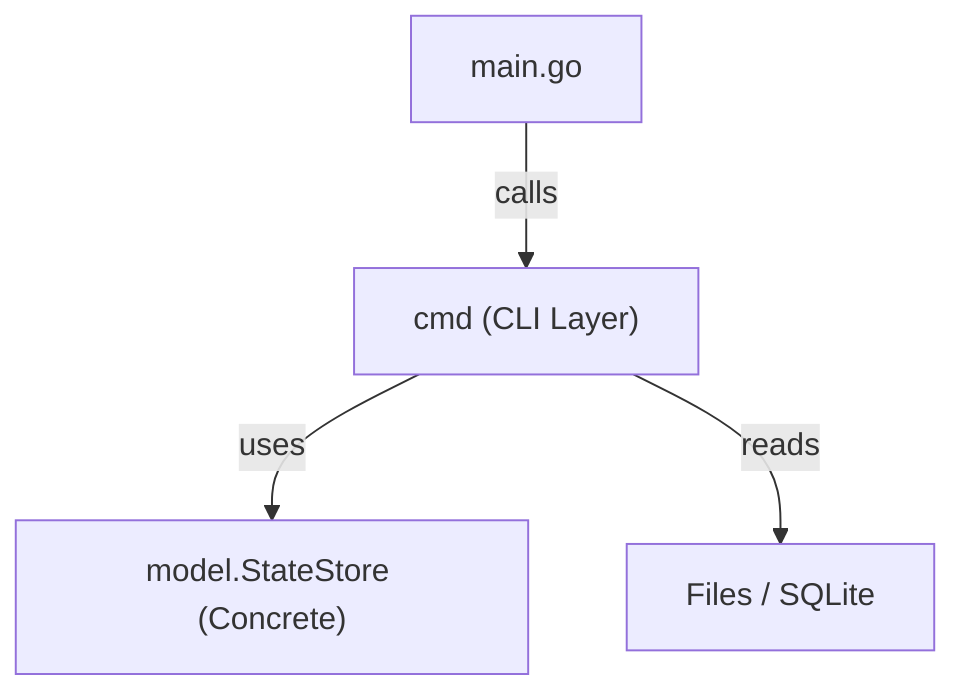
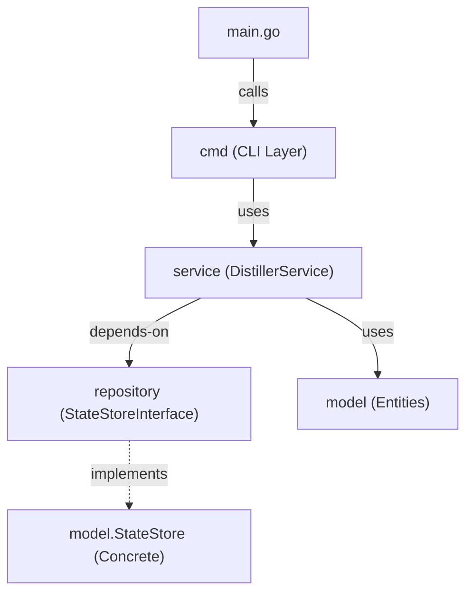
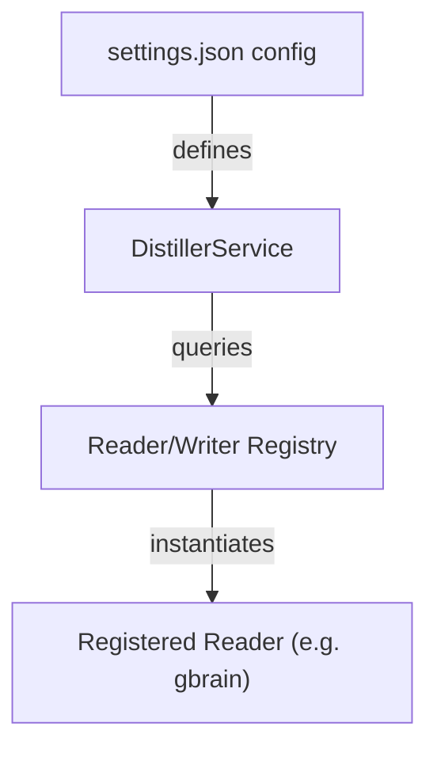

# 架構演進與優化計畫 — cc-distiller (Architecture Evolution & Optimization Plan)

## 1. 現有架構診斷與技術債 (Architecture Diagnosis & Technical Debt)

本專案的核心 Go 程式碼雖然精簡，但在架構設計與資源管理上存在以下技術債：

- `職責混雜與 CLI 耦合`：`cmd/` 套件中混雜了大量業務邏輯與外部 I/O 呼叫。例如 [distill.go](file:///Users/shuk/projects/cc-plugin/cmd/distill.go) 的 `DistillCmd` 負責了從資料讀取、LLM 萃取、API 寫入到資料保留的完整編排；[read_logic.go](file:///Users/shuk/projects/cc-plugin/cmd/read_logic.go) 的 `readGbrainLogic` 與 `readClaudeMemLogic` 負責底層 SQLite / 檔案讀寫。這使得 CLI 命令與核心蒸餾業務緊密耦合，無法在非 CLI 環境下重用。
- `重複建立 StateStore 連線`：在 [read_logic.go:L60-65](file:///Users/shuk/projects/cc-plugin/cmd/read_logic.go#L60-65) 中，`readClaudeMemLogic()` 自行呼叫了 `NewStateStore()` 並在結束時關閉。然而，呼叫它的 [distill.go:L35](file:///Users/shuk/projects/cc-plugin/cmd/distill.go#L35) 已經建立了一個 `store`。這導致對同一個 SQLite 資料庫重複建立與關閉連線，造成不必要的資源浪費與連線衝突風險。
- `迴圈內延遲關閉響應體 (Defer in loop)`：在 [write_agentmemory.go:L34](file:///Users/shuk/projects/cc-plugin/cmd/write_agentmemory.go#L34) 中，`defer resp.Body.Close()` 被放置在迴圈中。這是 Go 程式開發的常見錯誤。當 memories 數量龐大時，這些連線與 file descriptors 會直到整個 `writeAgentMemoryLogic` 函數返回時才釋放，容易造成 `too many open files` 錯誤或資源洩漏。
- `硬編碼預設設定 (Hardcoded configuration)`：[config.go:L18-28](file:///Users/shuk/projects/cc-plugin/config/config.go#L18-28) 中將所有的預設設定寫死在 `Init()` 函數中，而 [default_settings.json](file:///Users/shuk/projects/cc-plugin/config/default_settings.json) 則為空。這違反了設定與程式碼分離的原則，不利於外部管理。

## 2. 複雜度量測 (Complexity Metrics)

我們透過客觀指令與程式碼靜態掃描，量測出以下數據：

- `核心程式碼規模`：總計 `16,018` 行程式碼（含外部工具包），主要核心邏輯集中在 `cmd/`（共 `13` 個檔案，`13,382` 位元組）與 `model/`（共 `11` 個檔案，`24,407` 位元組）。
- `改動頻率 (Churn rate)`：過去 12 個月改動最頻繁的核心程式碼為 [cmd/root.go](file:///Users/shuk/projects/cc-plugin/cmd/root.go)（改動 8 次），主要用於註冊命令與執行初始化。
- `相依性分析`：核心流程對 SQLite 連線與 `gorm.DB` 有直接相依。目前的 `model.StateStore` 缺少 `interface` 隔離，導致單元測試必須依賴真實的 SQLite 檔案，增加了測試的複雜度。

## 3. 架構簡化與解耦設計 (Simplification & Decoupling Design)

為了解決上述耦合與資源問題，我們將引入典型的 `三層架構 (Three-Tier Architecture)`：`CLI 展現層 (Cobra CLI Commands)` -> `Service 核心業務邏輯層 (Distiller Service)` -> `Repository / Gateway 資料訪問層 (StateStore & FileIO)`。

此外，為了提高可測試性，我們將在資料訪問層定義 `介直接縫 (Interface seams)`。

現有相依關係：


解耦後相依關係：


介面設計如下：

```go
type StateStoreInterface interface {
    GetCursor(source string) (int64, error)
    SetCursorsBatch(cursors map[string]int64) error
    RecordSeen(fingerprint, source string) (int, error)
    MarkDistilledBatch(items []model.DistilledItem, at int64) error
}

type ObservationReader interface {
    Read(ctx context.Context, since int64) ([]model.Observation, int64, error)
}

type MemoryWriter interface {
    Write(ctx context.Context, memories []model.Memory) error
}
```

## 4. 目錄與模組重整方案 (Reorganization Map)

我們規劃重新調整目錄結構，將業務邏輯移出 `cmd/`，並引入 `service/` 與 `repository/`：

```tree
.
├── cmd/
│   ├── distill.go            # 僅負責解析 CLI 參數與 flag
│   └── root.go
├── service/                  # 新增：核心業務邏輯
│   ├── distill_service.go    # 記憶蒸餾管道編排
│   └── ollama.go             # LLM 萃取服務
├── repository/               # 新增：資料訪問層
│   ├── statestore.go         # 實作 StateStoreInterface
│   ├── gbrain_reader.go      # 實作 ObservationReader
│   └── claudemem_reader.go   # 實作 ObservationReader
└── model/                    # 僅保留純資料實體與結構
```

`舊到新遷移映射表 (Migration Map)`：

| 舊檔案路徑 | 新檔案路徑 | 職責調整與優化 |
| :--- | :--- | :--- |
| `cmd/distill.go` (DistillCmd) | `cmd/distill.go` (CLI) & `service/distill_service.go` (Service) | 移除業務邏輯，僅保留 Cobra 命令定義；蒸餾流程移至 `distill_service.go` |
| `cmd/read_logic.go` | `repository/gbrain_reader.go` & `repository/claudemem_reader.go` | 拆分為獨立的 Reader 實作，不再於內部自行建立 `StateStore`，統一由外部注入。 |
| `cmd/write_*.go` | `service/distill_service.go` (內部或 private helper) | 封裝成 Service 層的處理函數，並修復 `defer` 在迴圈中呼叫的資源洩漏問題。 |
| `cmd/state.go` | `repository/statestore.go` | 向後相容包裝改為正式的 Repository 介面與實作。 |

## 5. 插件化與可擴充性機制 (Plugin & Extensibility Mechanism)

- `插件化必要性論證`：cc-plugin 未來可能需要支援更多記憶來源（例如 `Slack`、`Notion`、`Apple Notes`）或寫入至不同的儲存端。若每次新增來源都需修改核心 distiller 程式碼，將違反 `開放封閉原則 (Open-Closed Principle)`。
- `插件載入設計`：由於 Go 語言的原生插件機制在跨平台編譯上有諸多限制，我們採用 `靜態註冊 (Static Registry)` 與 `配置驅動 (Configuration-driven)` 的最簡可行方案。



在 [settings.json](file:///Users/shuk/projects/cc-plugin/config/settings.json) 中定義配置：

```json
{
  "distiller": {
    "sources": ["gbrain", "claude-mem"],
    "stores": ["agentmemory", "mempalace"]
  }
}
```

在代碼中提供註冊機制：

```go
var readerRegistry = map[string]func() ObservationReader{}

func RegisterReader(name string, factory func() ObservationReader) {
    readerRegistry[name] = factory
}
```

## 6. 漸進式重構路徑與驗證 (Refactoring Roadmap & Verification)

為確保系統在重構過程中不被破壞，我們將遵循 `絞殺榕模式 (Strangler-Fig)` 分步實施：

### 第一階段：基礎安全網與 Bug 修復
1. `撰寫特徵測試`：在 [cmd/distill_test.go](file:///Users/shuk/projects/cc-plugin/cmd/distill_test.go) 中補全以模擬數據為基礎的整合測試，並使用 sqlite 記憶體資料庫 (`:memory:`)。
2. `修復 Defer in Loop`：修改 [write_agentmemory.go](file:///Users/shuk/projects/cc-plugin/cmd/write_agentmemory.go)，將 http 請求與 `body.Close()` 封裝至匿名函數或獨立 helper 函數中，立刻釋放資源。
   - `驗證方式`：執行 `go test ./...` 確保測試綠燈，且大批量記憶寫入時無 file descriptor 洩漏。

### 第二階段：介面提取與 Service 層抽離
1. `定義介面`：在 `repository/` 定義 `StateStoreInterface`、`ObservationReader` 與 `MemoryWriter`。
2. `抽離邏輯`：建立 `service/distill_service.go`，將 `distill` 主流程移入，並透過建構子注入 (Constructor Injection) 傳入 `StateStoreInterface` 與 Reader/Writer。
3. `重構 CLI Command`：修改 `cmd/distill.go`，使其僅負責 Viper 參數綁定並呼叫 `DistillService`。
   - `驗證方式`：使用 Mock 介面為 `DistillService` 撰寫單元測試。

### 第三階段：設定管理重整與配置驅動
1. `重整設定`：將 `config.go` 中寫死的設定移至 [default_settings.json](file:///Users/shuk/projects/cc-plugin/config/default_settings.json)，並於 `Init()` 中正確讀取。
2. `實現靜態註冊`：將 gbrain 與 claude-mem Reader 靜態註冊至 `Registry`，依 `settings.json` 的配置動態載入。
   - `驗證方式`：修改設定檔以停用某個 source，驗證 distill 是否正確略過該來源。

## 7. 風險與回滾策略 (Risks & Rollback)

- `風險：重構中斷或新寫法有未知錯誤`
  - `對策`：每一個重構步驟必須是獨立的 git commit。一旦驗證失敗，立即執行 `git reset --hard HEAD~1` 回退。
- `風險：SQLite 資料庫鎖定 (Database is locked)`
  - `對策`：重構時需確保 `StateStore` 介面只在 service 層被統一管理，避免多個 service 重複建立 DB 連線。
- `風險：LLM 提取行為改變`
  - `對策`：在重構前後保留一份真實的 observations 資料，比對新舊版本輸出的 `Memory` 與 `Fact` 內容是否完全一致。
