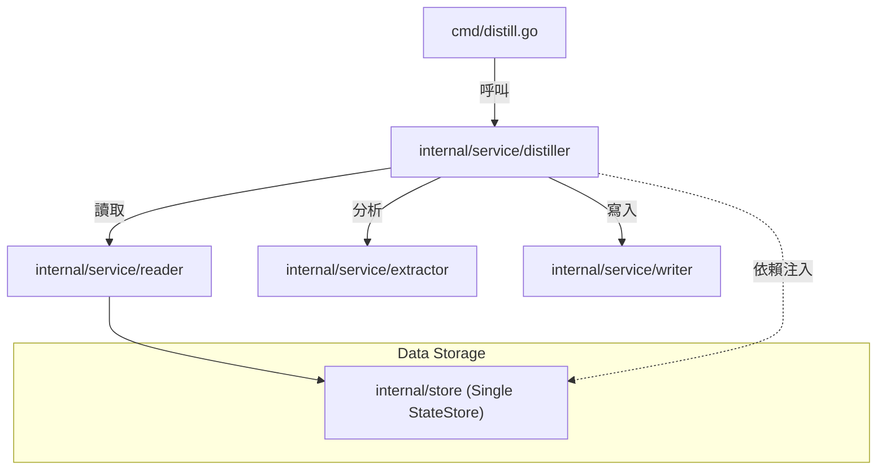

# 架構演進與優化計畫 — cc-plugin-decoupling (Architecture Evolution & Optimization Plan)

## 1. 現有架構診斷與技術債 (Architecture Diagnosis & Technical Debt)

基於對目前程式碼的審查，系統存在以下架構痛點與技術債：

*   `Cobra 介面層與業務邏輯高度耦合`：
    *   在 [cmd/distill.go](file:///Users/shuk/projects/cc-plugin/cmd/distill.go) 中，`DistillCmd` 的 `RunE` 函式直接編排了整個記憶蒸餾管道。它負責讀取設定、開啟與關閉 SQLite 資料庫、呼叫外部 HTTP API（Ollama 與 agentmemory）以及執行外部 CLI（mempalace）。
    *   在 [cmd/ollama.go](file:///Users/shuk/projects/cc-plugin/cmd/ollama.go) 中，`OllamaService` 直接與 `ExtractCmd` 放在同一個檔案，並直接讀取 `viper` 全域設定。這使得邏輯無法在不啟動 CLI 命令的情況下單獨測試。
*   `迴圈內 defer 導致的連線洩漏風險 (Connection Leak)`：
    *   在 [cmd/write_agentmemory.go](file:///Users/shuk/projects/cc-plugin/cmd/write_agentmemory.go#L16-L44) 的 `writeAgentMemoryLogic` 中，`defer resp.Body.Close()` 被宣告在 `for` 迴圈中。
    *   在 Go 中，`defer` 是在函式返回時才執行，而非在迴圈區塊結束時。當處理大量記憶批次寫入時，會造成多個 HTTP 響應主體同時保持開啟，有極高機率導致系統 `File Descriptor` 耗盡與記憶體洩漏。
*   `重複開啟資料庫連線與 SQLite 鎖定風險`：
    *   [cmd/distill.go](file:///Users/shuk/projects/cc-plugin/cmd/distill.go#L35) 已經建立了 `StateStore` 實例，但隨後呼叫的 [cmd/read_logic.go](file:///Users/shuk/projects/cc-plugin/cmd/read_logic.go#L60) 中的 `readClaudeMemLogic` 卻在內部又自行呼叫了 `NewStateStore` 並在結束時 `store.Close`。
    *   同樣地，[cmd/retain.go](file:///Users/shuk/projects/cc-plugin/cmd/retain.go#L31) 內部的 `retainLogic` 也是自行開啟並關閉 `store` 連線。
    *   這意味著同一個 SQLite 資料庫在同一處理流程中會被重複開啟和關閉多次，違反單一連線（Single Connection）原則，在高併發或排程重疊時容易引發 `database is locked` 錯誤。
*   `工具與通用邏輯放置不當`：
    *   在 [model/store.go](file:///Users/shuk/projects/cc-plugin/model/store.go#L198) 中定義了 `ExpandPath` 輔助函式，而 `model` 包應只負責純粹的 Domain Model 定義，不應包含路徑展開等底層系統公用工具。
*   `臨時檔案路徑未收斂`：
    *   在 [config/config.go](file:///Users/shuk/projects/cc-plugin/config/config.go#L26) 中，預設的 `stores.mempalace.temp_dir` 指向全域的 `/tmp/mempalace-temp`，增加了對系統目錄的依賴，不符合專案內部 tmp 自封裝原則。

## 2. 複雜度量測 (Complexity Metrics)

我們透過客觀指令與程式碼靜態分析，得出以下數據指標：

*   `改動頻繁度 (File Churn)`：
    根據近一年的 Git Commit 統計，最頻繁被修改的檔案為：
    1.  `cmd/root.go` (8次)
    2.  `model/topology_ops.go` (6次)
    3.  `cmd/state.go` (6次)
    4.  `config/config.go` (5次)
    5.  `cmd/write_agentmemory.go` (5次)
    這顯示 `cmd` 命令列層是變動的核心熱點，與核心邏輯高強度交織。
*   `程式碼行數 (Lines of Code)`：
    *   `cmd/` 目錄下共有 `1188` 行 Go 程式碼（排除子目錄）。
    *   主要邏輯檔案：`cmd/distill.go` 為 `160` 行，`cmd/ollama.go` 為 `142` 行。雖然程式碼行數不多，但每個檔案都包含了 I/O、網路 HTTP、JSON 處理以及命令列參數解析，職責複雜度極高。
*   `依賴扇出與扇入 (Fan-in/Fan-out)`：
    *   `cmd/distill.go` 的 Fan-out 高達 5+ 個技術模組：`model`、`net/http`、`os/exec`、`gorm` 以及 `viper`。
    *   這意謂著當資料庫 Schema 或外部 API 端點變更時，CLI 命令列層都需要被迫配合修改。

## 3. 架構簡化與解耦設計 (Simplification & Decoupling Design)

為簡化現有架構並消除上述技術債，提出以下解耦設計方案：

*   `抽離 Service 層 (Extraction of Service Layer)`：
    *   在專案中建立 `internal/service/` 模組，專門管理業務邏輯。
    *   `cmd/` 目錄下的 CLI 檔案僅作為命令列解析器，在驗證參數後，將操作委派給對應的 `Service`。
*   `依賴反轉與 Interface 抽離`：
    *   將外部服務調用定義為 `Interface`。例如，將 `Ollama` 調用抽象為 `Extractor` 介面，未來可無縫切換到 Anthropic API 或其他 LLM 服務，而無需修改 distill 編排邏輯。
*   `單一 Store 連線傳遞 (Single Connection Propagation)`：
    *   不再於各個子邏輯中自行調用 `NewStateStore`，而是在 pipeline 初始化時建立單一 `StateStore` 實例，並將其傳遞給 `Reader` 或 `Service`，確保資料庫連線的重用。



## 4. 目錄與模組重整方案 (Reorganization Map)

重新調整目錄樹結構，明確劃分每個包的職責範圍：

```tree
.
├── cmd/                        # 僅負責命令列解析與參數校驗
│   ├── root.go                 # 註冊所有命令
│   ├── distill.go              # CLI distill 參數入口
│   ├── ollama.go               # CLI extract 參數入口
│   ├── retain.go               # CLI retain 參數入口
│   └── export/                 # 匯出命令組
├── model/                      # 純 Domain 結構定義 (不含邏輯)
│   ├── agentmemory.go
│   ├── claudemem.go
│   └── ...
├── internal/
│   ├── store/                  # 資料庫與持久化實作
│   │   └── sqlite.go           # StateStore 實作移至此處
│   └── service/                # 核心業務邏輯
│       ├── distiller/
│       │   ├── orchestrator.go # 蒸餾管道編排
│       │   └── retain.go       # 記憶清理邏輯
│       ├── extractor/
│       │   ├── interface.go    # Extractor 介面定義
│       │   └── ollama.go       # Ollama API 實作
│       ├── reader/
│       │   ├── gbrain.go       # 讀取 gbrain 邏輯
│       │   └── claudemem.go    # 讀取 claude-mem 邏輯
│       └── writer/
│           ├── agentmemory.go  # 寫入 agentmemory
│           └── mempalace.go    # 寫入 mempalace
```

### 遷移映射表 (Migration Map)

| 舊代碼路徑 | 新規劃路徑 | 依賴方向是否合規 | 備註說明 |
| :--- | :--- | :--- | :--- |
| `cmd/distill.go` | `internal/service/distiller/orchestrator.go` | 是 | 僅保留 CLI 參數解析在 `cmd`，核心編排移至 `service` |
| `cmd/ollama.go` | `internal/service/extractor/ollama.go` | 是 | `OllamaService` 移至 `extractor` 包，並實作 `Extractor` 介面 |
| `cmd/read_logic.go` | `internal/service/reader/` | 是 | 拆分為 `gbrain.go` 與 `claudemem.go` |
| `cmd/write_*.go` | `internal/service/writer/` | 是 | 封裝成各自的 `Writer` 實作 |
| `cmd/retain.go` | `internal/service/distiller/retain.go` | 是 | 接受 `StateStore` 參數，不重複建立連線 |
| `model/store.go` | `internal/store/sqlite.go` | 是 | `StateStore` 移入 `store` 包，`ExpandPath` 移入 `utils` |

## 5. 插件化與可擴充性機制 (Plugin & Extensibility Mechanism)

*   `必要性評估`：
    *   本專案需要支持多種輸入源（gbrain、claude-mem）與多個輸出端點（agentmemory、mempalace）。
    *   考量目前擴充點數量小於 5 個，不建議引入 `Go Plugin` 或 `WebAssembly` 等動態加載機制，那會帶來極大的維護複雜度。
    *   「介面與註冊表 (Interface & Registry)」模式是目前最合適的極簡方案。
*   `介面設計 (Interface Design)`：
    *   `Reader 介面`：
        ```go
        type Reader interface {
            Read(ctx context.Context, store *store.StateStore) ([]model.Observation, int64, error)
        }
        ```
    *   `Extractor 介面`：
        ```go
        type Extractor interface {
            Extract(ctx context.Context, obs []model.Observation) ([]model.Candidate, error)
        }
        ```
    *   `Writer 介面`：
        ```go
        type Writer interface {
            Write(ctx context.Context, memories []model.Memory, facts []model.Fact) error
        }
        ```

## 6. 漸進式重構路徑與驗證 (Refactoring Roadmap & Verification)

本計畫採取 `絞殺榕模式 (Strangler-Fig)`，確保每一步都可獨立部署、測試與回滾：

*   `Phase 1 — 建立特徵測試 (Safety Net)` (工作量：低)
    *   目標：確保重構前後系統行為不變。
    *   動作：編寫 integration tests，以檔案或模擬資料庫作為輸入，捕捉目前的輸出行為。
*   `Phase 2 — 消除資源洩漏與單一連線建立` (工作量：中)
    *   目標：修復當前嚴重的 Bug 並重用資料庫連線。
    *   動作：
        1.  修正 `writeAgentMemoryLogic` 的迴圈內部 `defer` 釋放問題。
        2.  重構 `readClaudeMemLogic` 與 `retainLogic`，改由呼叫者傳遞 `StateStore`，並移除其內部的 `NewStateStore` 與 `Close`。
    *   驗證：確認單元測試綠燈，且背景執行 1000 筆以上資料時無 FD 洩漏與資料庫鎖定問題。
*   `Phase 3 — 提取服務層與依賴反轉` (工作量：高)
    *   目標：徹底將業務邏輯移出 `cmd/` 包。
    *   動作：
        1.  建立 `internal/service/` 及其子包。
        2.  將 `distill`、`ollama` 等邏輯遷入，並使用介面進行注入。
    *   驗證：特徵測試綠燈，命令列執行行為無變化。
*   `Phase 4 — 目錄結構重整` (工作量：中)
    *   目標：完成目錄結構的最終調整。
    *   動作：將 `store.go` 遷往 `internal/store/`，清理 `model` 包的雜質。

## 7. 風險與回滾策略 (Risks & Rollback)

*   `SQLite 併發鎖定風險 (Database Locking Risk)`：
    *   在單一連線重整過程中，若有多個排程或命令同時啟動，若未妥善共用或限制 Lock，可能會出現鎖定。
    *   回滾：保留舊有的 `cmd/state.go` 作為向後相容包裝，若新版 store 出現鎖定，可迅速切換回舊版連線行為。
*   `LLM 輸出結構解析失敗风险 (JSON Parsing Failure)`：
    *   重構 `Extractor` 連線時，若 payload 架構或 JSON 格式化設定遺失，可能導致 Ollama 返回非預期內容。
    *   驗證：透過 integration tests 進行 Dry-run 測試，比對提取出的 Candidates 欄位完整度。
