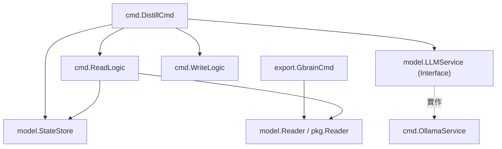

# 架構演進與優化計畫 — cc-plugin-evolution (Architecture Evolution & Optimization Plan)

## 1. 現有架構診斷與技術債 (Architecture Diagnosis & Technical Debt)

本專案 `cc-plugin` 是一個核心為 Go 語言開發的記憶蒸餾與 CLI 工具。經過代碼庫的靜態分析，我們診斷出以下技術債：

- `診斷 1 — 重重複的 StateStore 連線與資源浪費`
  在 `cmd/read_logic.go` 中，`readClaudeMemLogic` 於第 61 行獨立調用了 `NewStateStore`，而 `cmd/distill.go` 在調用它之前就已經初始化並持有了一個 `store` 連線。這會導致在同一個 CLI 執行週期內重複建立 SQLite 連線，造成不必要的 I/O 與記憶體開銷。
- `診斷 2 — 重複的 gbrain 讀取邏輯`
  `cmd/export/gbrain.go` 內部的 `gbrainRead` (第 15-61 行) 與 `cmd/read_logic.go` 中的 `readGbrainLogic` (第 16-58 行) 有 95% 以上的邏輯重複，唯一的差異是導出的 `all` 參數影響是否要從 `epoch 0` 開始讀取。這違背了 `DRY` 原則。
- `診斷 3 — 預設設定硬編碼 (Hard-coded Default Settings)`
  在 `config/config.go` 中，諸多預設設定（例如資料庫路徑、Ollama 預設模型、儲存 API 端點等）皆以代碼形式硬編碼在 `Init` 函數內。而專案中的 `config/default_settings.json` 內容為空。應將預設值遷移至 JSON 檔案中，以方便後續的配置管理。
- `診斷 4 — writeAgentMemoryLogic 存在資源洩漏風險`
  在 `cmd/write_agentmemory.go` 第 34 行，`defer resp.Body.Close` 被放置在 `for` 迴圈中。在 Go 語言中，`defer` 只會在函數返回時執行，而不是在當前迴圈 iteration 結束時。當批次寫入大量記憶時，會導致多個 HTTP 回應主體無法即時釋放，存在連線或檔案描述符耗盡的風險。
- `診斷 5 — 重複的 utility 輔助函數`
  路徑展開函數 `expandPath` 於 `cmd/root.go` 實作了一份，而在 `model/store.go` 中又以 `ExpandPath` (首字母大寫) 的名稱重新實作了一份，兩者功能完全相同，造成代碼冗餘。
- `診斷 6 — distill 與 OllamaService 之間高度耦合`
  `cmd/distill.go` 直接依賴了特定的 `NewOllamaService` 實作。這使得當用戶未來需要切換至其他 LLM 提供商 (例如 OpenAI 或 Anthropic API) 時，必須修改 distill 的核心編排代碼。

---

## 2. 複雜度量測 (Complexity Metrics)

為了確保優化方案有據可依，我們針對工作區進行了複雜度量測：

### 熱點與改動頻繁檔案 (Past 12 Months Commits)
統計過去一年改動最頻繁的專案檔案如下：
1. `config/settings.json` (36 次)
2. `.claude-plugin/marketplace.json` (33 次)
3. `CLAUDE.md` (27 次)
4. `README.md` (22 次)
5. `config/minimax.json` (22 次)
6. `run.sh` (18 次)
7. `config/llmbox.json` (17 次)
8. `model/topology_ops.go` 與測試 (6 次)

量測顯示：除了配置文件，`model/topology_ops.go` 與 `cmd/distill.go` 是最容易發生異動的核心程式碼。

### 程式碼行數分析 (Go Modules Line Count)
Go 程式碼行數統計排行 (排除 vendor 與外部 test)：
- `./cmd/export/mempalace.go` (319 行)
- `./model/topology_ops.go` (219 行)
- `./model/store.go` (204 行)
- `./model/topology.go` (184 行)
- `./cmd/distill.go` (160 行)
- `./cmd/ollama.go` (142 行)
- `./cmd/read_logic.go` (103 行)
- `./cmd/write_mempalace.go` (100 行)
- `./cmd/write_agentmemory.go` (85 行)

這表明優化的重點應放在簡化核心 `cmd/` 下的流程編排，將業務邏輯自 `cobra.Command` 的 `RunE` 函數中抽離。

---

## 3. 架構簡化與解耦設計 (Simplification & Decoupling Design)

為了解決核心流程與 LLM 實作的強相依，我們採用依賴反轉設計。定義一個 `LLMService` 介面 (Interface)，使 `cmd.DistillCmd` 僅依賴介面，而非 `OllamaService` 具體實作。

### 系統依賴關係圖 (System Dependency Graph)



---

## 4. 目錄與模組重整方案 (Reorganization Map)

為了消除重複代碼並使職責更加清晰，我們規劃了以下目錄與模組重整方案：

### 舊與新遷移映射表 (Migration Map)

| 舊代碼位置 | 新代碼位置 | 說明 |
| :--- | :--- | :--- |
| `cmd/read_logic.go` (`readGbrainLogic`) | `pkg/reader/gbrain.go` | 提取成獨立的 gbrain 讀取器，供 distill 與 export 命令共用。 |
| `cmd/export/gbrain.go` (`gbrainRead`) | `pkg/reader/gbrain.go` | 刪除此重複實作，直接調用統一的讀取器，並帶入參數 `fromCursor`。 |
| `cmd/read_logic.go` (`readClaudeMemLogic`) | `pkg/reader/claudemem.go` | 提取成獨立的 claude-mem 讀取器，改為接收 `StateStore` 作為參數以複用連線。 |
| `cmd/root.go` (`expandPath`) | `pkg/utils/path.go` | 將路徑展開邏輯統一放置於通用工具包。 |
| `model/store.go` (`ExpandPath`) | `pkg/utils/path.go` | 移除 `model` 包中的此方法，改為引用 `pkg/utils/path.go`。 |
| `cmd/state.go` | `[刪除]` | 移除多餘的相容性包裝檔案，使依賴關係扁平化。 |

### 重整後目錄樹結構 (Target Directory Structure)

```tree
.
├── cmd/                      # 僅包含 Cobra 命令宣告與參數解析
│   ├── root.go
│   ├── distill.go
│   ├── ollama.go
│   ├── reset.go
│   ├── retain.go
│   └── export/
├── pkg/
│   ├── reader/               # 數據讀取層，複用 StateStore
│   │   ├── gbrain.go
│   │   └── claudemem.go
│   ├── writer/               # 數據寫入層，修復資源洩漏
│   │   ├── agentmemory.go
│   │   └── mempalace.go
│   └── utils/                # 共享工具包
│       └── path.go
├── model/                    # 純粹的領域模型與 StateStore 定義
│   ├── store.go
│   ├── entities.go           # 合併簡單實體
│   └── interfaces.go         # 宣告 LLMService 等介面
```

---

## 5. 插件化與可擴充性機制 (Plugin & Extensibility Mechanism)

針對 Go 核心引擎 `cc-plugin` 的擴充點，我們設計了針對 `LLM` 以及 `Storage` 的適配器模式 (Adapter Pattern)：

- `LLM 契約 (LLM Contract)`
  定義統一的 `LLMService` 介面：
  ```go
  type LLMService interface {
      Extract(ctx context.Context, obs []model.Observation) ([]model.Candidate, error)
  }
  ```
  這允許我們在未來無縫添加 `ClaudeLLMService` 或 `GeminiLLMService`，而無須更動 `distill` 的管道邏輯。
- `儲存適配器 (Storage Adapters)`
  當引入新的事實儲存庫時，可透過實作 `FactStore` 與 `MemoryStore` 進行擴充，將 HTTP API (`agentmemory`) 與 CLI 呼叫 (`mempalace`) 徹底解耦。

---

## 6. 漸進式重構路徑與驗證 (Refactoring Roadmap & Verification)

我們將重構規劃為四個可獨立交付且可回滾的階段：

### `Phase 1 — 複用 StateStore 連線與設定純淨化 (優先度：高)`
- `目標`：消除重複的 SQLite 初始化，並將 `config/config.go` 預設值搬遷至 `config/default_settings.json`。
- `驗證方式`：運行 `go test ./...` 且手動執行 `cc-plugin distill` 確保正常寫入。

### `Phase 2 — 消除重複代碼與修正資源洩漏 (優先度：高)`
- `目標`：將 `gbrainRead` 重複邏輯抽取至新模組，並將 `writeAgentMemoryLogic` 的 `defer Close()` 移出迴圈以避免資源洩漏。
- `驗證方式`：執行 `go test ./...` 並用 `lsof -i` 觀察 distill 執行時的檔案描述符狀態。

### `Phase 3 — 建立核心服務層與介面抽離 (優先度：中)`
- `目標`：引入 `LLMService` 與 `path.go`，將 `distill.go` 的具體實作解耦。
- `驗證方式`：編寫 mock 測試，驗證當 Ollama 故障時，能否優雅切換為其他備用 LLM。

### `Phase 4 — 規範檔案更名與整合驗證 (優先度：中)`
- `目標`：進行目錄重整，並更新專案中的 `README.md` 與 `CLAUDE.md` 文件。
- `驗證方式`：執行 `go test ./...` 驗證整個工作區的 Go 套件編譯綠燈。

---

## 7. 風險與回滾策略 (Risks & Rollback)

- `風險 1 — 重構期間導致資料遺失`
  在進行 `gbrain` 與 `claude-mem` 讀取邏輯重整時，若 timestamp 遊標未正確傳遞，可能會導致重複讀取或遺漏觀察值。
  - `對策`：重構前備份 `~/.config/cc-plugin/state.db`，且重構代碼需在 local 進行沙盒測試。
- `風險 2 — 模組重整導致編譯失敗`
  因為 `plugins/gosdk` 與 `cc-plugin` 本身存在套件依賴，如果更名或移動檔案可能引發 import 錯誤。
  - `對策`：使用 `git diff` 隨時確認改動。若出現大規模編譯錯誤，可執行 `git checkout .` 快速回滾至上一個穩定 commit。
