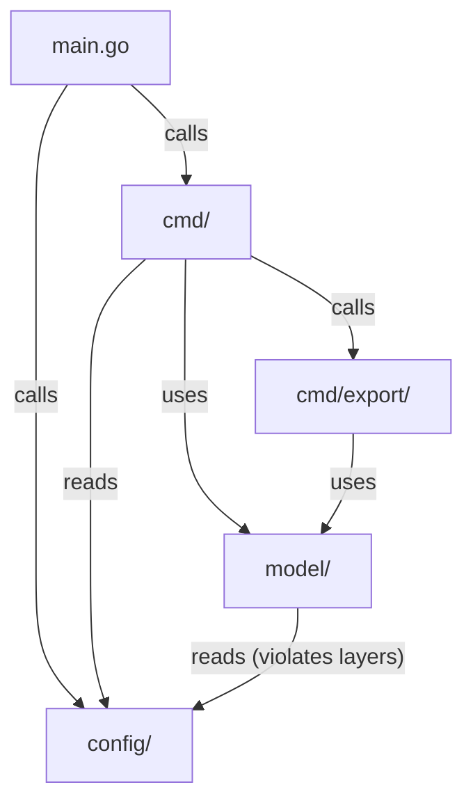
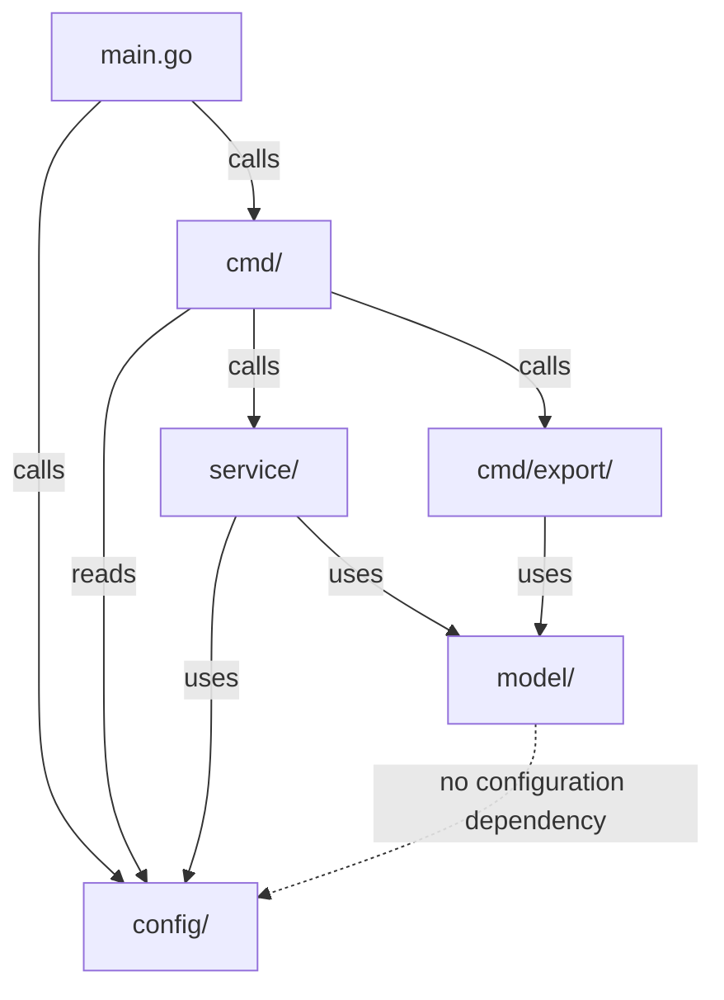
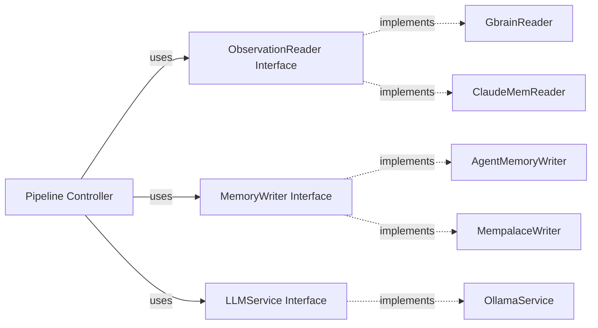

# 架構演進與優化計畫 — cc-plugin (Architecture Evolution & Optimization Plan)

## 1. 現有架構診斷與技術債 (Architecture Diagnosis & Technical Debt)

本專案 `cc-plugin` 是一個基於 `Go` 語言開發的 `CLI` 記憶蒸餾工具，旨在自 `gbrain-working` 與 `claude-mem` 提取事實並寫入記憶儲存庫。經評估，現有系統存在以下架構技術債：

- `診斷 1：邏輯與 CLI 命令高度耦合 (Command-Logic Coupling)`
  - `量測依據`：在 [distill.go](file:///Users/shuk/projects/cc-plugin/cmd/distill.go) 中，`RunE` 包含了主要的記憶蒸餾管道邏輯，並且 [read_logic.go](file:///Users/shuk/projects/cc-plugin/cmd/read_logic.go)、[write_agentmemory.go](file:///Users/shuk/projects/cc-plugin/cmd/write_agentmemory.go) 和 [write_mempalace.go](file:///Users/shuk/projects/cc-plugin/cmd/write_mempalace.go) 等直接在 `cmd` 包中實現了與 `gbrain`、`claude-mem`、`agentmemory`、`mempalace` 的讀寫細節與事實品質判定 `QualifiesForTruth`。
  - `架構痛點`：`cmd` 目錄應僅負責 `Cobra CLI` 指令的定義與參數解析。業務邏輯直接寫在命令的 `RunE` 函式中，會導致邏輯難以被重用或進行獨立的單元測試。

- `診斷 2：領域模型對配置框架的反向依賴 (Configuration Dependency Leak in Domain)`
  - `量測依據`：在 [store.go](file:///Users/shuk/projects/cc-plugin/model/store.go) 中，`NewStateStore` 直接調用了 `viper.GetString("state.db_path")`。
  - `架構痛點`：`model` 層作為最核心的領域模型，不應依賴外部的設定管理工具（如 `viper`）。這破壞了乾淨架構 (Clean Architecture) 的依賴關係，導致該包難以在沒有 `viper` 初始化環境的情況下進行獨立測試。

- `診斷 3：未暴露的拓撲管理模組 (Unexposed Topology Module in CLI)`
  - `量測依據`：在 [topology.go](file:///Users/shuk/projects/cc-plugin/model/topology.go) 和 [topology_ops.go](file:///Users/shuk/projects/cc-plugin/model/topology_ops.go) 中，雖然實作了對 `topology-builder` markdown 圖譜的載入、驗證與 index 渲染，但在 `cmd/` 包中沒有任何 CLI 進入點來調用這些操作，目前該部分程式碼僅在測試檔案中被執行。
  - `架構痛點`：有功能的模組在 CLI 中缺失入口，屬於尚未完成的組件，增加了代碼庫的維護負擔。

- `診斷 4：多處重複初始化 SQLite 連線 (Redundant Database Connections)`
  - `量測依據`：在 [distill.go](file:///Users/shuk/projects/cc-plugin/cmd/distill.go)（第 35 行）、[read_logic.go](file:///Users/shuk/projects/cc-plugin/cmd/read_logic.go) 的 `readClaudeMemLogic()`（第 61 行），以及 [retain.go](file:///Users/shuk/projects/cc-plugin/cmd/retain.go) 的 `retainLogic()`（第 35 行），各個函數都各自獨立調用了 `NewStateStore()` 開啟資料庫連接。
  - `架構痛點`：重複開啟連接造成資源開銷，且未實行依賴注入 (Dependency Injection)，破壞了單一資料庫連線的生命週期管理。

- `診斷 5：硬編碼的 Ollama HTTP 客戶端 (Hard-coded Ollama HTTP Client)`
  - `量測依據`：在 [ollama.go](file:///Users/shuk/projects/cc-plugin/cmd/ollama.go) 中，`OllamaService` 直接使用硬編碼的 `http.Client`，且在 `distill.go` 中寫死以 `NewOllamaService()` 建立。
  - `架構痛點`：缺乏抽象，若未來需要擴展至其他大語言模型 (Large Language Model) 服務商（例如 `OpenAI` 或 `Anthropic`），將需要大量修改核心流程。

- `診斷 6：重複的路徑展開實作 (Redundant Path Expansion Logic)`
  - `量測依據`：`cmd/root.go` 的 `expandPath` 與 `model/store.go` 的 `ExpandPath` 各自實作了將波浪號 `~` 展開為家目錄的邏輯。
  - `架構痛點`：代碼重複，且未歸納至統一的公共工具包 (Utility Package)。

## 2. 複雜度量測 (Complexity Metrics)

我們對專案源碼進行了代碼行數（Lines of Code, LOC）與重複度量測：

- `總代碼行數`：排除 `pkg/tools/career-ops/` 之外，主要 Go 代碼約為 `5200` 行。
- `cmd/ 包`：共 `1172` 行（佔 `22.5%` 的核心代碼量）。
- `model/ 包`：共 `684` 行（佔 `13.1%` 的核心代碼量，其中 `topology` 相關代碼佔 `403` 行）。
- `plugins/gosdk`：共 `3403` 行（佔 `65.4%` 的核心代碼量，包含 `config`、`metric`、`notify` 等通用 SDK 組件）。
- `config/ 包`：共 `29` 行。
- `main.go`：`11` 行。

### 現有依賴關係 (Current Dependency Graph)



## 3. 架構簡化與解耦設計 (Simplification & Decoupling Design)

為解決上述技術債，提出以下解耦與簡化方案：

- `方案 1：解除領域模型與 viper 的依賴 (Inversion of Config Dependency)`
  - 將 `model.NewStateStore` 重構為 `model.NewStateStore(dbPath string)`。
  - 具體 `dbPath` 參數由外層的 `cmd` 呼叫端自 `viper` 讀取後傳入，使 `model` 包完全去除對 `github.com/spf13/viper` 的依賴。

- `方案 2：提取業務邏輯至獨立服務層 (Extraction of Service Layer)`
  - 建立 `service/` 目錄。
  - 將 `distill.go` 中的管道流程與 `read_logic.go`、`write_agentmemory.go`、`write_mempalace.go` 的邏輯轉移至服務層，使 `cmd/` 僅作為薄薄的 CLI 入口。

- `方案 3：依賴注入與資料庫連線生命週期管理 (Database Connection Life-cycle Management)`
  - 將資料庫連接 `store *StateStore` 作為參數傳遞給 `service` 裡的 `reader` 與 `pipeline`，由外層 `Cobra Command` 在命令啟動時初始化並在結束時關閉，避免重複開啟。

- `方案 4：暴露拓撲指令給 CLI (Expose Topology Module)`
  - 新增 `cmd/topology.go`，定義 `topology` 父指令，並包含兩個子指令 `verify` 和 `index`。
  - 分別呼叫 `model.LoadTopology(root).Verify()` 與 `RenderIndex`，提供給使用者機械式驗證圖譜的功能。

- `重構後依賴方向`



## 4. 目錄與模組重整方案 (Reorganization Map)

### 重整後目錄樹 (Target Directory Structure)

```tree
.
├── cmd/
│   ├── root.go
│   ├── distill.go            # 僅負責解析 CLI 參數與呼叫 service
│   ├── topology.go           # 新增：暴露拓撲 CLI 入口
│   ├── write_*.go            # 僅負責 stdin 讀取與轉發
│   └── export/
├── config/
├── model/
│   ├── store.go              # 不再依賴 viper
│   ├── topology.go           # 不變
│   └── topology_ops.go       # 不變
├── service/                  # 新增：核心業務邏輯服務層
│   ├── pipeline.go           # distill 核心流程控制
│   ├── reader.go             # 讀取 gbrain/claude-mem 的實作
│   └── writer.go             # 寫入 agentmemory/mempalace 的實作
└── main.go
```

### 遷移映射表 (Migration Map)

| 舊檔案路徑 | 新檔案路徑 | 職責變更說明 | 依賴關係合規度 |
| :--- | :--- | :--- | :--- |
| `cmd/read_logic.go` | `service/reader.go` | 自 `cmd` 解耦，獨立負責 observation 讀取邏輯。並接受 `store` 參數。 | `合規：僅依賴 model 與 stdlib` |
| `cmd/write_*.go` 中的邏輯 | `service/writer.go` | 核心的 API 寫入與外部 CLI 呼叫邏輯。 | `合規：僅依賴 model` |
| `cmd/distill.go` 中的流程 | `service/pipeline.go` | 蒸餾編排管道實作。 | `合規：整合 reader/writer 服務` |
| `cmd/distill.go` 中的指令 | `cmd/distill.go` | 僅負責 Cobra 命令註冊與 `viper` 參數讀取。 | `合規：依賴 config 與 service` |

## 5. 插件化與可擴充性機制 (Plugin & Extensibility Mechanism)

- `必要性論證`：
  當前系統支持兩個輸入來源 (`gbrain-working` 與 `claude-mem`) 以及兩個輸出儲存庫 (`agentmemory` 與 `mempalace`)。然而，這些讀寫操作都在管道流程中被硬編碼呼叫。若未來要擴增新的輸入來源（例如 `slack`）或輸出（例如 `vector-db`），將需要修改管道核心。

- `設計機制`：
  設計三個核心 `Go interface` 來支持水平擴充，而無需修改 `pipeline` 控制流：

```go
type ObservationReader interface {
    Read(store *model.StateStore) ([]model.Observation, int64, error)
}

type MemoryWriter interface {
    Write(memories []model.Memory) error
}

type LLMService interface {
    Extract(ctx context.Context, observations []model.Observation) ([]model.Candidate, error)
}
```

- `載入機制`：
  在服務層註冊表 (`Registry`) 中，通過配置驅動在運行時初始化所需的 `Readers`、`Writers` 與 `LLMService`。



## 6. 漸進式重構路徑與驗證 (Refactoring Roadmap & Verification)

本重構遵循 `絞殺榕模式 (Strangler-Fig)`，確保每一步都包含綠燈測試，可隨時回滾。

- `第一階段：解除領域依賴與連線優化`
  - `目標`：修改 `model.NewStateStore`，去除 `viper` 改為參數傳遞。重構 `readClaudeMemLogic` 與 `retainLogic`，改為自外層傳入 `store` 實例，避免重複開啟 SQLite 連線。
  - `驗證方式`：執行 `go test ./model/...` 與 `go test ./cmd/...` 確保測試綠燈。

- `第二階段：補全拓撲 CLI 功能`
  - `目標`：新增 `cmd/topology.go` 暴露已寫好的拓撲功能。
  - `驗證方式`：編寫 `cmd/topology_test.go` 驗證 `cc-plugin topology verify` 的輸出與 `model/topology_ops_test.go` 行為一致。

- `第三階段：服務層提取`
  - `目標`：在保留既有 `cmd` 運作下，先在 `service/` 實現 pipeline 流程。逐漸將 `cmd/distill.go` 的 RunE 實作切換至呼叫 `service`。
  - `驗證方式`：運行 `go test ./cmd/... -run TestDistill` 驗證行為不變。

- `第四階段：介面抽象化與 LLM 解耦`
  - `目標`：引入 `ObservationReader`、`MemoryWriter` 與 `LLMService` 介面，將原有實作改為介面的實例，解除對單一 `Ollama` 客戶端的依賴。
  - `驗證方式`：增加 Mock 測試，模擬新來源。

## 7. 風險與回滾策略 (Risks & Rollback)

- `風險 1：SQLite schema 自動遷移相容性問題`
  - `說明`：重構 `model.NewStateStore`時，若不慎改動其與舊有資料庫的連接流程，可能導致既有 cursor 資料丟失。
  - `回滾策略`：在進行任何重構測試前，使用 `cp ~/.config/cc-plugin/state.db ~/.config/cc-plugin/state.db.bak` 備份當前狀態，發生故障時立刻還原。

- `風險 2：外部命令依賴失效`
  - `說明`：`mempalace` 寫入依賴於本地的 `mempalace` 命令列工具。在重構移轉至 `service` 包時可能因執行路徑或環境變數丟失而失效。
  - `驗證與回滾`：重構時需包含一個 `exec.Command` 的環境變數隔離測試。若驗證失敗，可用 `git checkout cmd/` 還原至舊的 cli 呼叫實作。
