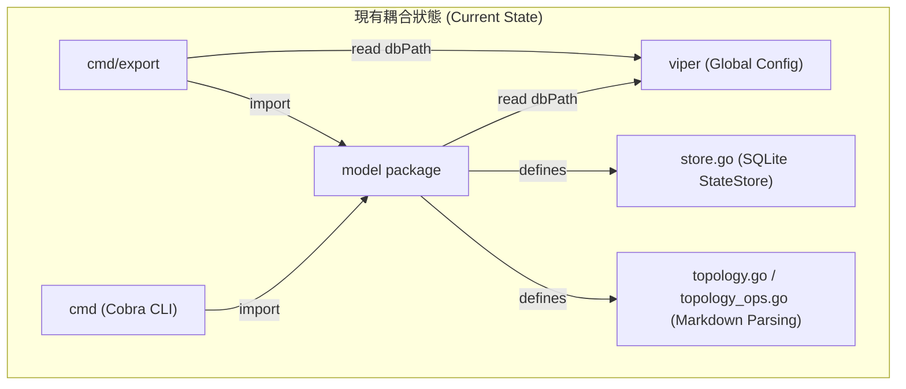
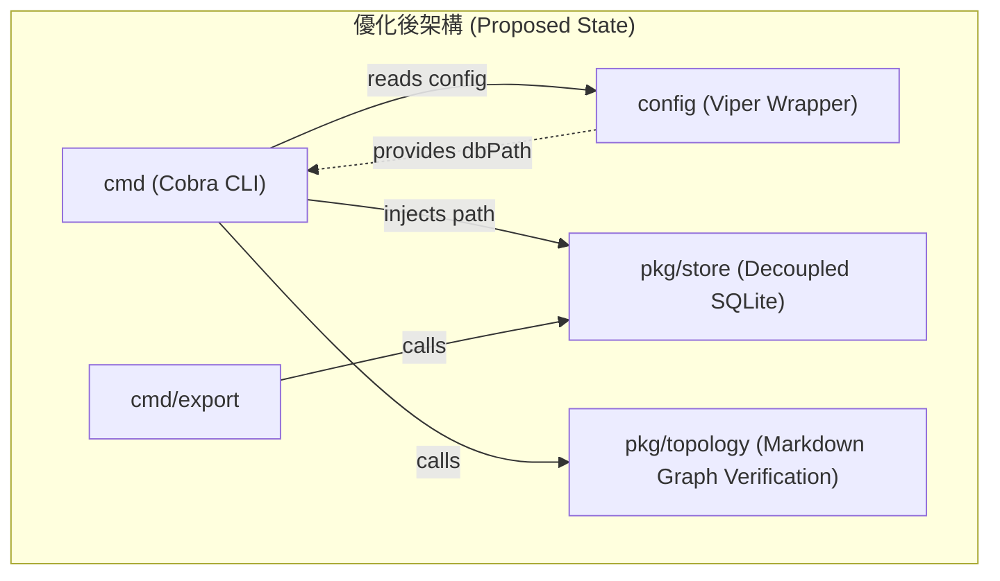

# 架構演進與優化計畫 — 系統模組化與解耦 (Architecture Evolution & Optimization Plan)

## 1. 現有架構診斷與技術債 (Architecture Diagnosis & Technical Debt)

經過對目前工作區的深度分析，診斷出以下架構技術債：

- 診斷 1 — 領域職責過載與邊界模糊 (Domain Overload & Boundary Blurring)：`model/` 套件同時承載了核心記憶狀態管理 `StateStore`（使用 `GORM` 與 SQLite）以及 Markdown 知識圖譜解析與驗證的 `Topology` 邏輯（包含 `model/topology.go` 與 `model/topology_ops.go`）。這違反了單一職責原則 (Single Responsibility Principle)，使 `model` 套件邊界不清，增加了模組間的耦合度。
- 診斷 2 — 孤立程式碼與死模組 (Orphaned Code & Dead Module)：`model/topology.go` 和 `model/topology_ops.go` 目前在核心 CLI 指令（`cmd/`）中完全沒有任何實質調用，僅在單元測試檔 `topology_test.go` 與 `topology_ops_test.go` 中被引用。這導致相關的圖譜分析程式碼處於閒置狀態，缺乏 CLI 接入點。
- 診斷 3 — 領域層強耦合全域設定 (Domain Layer Tight Coupling with Global Config)：`model/store.go` 中的 `NewStateStore()` 函數直接調用全域物件 `viper.GetString("state.db_path")`。這使得底層的資料庫訪問模組對 `Viper` 設定框架產生強依賴，無法在不載入設定檔或進行環境變數初始化的情況下獨立進行單元測試與模擬 (Mocking)。
- 診斷 4 — 程式碼重複與架構分層混雜 (Code Duplication & Mixed Layering)：`cmd/read_logic.go` 中的 `readGbrainLogic()` 函數與 `cmd/export/gbrain.go` 中的 `gbrainRead()` 函數，在邏輯上幾乎完全一致，皆為遍歷目錄讀取 Markdown 並轉換為觀察值。同理，`cmd/read_logic.go` 中的 `readClaudeMemLogic()` 函數與 `cmd/export/claudemem.go` 中的 `claudeMemRead()` 函數也存在高度相似的資料庫查詢邏輯，且 `readClaudeMemLogic()` 還存在重複初始化 `StateStore` 連線的問題，增加了連線資源浪費。
- 診斷 5 — 迴圈內延遲關閉資源漏洞 (Deferred Resource Closure in Loop Vulnerability)：在 `cmd/write_agentmemory.go` 的 `writeAgentMemoryLogic()` 函數中，`defer resp.Body.Close()` 被放置於 `for` 迴圈之內。由於 `defer` 僅在包裝函數返回時才會執行，若傳入的記憶體列表 `memories` 龐大，將會同時佔用大量 HTTP 連線與檔案描述符 (File Descriptor)，有極大機率觸發系統資源耗盡錯誤。
- 診斷 6 — 缺乏結構化日誌 (Lack of Structured Logging)：當前系統廣泛使用 `fmt.Printf` 與 `fmt.Fprintf` 輸出日誌。若將此 CLI 工具部署於 `Crontab` 作為每日定時任務，將難以與現代觀測系統（如 Elastic Stack 或 Grafana Loki）對接以收集與分析結構化日誌。

## 2. 複雜度量測 (Complexity Metrics)

針對核心模組進行的客觀程式碼行數與職責量測：

| 模組/檔案 (Module/File) | 總行數 (Lines) | 主要職責 (Main Responsibility) | 耦合與改動指標 (Coupling & Change Metrics) |
| :--- | :--- | :--- | :--- |
| `model/store.go` | 205 | `GORM` SQLite 狀態與遊標管理 | 低頻改動，強耦合 `viper` 全域變數 |
| `model/topology.go` | 185 | Markdown 實體與邊界解析 | 孤立模組，僅測試依賴，與記憶領域無關 |
| `model/topology_ops.go` | 219 | 拓撲邊界驗證與 backlink 生成 | 孤立模組，僅測試依賴，與記憶領域無關 |
| `cmd/read_logic.go` | 104 | 讀取 gbrain 與 claude-mem 觀察值 | 與 export 邏輯重複，且有重複連線問題 |
| `cmd/export/mempalace.go` | 320 | 匯出 mempalace 資料庫內容至 Markdown | 大型檔案，包含直接 SQL 查詢與檔案格式化 |
| `cmd/export/gbrain.go` | 111 | 匯出 gbrain Markdown | 與 `readGbrainLogic` 邏輯重複 |
| `cmd/export/claudemem.go` | 101 | 匯出 claudemem 觀察值 | 與 `readClaudeMemLogic` 邏輯重複 |
| `cmd/write_agentmemory.go` | 86 | 將記憶寫入 `agentmemory` API | 包含 `defer` 資源釋放漏洞 |



## 3. 架構簡化與解耦設計 (Simplification & Decoupling Design)

為了簡化架構，採取以下核心重構設計：

1. 領域與工具套件解耦 (Domain & Package Decoupling)：將 `topology` 相關程式碼自 `model/` 包中完全剝離，遷移至獨立的 `pkg/topology` 套件。此套件定義專屬的 Markdown 圖譜解析邏輯，不應與記憶蒸餾領域的 `model` 產生 any 循環依賴。
2. 依賴注入重構 (Dependency Inversion/Injection)：修改 `NewStateStore()` 的簽名，使其不依賴 `viper`。改為接收具體的資料庫檔案路徑參數：`NewStateStore(dbPath string)`。由 `cmd/` 層負責從 `viper` 讀取路徑並進行路徑展開，再注入到 `StateStore` 中，提高單元測試的隔離性。
3. 共享邏輯提取 (Shared Logic Extraction)：將 `cmd/read_logic.go` 中的觀察值讀取邏輯與 `cmd/export/` 中的讀取邏輯進行整合。在 `model/` 套件中，定義統一的觀察值讀取器介面或共享函數（例如在 `model/gbrain.go` 或 `model/claudemem.go` 中實作），使讀取與匯出命令共享同一個可信的資料源頭。
4. 安全性與效能優化 (Safety & Performance Optimization)：重構 `writeAgentMemoryLogic()`，將 HTTP 請求與資源釋放邏輯移出 `for` 迴圈，或是在迴圈內部使用匿名函數 (IIFE) 包裝以確保每次迭代結束時，`resp.Body.Close()` 能被即時呼叫，從而防止連線洩漏。



## 4. 目錄與模組重整方案 (Reorganization Map)

詳細的檔案遷移與命名重整方案：

| 原始檔案路徑 (Source Path) | 目標檔案路徑 (Destination Path) | 調整說明 (Adjustment Description) |
| :--- | :--- | :--- |
| `model/topology.go` | `pkg/topology/topology.go` | 移動至 `pkg/topology`，變更 package 為 `topology`，剝離領域模型 |
| `model/topology_ops.go` | `pkg/topology/topology_ops.go` | 同上，處理拓撲關聯運算 |
| `model/topology_test.go` | `pkg/topology/topology_test.go` | 同上，對應的單元測試遷移 |
| `model/topology_ops_test.go` | `pkg/topology/topology_ops_test.go` | 同上，對應的單元測試遷移 |
| `cmd/read_logic.go` | `model/reader.go` (或合併至 domain) | 將 gbrain 與 claudemem 讀取邏輯下沉至 `model/`，對外提供統一讀取介面 |
| — | `cmd/topology.go` (及子目錄) | 新增 `cc-plugin topology` 命令，實作 `verify`、`rewrite` 與 `unlinked` 檢查 |

## 5. 插件化與可擴充性機制 (Plugin & Extensibility Mechanism)

針對當前的系統架構，論證插件化之必要性：

- 拓撲驗證與 CLI 命令：擴充點與調用鏈單一，無需設計複雜的插件加載器。應遵循「簡化優先，移除勝於新增抽象」原則，採用標準 Go 介面 `Interface` 進行設計即可。
- 記憶來源與寫入目標 (Memory Sources & Stores)：目前有 `gbrain`、`claude-mem` 兩個來源，與 `agentmemory`、`mempalace` 兩個寫入端。若未來需要擴充第 3 個來源或儲存端，可在 `model/` 中定義 `MemoryReader` 與 `MemoryWriter` 介面。
- 介面契約定義：
```go
type MemoryReader interface {
    Read(cursor int64) ([]model.Observation, int64, error)
}

type MemoryWriter interface {
    Write(memories []model.Memory) error
}
```

## 6. 漸進式重構路徑與驗證 (Refactoring Roadmap & Verification)

本計畫採用絞殺榕模式 (Strangler-Fig Pattern) 進行漸進式重構，確保每一步皆可單獨驗證且隨時可回滾：

### Phase 1 — 解耦 StateStore 與資源漏洞修復 (低風險)
- 步驟 1：修改 `model/store.go` 中的 `NewStateStore()` 簽名為 `NewStateStore(dbPath string)`，並移除檔案中的 `github.com/spf13/viper` 依賴。
- 步驟 2：在 `cmd/distill.go`、`cmd/export/claudemem.go` 等調用處，改為 `viper.GetString("state.db_path")` 後展開路徑再傳入。
- 步驟 3：修改 `cmd/write_agentmemory.go`，將迴圈內的 `http.Post` 調用封裝至一個獨立的匿名函數中，確保 `defer resp.Body.Close()` 能在每次迭代結束時立即被調用。
- 驗證方式：執行 `go test ./...` 確保測試綠燈，且運行 `cc-plugin distill` 無連線洩漏問題。

### Phase 2 — 遷移 Topology 與單元測試 (中風險)
- 步驟 1：在 `pkg/` 下建立 `topology` 目錄。將 `model/topology*` 移動至該目錄。
- 步驟 2：將檔案的 package 宣告改為 `topology`，並更新 import 路徑。
- 驗證方式：在 workspace 根目錄執行 `go test ./pkg/topology/...` 確保解析與邊界驗證功能正常。

### Phase 3 — 消除重複代碼與整合讀取層 (中風險)
- 步驟 1：在 `model/` 中建立 `reader.go`，將 `readGbrainLogic` 與 `readClaudeMemLogic` 的核心讀取邏輯移入，並提供可接收 `StateStore` 參數的統一介面。
- 步驟 2：重構 `cmd/export/gbrain.go` 與 `cmd/export/claudemem.go`，調用 `model/` 提取出的共享邏輯，移除重複的 Walk 與 DB Query 代碼。
- 驗證方式：執行 `go test ./...` 確保導出資料與原先功能完全一致。

### Phase 4 — 補齊 cmd/topology CLI 指令 (中風險)
- 步驟 1：新增 `cmd/topology.go`，實作 Cobra 子指令，註冊至 `cmd/root.go`。
- 步驟 2：在指令中呼叫 `pkg/topology` 的解析與驗證方法，對指定的 Markdown 知識圖譜目錄進行掃描與校正。
- 驗證方式：執行 `go build -o cc-plugin main.go` 後，手動執行 `cc-plugin topology verify --root plugins/general/skills/topology-builder/references` 驗證輸出。

## 7. 風險與回滾策略 (Risks & Rollback)

- 破壞性變更風險 (Breaking Changes Risk)：修改 `NewStateStore()` 簽名與移動 `topology.go` 檔案會導致既有程式碼 import 失敗，造成編譯錯誤。
- 緩和策略 (Mitigation Strategy)：每次 Phase 重構皆應在獨立的 `Git` 分支進行，並在合併前進行編譯與測試驗證。
- 回滾路徑 (Rollback Path)：若在重構中遇到無法解決的編譯或邏輯錯誤，可執行 `git reset --hard HEAD` 或 `git checkout <filename>` 快速還原。每次變更應保持 commit 粒度極小。
