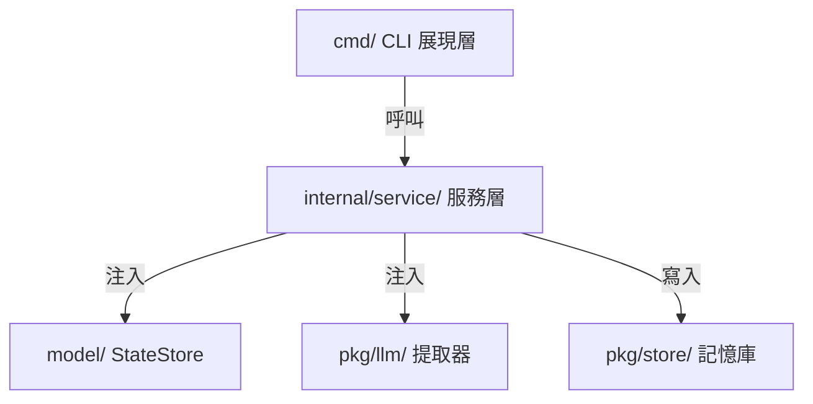

# 架構演進與優化計畫 — system-simplification (Architecture Evolution & Optimization Plan)

## 1. 現有架構診斷與技術債 (Architecture Diagnosis & Technical Debt)

經過對 `cc-plugin` 代碼庫的深度分析，發現以下主要的技術債與耦合問題：

- `重複建立資料庫連線 (Duplicate Database Connections)`：在 [cmd/read_logic.go](file:///Users/shuk/projects/cc-plugin/cmd/read_logic.go#L60-L65) 內，`readClaudeMemLogic()` 在每次呼叫時都會重複執行 `NewStateStore()` 以及 `defer store.Close()`。這會引起 SQLite 連線頻繁開啟與關閉，浪費系統資源，且與 `cmd/distill.go` 中主流程獨立開啟的連線共存。
- `重複的讀取邏輯 (Duplicate Reader Logic)`：[cmd/read_logic.go](file:///Users/shuk/projects/cc-plugin/cmd/read_logic.go#L16-L58) 的 `readGbrainLogic` 與 [cmd/export/gbrain.go](file:///Users/shuk/projects/cc-plugin/cmd/export/gbrain.go#L15-L61) 的 `gbrainRead` 的邏輯幾乎 100% 相同；同時，[cmd/export/claudemem.go](file:///Users/shuk/projects/cc-plugin/cmd/export/claudemem.go#L15-L56) 中的 `claudeMemRead` 函式與 [cmd/read_logic.go](file:///Users/shuk/projects/cc-plugin/cmd/read_logic.go#L60-L103) 中的 `readClaudeMemLogic` 函式也高度重複，僅差在是否利用 cursor 過濾。
- `HTTP 資源洩漏 (Resource Leak in Loop)`：在 [cmd/write_agentmemory.go](file:///Users/shuk/projects/cc-plugin/cmd/write_agentmemory.go#L34) 內，`writeAgentMemoryLogic` 中的 `defer resp.Body.Close()` 位於 for loop 內，由於 `defer` 僅在函數返回時執行，若 `memories` 陣列較大，會導致 concurrent socket 洩漏，進而引發 file descriptor 耗盡錯誤。
- `全域設定依賴與依賴反轉缺失 (Lack of Dependency Injection and Global Config Dependency)`：核心模型如 [model/store.go](file:///Users/shuk/projects/cc-plugin/model/store.go#L28) 中 `NewStateStore` 直接調用 `viper.GetString("state.db_path")` 獲取配置，且 `config/config.go` 中將設定預設值硬編碼在 Go 原始碼內，導致 `config/default_settings.json` 為空 `{}`。
- `插件技能命名不符規範 (Naming Convention Violation)`：[plugins/general/skills/anti-sabotage/anti-sabotage.md](file:///Users/shuk/projects/cc-plugin/plugins/general/skills/anti-sabotage/anti-sabotage.md) 不符合 `agentskills.io` 規範的 `SKILL.md` 命名。

## 2. 複雜度量測 (Complexity Metrics)

以下為使用靜態分析與 `git log` 所量測的系統複雜度指標：

- `熱點檔案與改動頻率 (Git Commits Heatmap)`：
  近 12 個月改動最頻繁的 Go 檔案：
  - `cmd/root.go` (8次)
  - `model/topology_ops.go` (6次)
  - `cmd/state.go` (6次)
  - `config/config.go` (5次)
  - `cmd/write_agentmemory.go` (5次)
- `程式行數分析 (Code Size Metrics)`：
  目前 Go 程式總行數約為 `3941 行`。其中主要檔案行數為：
  - `cmd/export/mempalace.go` (319行)
  - `model/topology_ops.go` (219行)
  - `model/store.go` (204行)
  - `cmd/distill.go` (161行)
  - `cmd/read_logic.go` (104行)
- `依賴度量測 (Dependency Metrics)`：
  核心狀態 `model/store.go` 被 `cmd/distill.go`、`cmd/read_logic.go` 等直接引用。所有核心模組均高度依賴 `viper` 全域設定。

## 3. 架構簡化與解耦設計 (Simplification & Decoupling Design)

為解決上述痛點，本計畫設計引入分層架構 (`Layered Architecture`)，將 CLI 展現層、業務服務層、與底層資料庫或外部 API 儲存層進行徹底解耦，其依賴方向一律為「由外向內」單向依賴。

### 解耦關鍵點 (Decoupling Highlights)
- `定義抽象介面 (Define Interfaces)`：
  定義 `Extractor` 用於 LLM 提取，以及 `MemoryWriter` 與 `FactWriter` 用於資料儲存，將 Ollama API 的呼叫以及 `agentmemory` / `mempalace` 的寫入實作細節從蒸餾主流程中剝離。
- `消除重複連線 (Eliminate Duplicate Connections)`：
  重整讀取邏輯，由外部傳入統一的 `StateStore` 實例，避免多個資料庫連線實例共存。
- `依賴注入 (Dependency Injection)`：
  `StateStore` 與 `OllamaService` 將透過其建構式接收具體的路徑或用戶端參數，不再直接引用全域 `viper` 物件。

## 4. 目錄與模組重整方案 (Reorganization Map)

本方案將新增 `internal/` 目錄以存放核心業務邏輯，避免其被外部直接引用，並將邏輯從 `cmd/` 移動至服務層。

### 新舊結構映射表 (Structure Mapping)

| 原始路徑 (Original Path) | 新路徑 (New Path) | 職責與依賴說明 (Responsibility & Dependencies) |
| :--- | :--- | :--- |
| `cmd/distill.go` (混合邏輯) | `cmd/distill.go` | 僅負責 CLI 指令參數解析，並實例化服務執行蒸餾。 |
| `cmd/distill.go` (蒸餾邏輯) | `internal/service/distill.go` | `DistillerService`：編排讀取、提取、Seen過濾與寫入的主流程。 |
| `cmd/read_logic.go` | `internal/service/reader.go` | `ReaderService`：負責 `gbrain` 與 `claude-mem` 資料來源的讀取，接受外部傳入的 `StateStore` 實例。 |
| `cmd/export/gbrain.go` | `cmd/export/gbrain.go` | 呼叫 `internal/service/reader.go` 的讀取函式，消除重複程式碼。 |
| `cmd/write_*.go` | `pkg/store/` | `AgentMemoryWriter` 與 `MempalaceWriter`：實作資料庫與 API 的寫入（修復 `for` 迴圈內的 `defer` 釋放問題）。 |
| `model/store.go` (依賴viper) | `model/store.go` (純淨化) | `StateStore`：不再依賴 `viper`，改由建構式傳入資料庫檔案路徑。 |
| `plugins/general/skills/anti-sabotage/anti-sabotage.md` | `plugins/general/skills/anti-sabotage/SKILL.md` | 重新命名以符合規範並添加 frontmatter。 |

## 5. 插件化與可擴充性機制 (Plugin & Extensibility Mechanism)

由於 `cc-plugin` 本身就是作為 Claude Code 插件執行，且擴充點主要是針對資料來源（如讀取 `gbrain` / `claude-mem`）與儲存目標（如寫入 `agentmemory` / `mempalace`），暫時不需要設計複雜 of 動態插件載入機制。

### 可擴充性設計 (Extensibility Design)
透過 `介面註冊 (Interface Registration)` 即可滿足擴充需求：
- 若未來需要新增資料來源（如讀取 `slack-mem`），只需實作 `Reader` 介面，並將其加入 `DistillerService` 的讀取清單中。
- 若需要新增儲存終端，只需實作 `Writer` 介面，無需修改 `DistillerService` 的核心蒸餾代碼。

## 6. 漸進式重構路徑與驗證 (Refactoring Roadmap & Verification)

為降低風險，本重構計畫將拆分為四個小步，且每步皆可獨立交付並提供完整的測試驗證：

### Phase 1 — 建立單一 store 連線與設定純淨化 (30% 進度)
- `目標`：修改 `NewStateStore` 接受 `dbPath` 參數，移除 `viper` 直接依賴；調整 `readClaudeMemLogic` 使引導同一個 `store` 實例，消滅重複連線。
- `驗證`：執行 `go test ./model/...` 與 `go test ./cmd/...` 確保測試綠燈，且功能無 regression。

### Phase 2 — 消除重複代碼與修正資源洩漏 (55% 進度)
- `目標`：將 `readGbrainLogic` 提取至 `internal/service/`，並讓 `cmd/export/gbrain.go` 與 `cmd/distill.go` 共用。修改 `writeAgentMemoryLogic` 以手動關閉 `resp.Body` 替代 `defer`。
- `驗證`：執行單元測試並檢查在匯入大量資料時，檔案描述符 (`File Descriptor`) 是否無持續攀升。

### Phase 3 — 建立核心服務層與介面抽離 (80% 進度)
- `目標`：在 `internal/service/` 建立 `DistillerService`、`ReaderService`、`WriterService`。將 `cmd/distill.go` 的蒸餾編排邏輯轉移至服務層。
- `驗證`：對 `DistillerService` 補上特徵測試 (`Characterization Test`) 與 `Mock` 測試，確保蒸餾邏輯與過濾演算法完全正確。

### Phase 4 — 規範檔案更名與整合驗證 (100% 進度)
- `目標`：將 `plugins/general/skills/anti-sabotage/anti-sabotage.md` 更名為 `SKILL.md`，並加上標準 yaml frontmatter。
- `驗證`：執行 `npx skills add .` 確保無異常，並測試 `cc-plugin distill` 執行成功。

## 7. 風險與回滾策略 (Risks & Rollback)

- `風險一：重構過程中資料庫連線遺漏或損壞`
  - `對策`：在 Phase 1 之前，對當前的資料庫讀寫行為撰寫基於 SQLite 記憶體模式的單元測試，作為重構安全網。
- `風險二：Ollama LLM 提取結果因介面改裝格式不一致`
  - `對策`：建立一個 Mock Ollama 服務，用來返回預期的 JSON 回應，並在測試中比對轉換後的 `model.Candidate` 結構是否與舊版完全一致。
- `回滾策略`：
  - 每次 Phase 均建立獨立的 git commit。若驗證失敗，立即執行 `git reset --hard HEAD~1` 回滾至上一個穩定狀態。
