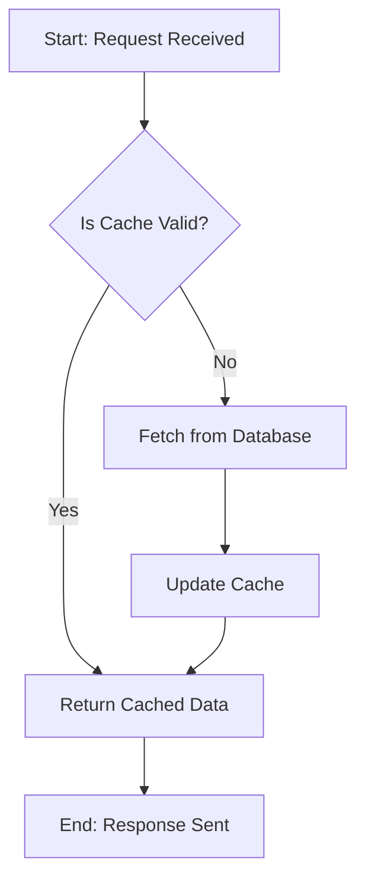

# Flowchart (流程圖)

- 關鍵字：`flowchart` 或 `graph`
- 說明：用於展示處理流程、決策路徑或系統拓撲。

```mermaid
flowchart TD
    A[Start: Request Received] --> B{Is Cache Valid?}
    B -- Yes --> C[Return Cached Data]
    B -- No --> D[Fetch from Database]
    D --> E[Update Cache]
    E --> C
    C --> F[End: Response Sent]
```
