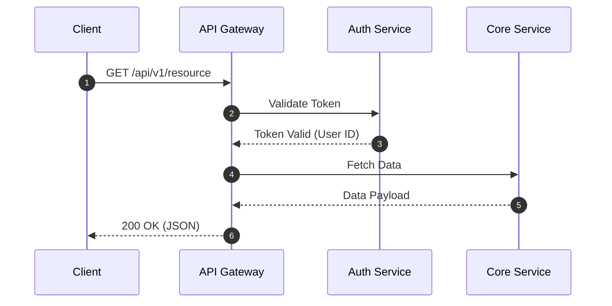

# Sequence Diagram (循序圖/時序圖)

- 關鍵字：`sequenceDiagram`
- 說明：展示多個物件、服務或組件在時間順序上的互動與訊息傳遞。

```mermaid
sequenceDiagram
    autonumber
    Client->>API Gateway: GET /api/v1/resource
    API Gateway->>Auth Service: Validate Token
    Auth Service-->>API Gateway: Token Valid (User ID)
    API Gateway->>Core Service: Fetch Data
    Core Service-->>API Gateway: Data Payload
    API Gateway-->>Client: 200 OK (JSON)
```
