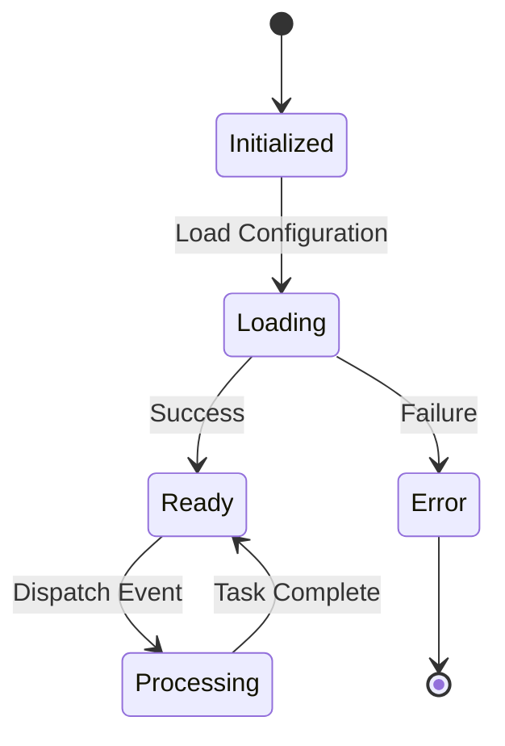

# State Diagram (狀態圖)

- 關鍵字：`stateDiagram-v2`
- 說明：描述有限狀態機（Finite State Machine）在事件觸發下的狀態轉移。

```mermaid
stateDiagram-v2
    [*] --> Initialized
    Initialized --> Loading: Load Configuration
    Loading --> Ready: Success
    Loading --> Error: Failure
    Ready --> Processing: Dispatch Event
    Processing --> Ready: Task Complete
    Error --> [*]
```
