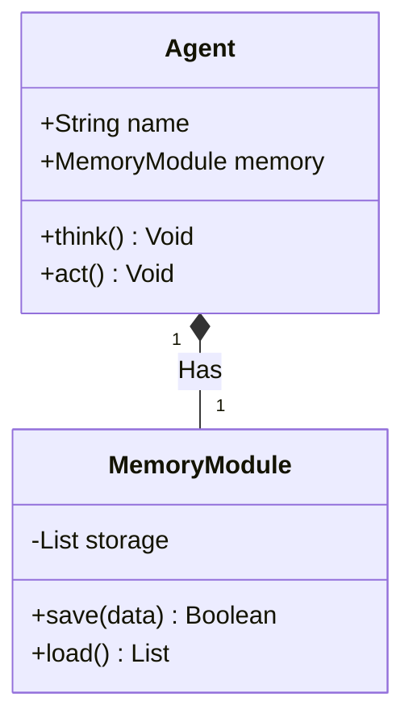

# Class Diagram (類別圖)

- 關鍵字：`classDiagram`
- 說明：在物件導向設計（OOP）中，展示類別的結構、屬性、方法以及繼承或組合關係。

```mermaid
classDiagram
    class Agent {
        +String name
        +MemoryModule memory
        +think() Void
        +act() Void
    }
    class MemoryModule {
        -List storage
        +save(data) Boolean
        +load() List
    }
    Agent "1" *-- "1" MemoryModule : Has
```
