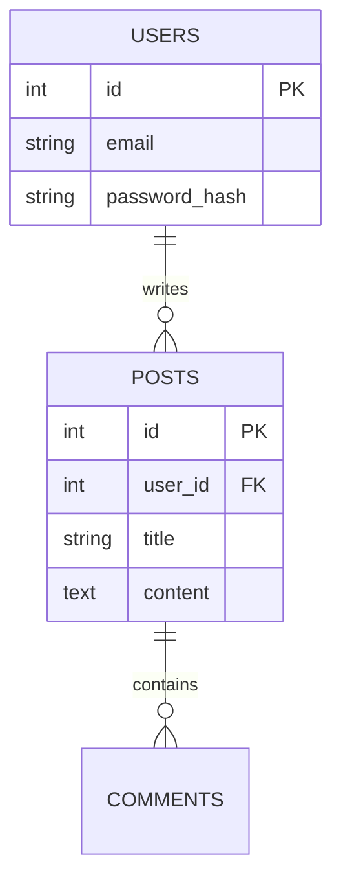

# Entity Relationship Diagram (ERD, 實體關聯圖)

- 關鍵字：`erDiagram`
- 說明：資料庫設計中用來表達資料表（Table）之間的結構與基數關聯（Cardinality）。

```mermaid
erDiagram
    USERS ||--o{ POSTS : writes
    POSTS ||--o{ COMMENTS : contains
    USERS {
        int id PK
        string email
        string password_hash
    }
    POSTS {
        int id PK
        int user_id FK
        string title
        text content
    }
```
