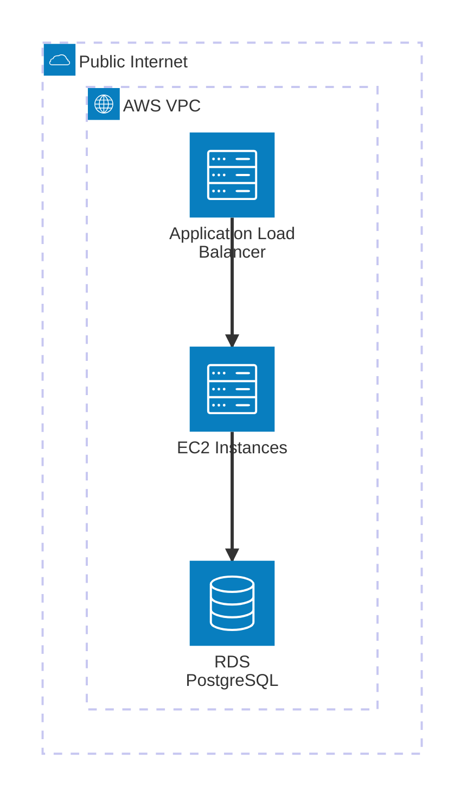

# Architecture Diagram (雲端架構圖)

- 關鍵字：`architecture-beta`
- 說明：用於視覺化雲端基礎設施、部署服務節點之間的連接關係。

```mermaid
architecture-beta
    group public_net(cloud)[Public Internet]
    group vpc(internet)[AWS VPC] in public_net
    service alb(server)[Application Load Balancer] in vpc
    service ec2(server)[EC2 Instances] in vpc
    service rds(database)[RDS PostgreSQL] in vpc

    alb:B --> T:ec2
    ec2:B --> T:rds
```
