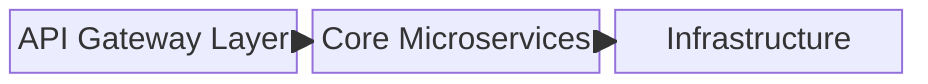

# Block Diagram (區塊圖)

- 關鍵字：`block`
- 說明：用於方塊化的版面配置，適合呈現高階系統模組的水平與垂直堆疊。

```mermaid
block-beta
    columns 3
    api["API Gateway Layer"]
    service["Core Microservices"]
    infra["Infrastructure"]

    api --> service
    service --> infra
```
