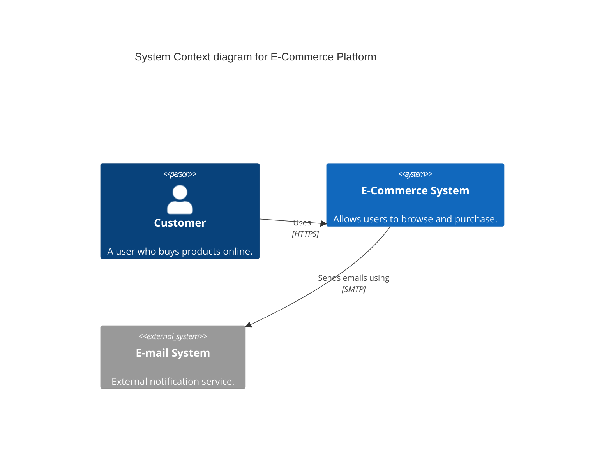

# C4 Diagram (C4 模型圖)

- 關鍵字：`C4Context` / `C4Container`
- 說明：基於 C4 軟體架構模型，由大至小描述軟體系統的上下文環境。

```mermaid
C4Context
    title System Context diagram for E-Commerce Platform
    Person(customer, "Customer", "A user who buys products online.")
    System(ecommerce, "E-Commerce System", "Allows users to browse and purchase.")
    System_Ext(mail, "E-mail System", "External notification service.")

    Rel(customer, ecommerce, "Uses", "HTTPS")
    Rel(ecommerce, mail, "Sends emails using", "SMTP")
```
