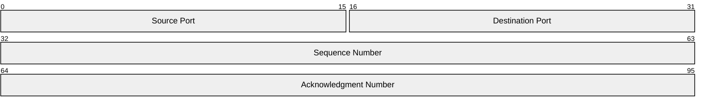

# Packet Diagram (網絡封包結構圖)

- 關鍵字：`packet`
- 說明：底層網路開發中，用來繪製封包標頭（Packet Header）內二進位欄位的長度與排列。

```mermaid
packet
    0-15: "Source Port"
    16-31: "Destination Port"
    32-63: "Sequence Number"
    64-95: "Acknowledgment Number"
```
