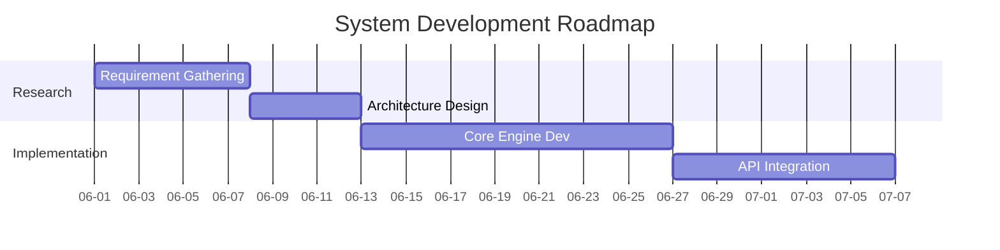

# Gantt Chart (甘特圖)

- 關鍵字：`gantt`
- 說明：專案時程規劃，展示各項任務的時間跨度、先後依賴關係與里程碑。

```mermaid
gantt
    title System Development Roadmap
    dateFormat  YYYY-MM-DD
    axisFormat  %m-%d
    section Research
    Requirement Gathering   :a1, 2026-06-01, 7d
    Architecture Design     :after a1, 5d
    section Implementation
    Core Engine Dev        :2026-06-13, 14d
    API Integration        :10d
```
