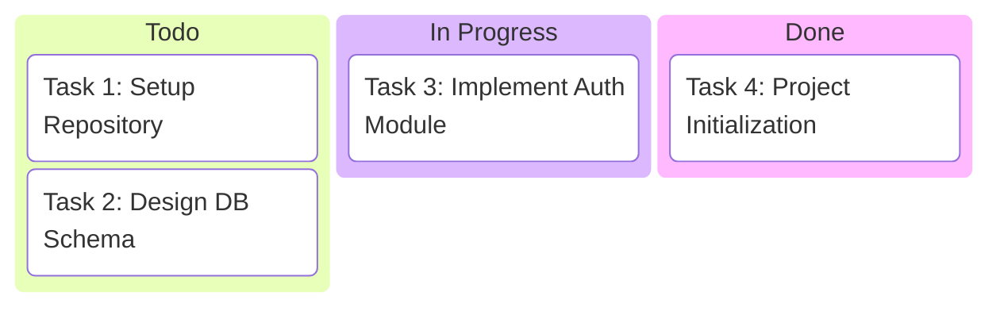

# Kanban (看板)

- 關鍵字：`kanban`
- 說明：敏捷開發工作流的任務分配看板，分流不同的任務狀態。

```mermaid
kanban
  Todo
    Task 1: Setup Repository
    Task 2: Design DB Schema
  In Progress
    Task 3: Implement Auth Module
  Done
    Task 4: Project Initialization
```
