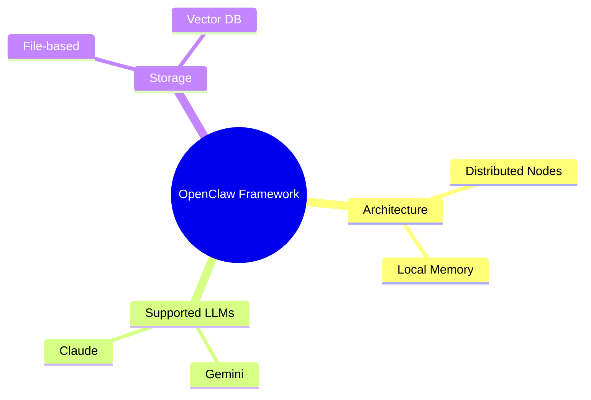

# Mindmap (心智圖)

- 關鍵字：`mindmap`
- 說明：腦力激盪、由核心概念向外放射發散的結構化想法整理。

```mermaid
mindmap
  root((OpenClaw Framework))
    Architecture
      Distributed Nodes
      Local Memory
    Supported LLMs
      Gemini
      Claude
    Storage
      File-based
      Vector DB
```
