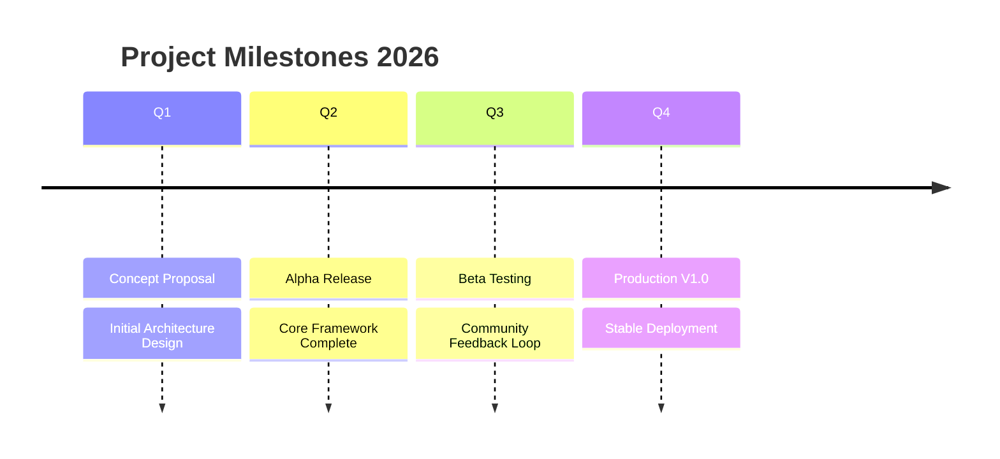

# Timeline (時間軸)

- 關鍵字：`timeline`
- 說明：按時間線性順序排列的重大事件、歷史軌跡或版本變更紀錄。

```mermaid
timeline
    title Project Milestones 2026
    Q1 : Concept Proposal : Initial Architecture Design
    Q2 : Alpha Release : Core Framework Complete
    Q3 : Beta Testing : Community Feedback Loop
    Q4 : Production V1.0 : Stable Deployment
```
