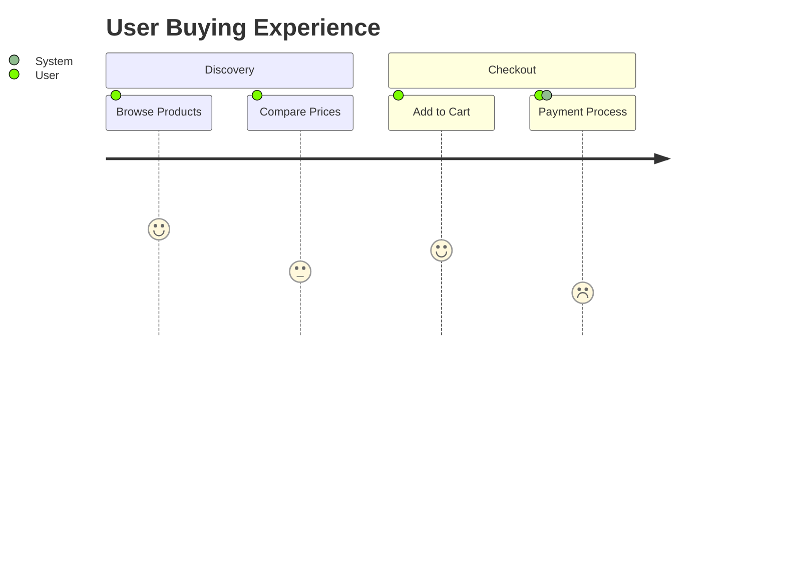

# User Journey Diagram (用戶旅程圖)

- 關鍵字：`journey`
- 說明：描繪使用者在操作產品過程中的心路歷程、痛點與滿意度評分。

```mermaid
journey
    title User Buying Experience
    section Discovery
      Browse Products: 5: User
      Compare Prices: 3: User
    section Checkout
      Add to Cart: 4: User
      Payment Process: 2: User, System
```
