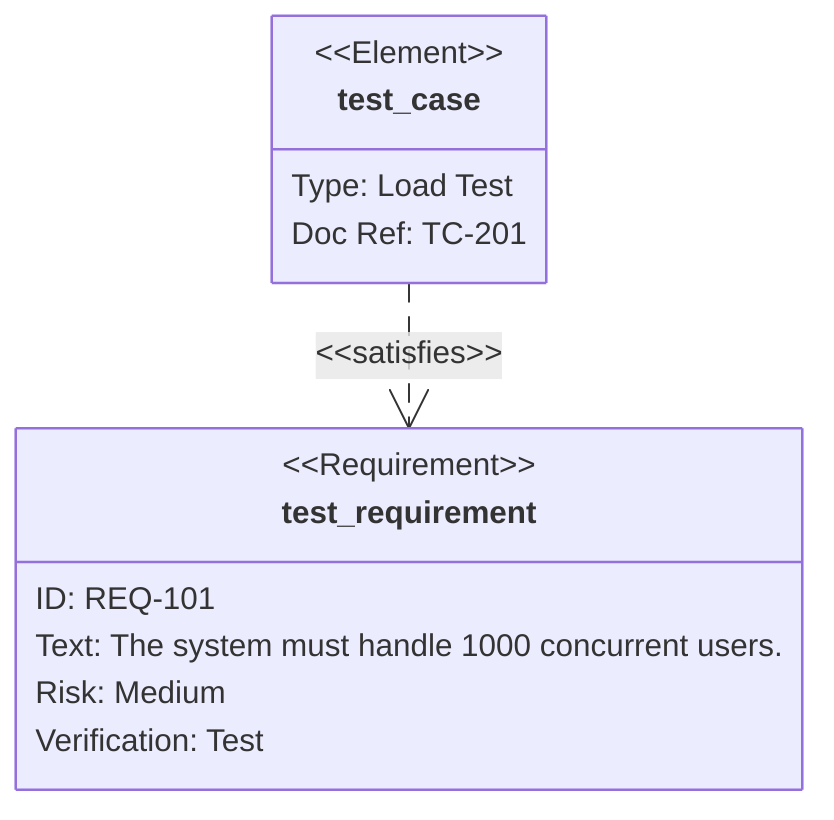

# Requirement Diagram (需求圖)

- 關鍵字：`requirementDiagram`
- 說明：軟體需求工程中，定義系統需求與測試案例（Test Case）之間的追蹤關聯。

```mermaid
requirementDiagram
    requirement test_requirement {
        id: "REQ-101"
        text: "The system must handle 1000 concurrent users."
        risk: Medium
        verifymethod: Test
    }
    element test_case {
        type: "Load Test"
        docref: "TC-201"
    }
    test_case - satisfies -> test_requirement
```
