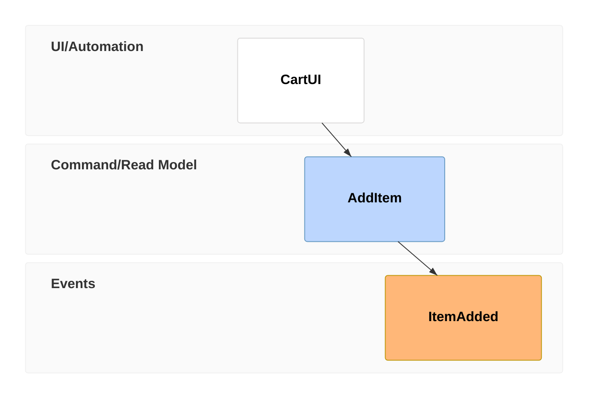

# Event Modeling (事件建模圖)

- 關鍵字：`eventmodeling`
- 說明：資訊系統設計中，用來精準勾勒使用者介面、指令（Command）、事件（Event）與讀取模型的全貌。

```mermaid
eventmodeling
    tf 01 ui CartUI
    tf 02 cmd AddItem
    tf 03 evt ItemAdded
```
