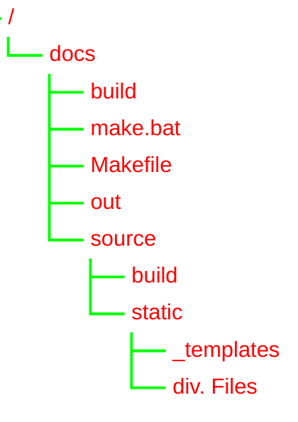

# TreeView (樹狀列表圖)

- 關鍵字：`treeView-beta`
- 說明：展示如作業系統檔案目錄、專案結構等純文字階層結構。
- 版本：Mermaid v11.14.0+
- 語法規則：以 `treeView-beta` 開頭；節點名稱以引號包裹；階層完全由縮排深度決定，更深的縮排即為子節點。

設定變數 (`config.treeView`)：

| 屬性 | 用途 | 預設 |
| --- | --- | --- |
| `rowIndent` | 每層縮排間距 | 10 |
| `paddingX` | 列的水平內距 | 5 |
| `paddingY` | 列的垂直內距 | 5 |
| `lineThickness` | 連接線寬度 | 1 |

主題變數 (`themeVariables.treeView`)：

| 屬性 | 用途 | 預設 |
| --- | --- | --- |
| `labelFontSize` | 標籤文字大小 | `'16px'` |
| `labelColor` | 標籤文字顏色 | `'black'` |
| `lineColor` | 連接線顏色 | `'black'` |

