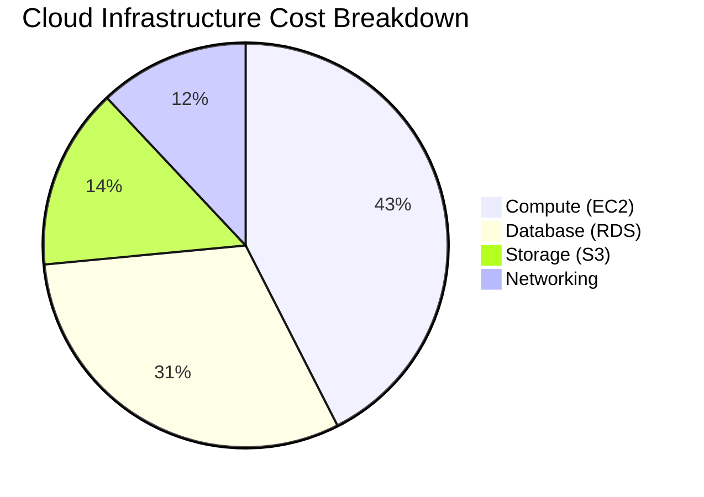

# Pie Chart (圓餅圖)

- 關鍵字：`pie`
- 說明：呈現各分類數據在總體中所佔的百分比。

```mermaid
pie title Cloud Infrastructure Cost Breakdown
    "Compute (EC2)" : 42.5
    "Database (RDS)" : 31.0
    "Storage (S3)" : 14.5
    "Networking" : 12.0
```
