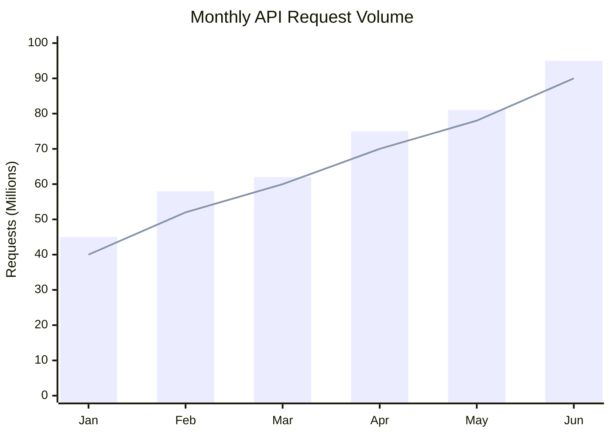

# XY Chart (直角座標圖)

- 關鍵字：`xychart-beta`
- 說明：在同一個直角座標系中繪製長條圖（Bar Chart）與折線圖（Line Chart）。

```mermaid
xychart-beta
    title "Monthly API Request Volume"
    x-axis [Jan, Feb, Mar, Apr, May, Jun]
    y-axis "Requests (Millions)" 0 --> 100
    bar [45, 58, 62, 75, 81, 95]
    line [40, 52, 60, 70, 78, 90]
```
