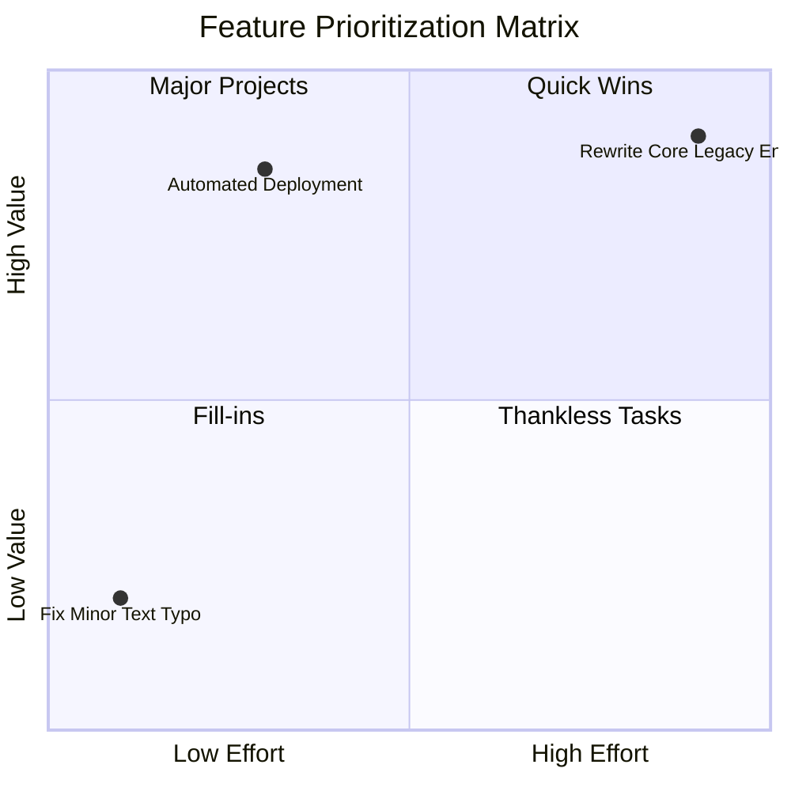

# Quadrant Chart (象限圖)

- 關鍵字：`quadrantChart`
- 說明：利用 2x2 矩陣定位資料，常見於優先級決策或策略分析（如 SWOT）。

```mermaid
quadrantChart
    title Feature Prioritization Matrix
    x-axis Low Effort --> High Effort
    y-axis Low Value --> High Value
    quadrant-1 Quick Wins
    quadrant-2 Major Projects
    quadrant-3 Fill-ins
    quadrant-4 Thankless Tasks
    "Automated Deployment": [0.3, 0.85]
    "Fix Minor Text Typo": [0.1, 0.2]
    "Rewrite Core Legacy Engine": [0.9, 0.9]
```
